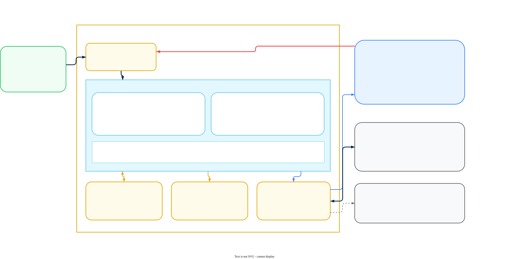

# AI Gateway Hybrid Infrastructure

Plan, size, and prepare the infrastructure for a Prisma AIRS AI Gateway hybrid data plane on EKS, AKS, GKE, ECS, or Azure Container Apps, covering the two-plane architecture, component inventory, published sizing, connectivity in both directions, and per-platform prerequisites.

> **Guide Approach:** This is a companion to the [AI Gateway Deployment Guide](ai-gateway-deployment.md). It covers only the infrastructure a hybrid data plane needs: what runs in your environment, how big it has to be, what it talks to in both directions, and what each platform requires before you deploy. It does not repeat licensing, activation, or Strata Cloud Manager (SCM) configuration. Those live in the deployment guide, and you need them regardless of which platform you land on.

> **Warning &mdash; complete these first:** Everything below assumes you have already finished Phase 1 (License and Activate) and Phase 2 (Enable the Gateway) in the deployment guide. You also need the Docker credentials and Client Auth Key that the Palo Alto Networks team issues against your Organisation ID. Without those the install will come up but never pull images or sync.

---

## Hybrid Architecture

Prisma AIRS AI Gateway is deployed as a two-plane system. AI traffic is processed inside your own environment. Administration, analytics, and log presentation run in the management plane behind Strata Cloud Manager. The split determines what leaves your network, which is usually the first question a security or privacy review asks.

The diagram below is the reference topology on AWS. Azure and GCP versions appear in their prerequisite sections, and the numbered flows are consistent across all three.

> **Note &mdash; the diagrams show the platform-page deployment path:** All three draw the inbound management plane connection, which belongs to the `portkey-ai/gateway` chart installed from the EKS, AKS, or GKE pages. A gateway registered through the SCM wizard and installed with `airs-gw` has no inbound path at all. Read [Two integration paths, two charts](#two-integration-paths-two-charts) before you use a diagram as a design.



### What runs where

The data plane processes every LLM request. The management plane is where you author configuration and read analytics. The Strata Cloud Manager API Gateway sits at the boundary and is the sole authentication authority for anything entering the management plane.

| Customer environment | Role |
|---|---|
| AI Gateway | LLM reverse proxy. Routes to providers, enforces rate limits and quotas, applies guardrails, produces analytics and raw log data. Stateless containers that scale horizontally. |
| Cache Store | Local Redis holding configuration objects, so requests are served without a round trip to the management plane. |
| Log Storage | Blob store holding the full request and response payload for every LLM call. |
| LLM Providers | The upstream models the gateway routes to, whether public, private, or self-hosted. |

| Management plane | Role |
|---|---|
| SCM API Gateway | Terminates mTLS, authenticates end users, injects identity headers. Sole authentication authority. |
| Backend | Owns all writes to MySQL. Reads ClickHouse for analytics, reads the blob store for log detail views, manages cache invalidation. |
| Dashboard | The SCM web interface for configuration, logs, and analytics. |
| MySQL | Organisations, workspaces, API keys, routing configs, guardrail definitions, entitlements, tenant mappings. The gateway never connects to it directly. |
| ClickHouse | Request metrics and guardrail results written by the gateway; audit logs written by the Backend. |
| Redis | Management plane cache for auth context, configs, rate limit counters, and circuit breaker state. |
| Blob Store | Object storage for full request and response bodies, read by the Backend to serve log detail views. |

> **Note &mdash; log storage location is configurable:** Both tables list a blob store. Where the raw payloads actually land depends on your `LOG_STORE` setting: pointed at your own bucket, the bodies stay in your account and the Backend reads them across the link when an operator opens a log entry. Set to `control_plane`, they go to the management plane instead. Decide this deliberately, because it is the single setting that governs where prompt content rests.

### Identity and authentication

Session cookies are not used on management plane routes. Identity is established through three headers the SCM API Gateway injects into every request it forwards.

| Header | Carries | Used for |
|---|---|---|
| Tenant ID | The Palo Alto Tenant/TSG identifier | Resolved in MySQL to an internal organisation identity. Unrecognised tenants are rejected before any business logic runs. |
| User Subject | Opaque user identity from the Palo Alto JWT | Caller identity for audit entries. Never persisted in a Backend user store, because SCM owns user lifecycle entirely. |
| Scope Access | The workspace scopes the caller may access | Evaluated per request. Workspace membership tables are not consulted, so access is entirely scope based. |

The load balancer in front of the Backend terminates mTLS and forwards the verified client certificate subject. The Backend then re-verifies the certificate CN, so gateway-injected identity headers are trusted only when the caller is genuinely the SCM API Gateway.

### Request lifecycle

Only the synchronous path affects response latency. Everything else runs after the client already has its answer.

**Synchronous:**

1. **Entry** &mdash; the application sends an LLM request to the gateway in your environment.
2. **Auth and config hydration** &mdash; the gateway checks Redis for the API key, organisation context, and routing configuration. A cache miss calls the Backend over the link, which reads MySQL and returns the hydrated object for the gateway to cache.
3. **LLM proxying** &mdash; the gateway forwards the request, with any configured transformations, to the target provider. The response streams back through the gateway.
4. **Response return** &mdash; the client's request ends here.

**Asynchronous, non-blocking:**

1. **Metrics to ClickHouse** &mdash; token counts, cost, latency, model, provider, cache status, and trace identifiers, plus a pointer to the full log body. Batched.
2. **Raw log to blob store** &mdash; the complete request and response payload as a structured document. The file path matches the pointer in the ClickHouse record, which is how the Backend cross-references the two when serving log details.
3. **Usage sync** &mdash; updated usage counters, API key exhaustion events, and quota state.

Because config is cached locally, the gateway keeps serving traffic when the management plane is unreachable. It stops receiving configuration updates, not requests.

### Data residency and encryption

This is the section to bring to a data protection review.

- **Prompt content and LLM responses** &mdash; remain within your network.
- **Crossing the boundary** &mdash; only anonymised metrics.
- **Log storage location** &mdash; configurable, per the note above.
- **In transit** &mdash; TLS 1.3 between planes.
- **At rest** &mdash; all management plane data encrypted, with envelope encryption for sensitive fields.
- **BYOK** &mdash; optional, with AWS KMS.
- **Access control** &mdash; network-level controls restrict management plane access to authorised IPs, administrative functions use scope-based access control, all administrative actions are audit logged, and access tokens are short lived with automatic rotation.

> **Warning &mdash; region placement is still an open question:** The published architecture does not state whether the SCM tenant can be placed in the same region as your data plane, or whether hybrid deployments are constrained to a single management plane region. For a deployment with EU data residency obligations, confirm this with your account team before you design around it. See [Open Questions](#open-questions-for-the-product-team).

---

## Data Plane Components

The gateway itself is the only mandatory component. Everything else is a choice between a bundled instance and a managed service, and in most production designs you want the managed service.

### Component inventory

| Component | Required | Options |
|---|---|---|
| AI Gateway | Yes | Stateless containers. Scales horizontally. |
| Cache Store | Yes | Built-in Redis, Amazon ElastiCache for Redis OSS or Valkey, Azure Cache for Redis, GCP Memorystore. Must sit in the same VPC or VNet as the gateway. |
| Log Store | Optional | Amazon S3, Azure Blob Storage, Google Cloud Storage, any S3-compatible store, MongoDB, or Wasabi. |
| Analytics Store | Managed | ClickHouse in the management plane. Exportable to any OpenTelemetry-compatible collector. |
| Semantic Cache Store | Optional | Milvus or Pinecone, only if you want semantic caching. |
| Data Service | Optional | Batch processing, fine-tuning, and log exports. |
| MCP Gateway | Optional | Enabled through `values.yaml`. |

Sizing the log store is straightforward: each log document is roughly 10 kB uncompressed. Multiply by your request volume and retention window.

### Log object path format

Set `LOG_STORE_FILE_PATH_FORMAT` to control how log files are laid out in the bucket.

| Value | Format | Example path |
|---|---|---|
| `v1` (default) | Flat | `30/<organisation-id>/<log-id>.json` |
| `v2` | Time-hierarchical | `30/<organisation-id>/<workspace-slug>/<year>/<month>/<day>/<hour>/<log-id>.json` |

Choose `v2` if you intend to apply lifecycle rules or query by time period, which most retention policies need. Two constraints apply: changing the value affects only newly written logs, since existing objects are not migrated, and `v2` is not supported for air-gapped deployments where `LOG_STORE` is set to `control_plane`.

---

## Platform Support

Five platforms are documented, across two different delivery mechanisms. Which mechanism applies is the first thing to establish, because it changes the whole deployment workflow.

### Supported platforms and delivery method

| Platform | Delivery | Notes |
|---|---|---|
| Amazon EKS | Helm chart | Also available through AWS Marketplace. |
| Azure AKS | Helm chart | Also available through Azure Marketplace. |
| Google GKE | Helm chart | Requires a `REGIONAL_MANAGED_PROXY` subnet. |
| Amazon ECS | Terraform | Container tasks, no Kubernetes involved. |
| Azure Container Apps | Terraform | Container replicas, no Kubernetes involved. |
| Any conformant Kubernetes cluster | Helm chart | Private cloud and on-premises included. No platform-specific page exists, so the cloud pages are the model. |

> **Success &mdash; serverless containers are supported:** ECS and Azure Container Apps are both documented deployment targets with their own Terraform-based instructions. You do not need a Kubernetes cluster to run the gateway. See [ECS and Container Apps](#ecs-and-container-apps) for what changes when you go that route.

> **Note &mdash; three clouds have pages, but the support statement is broader:** EKS, AKS, GKE, ECS, and Container Apps are the only platforms with step-by-step pages. That is a documentation boundary, not a support boundary: Palo Alto Networks states that the data plane runs in any public cloud, private cloud, or on-premises Kubernetes cluster.

### On-premises and private cloud clusters

On-premises Kubernetes is supported. The Palo Alto Networks administration documentation describes hybrid as hosting the data plane in your own environment, naming any public cloud, private cloud, or on-premises Kubernetes cluster. The data plane is an ordinary container workload delivered as a Helm chart, so vSphere with Tanzu, TKG, OpenShift, RKE2, Rancher, k3s, and self-built clusters on bare metal are all valid targets.

> **Warning &mdash; supported, but not separately documented:** No on-premises page exists, so there is no vendor-published procedure to follow and no distribution-specific guidance on storage drivers or ingress controllers. Work from the requirements below and the cloud pages, and confirm the specifics with your account team before committing a customer to a date.

What the cluster has to provide, independent of platform:

| Requirement | Detail |
|---|---|
| Conformant Kubernetes | Any distribution that passes upstream conformance. No minimum managed-service tier and no cloud-specific integration. |
| Helm v3 | With enough RBAC to create the release's resources in the target namespace. |
| Two worker nodes minimum | At least 2 vCPU and 4 GiB each, matching the published cloud minimums. Spread them across failure domains if your platform has them. |
| Egress to the management plane | HTTPS on 443. Which hostnames depends on your integration path: see [Connectivity](#connectivity). |
| Image pull access | `registry.portkey.ai` for the gateway image. Bundled optional components pull from `docker.io` and `quay.io`, so a mirrored cluster needs all three mirrored. |
| An object store | Any S3-compatible endpoint, including in-cluster MinIO. Nothing requires it to be a cloud service. |
| A Redis the pods can reach | The chart can deploy its own, or point it at one you run. |
| A load balancer or ingress | To publish the gateway endpoint to your own workloads. The idle timeout must exceed your longest generation. |

> **Note &mdash; storage is where the environment actually matters:** The Kubernetes platform underneath changes nothing in the chart values. Storage does, because each provider has its own service names, environment variables, and authentication model. Pick the backend you already own rather than the one matching your cluster's location: nothing stops an on-premises cluster from writing to S3, or an EKS cluster from writing to in-cluster MinIO.

### Two integration paths, two charts

This is the single most important thing to settle before you write any `values.yaml`, because the two paths differ in more than the chart name. They differ in how the planes reach each other, which endpoints you allow, and whether you need to involve Palo Alto Networks to complete the integration.

| | SCM Gateway Registration | Platform deployment pages |
|---|---|---|
| Chart | `airs-gw` | `portkey-ai/gateway` |
| Source | `Portkey-AI/airs-gw-helm`, `charts/airs-gw` | `https://portkey-ai.github.io/helm` |
| How you get `values.yaml` | Generated by the wizard in SCM | You write it from the platform page |
| Connectivity | Outbound only, to `api.portkey.ai` | Outbound and inbound, per [Connectivity](#connectivity) |
| Palo Alto Networks involvement | None, self-service | Required, to authorise and initiate the inbound link |
| Documented in | [AI Gateway deployment guide](ai-gateway-deployment.md), Phase 2 | This guide, and `self-hosting/hybrid-deployments/` |

> **Warning &mdash; establish which path you are on before reading any further:** If your tenant offers **Add New Gateway** under Gateway Registration, you are on the first path and the deployment guide is your instructions. Everything in this guide about PrivateLink, IP allow-lists, and the management plane's AWS principal belongs to the second path and does not apply to you. The cluster requirements, sizing, and storage sections apply to both.

```bash
helm repo add portkey-ai https://portkey-ai.github.io/helm

helm upgrade --install portkey-ai portkey-ai/gateway \
  -f ./values.yaml \
  -n portkeyai \
  --create-namespace
```

---

## Sizing

Sizing recommendations are published per platform. They are minimums for a working deployment, not throughput-validated figures, so treat them as the floor and load test against your own traffic before committing to a production shape.

### Published sizing by platform

| Platform | Unit | Minimum |
|---|---|---|
| EKS | Worker node | `t4g.medium`, at least 2 vCPU and 4 GiB |
| AKS | Worker node | `B2ms`, at least 2 vCPU and 4 GiB |
| GKE | Worker node | At least 2 vCPU and 4 GiB |
| ECS | Task | At least 1 vCPU (1024 CPU units) and 2 GiB |
| Azure Container Apps | Replica | At least 1 vCPU and 2 GiB |

Note the difference in unit. On the Kubernetes platforms the figure describes a worker node; on the serverless platforms it describes a single task or replica. They are not directly comparable.

- **Node count** &mdash; at least 2 worker nodes on all three Kubernetes platforms.
- **Availability** &mdash; one node per Availability Zone is the documented best practice, and for ECS and Container Apps the equivalent is tasks or replicas spread across zones with autoscaling enabled.
- **Log volume** &mdash; roughly 10 kB per log document, uncompressed.
- **Cache placement** &mdash; the cache store must sit in the same VPC or VNet as the gateway.

> **Note &mdash; what is not published:** There are no requests-per-second figures tied to these sizes, no guidance on how the numbers scale with concurrency or payload size, and no separate sizing for the optional Data Service or a self-hosted semantic cache. Measure those yourself.

---

## Connectivity

Traffic flows in both directions between the planes, and the two directions are configured separately. Getting only the outbound half in place is a common way to end up with a gateway that serves traffic but never appears in Strata Cloud Manager.

> **Danger &mdash; this section describes the platform-page path only:** Everything below applies to the `portkey-ai/gateway` chart installed from the EKS, AKS, or GKE pages. If you registered your gateway through the SCM wizard and installed `airs-gw`, the connectivity model is different and simpler: outbound only, HTTPS on 443 to `api.portkey.ai` for configuration and analytics and to `registry.portkey.ai` for the image. No inbound rule, no public load balancer, and no private link back to Palo Alto Networks is required. Check [Two integration paths, two charts](#two-integration-paths-two-charts) if you are not sure which you are on.

### Outbound: data plane to management plane

Two options, per cloud.

| Cloud | Private option | Internet option |
|---|---|---|
| AWS | AWS PrivateLink | Reach `https://aigw.portkey.ai` and `https://albus.portkey.ai` |
| Azure | Azure Private Link | Reach `https://aigw.portkey.ai` and `https://albus.portkey.ai` |
| GCP | Private Service Connect | Reach `https://aigw.portkey.ai` and `https://albus.portkey.ai` |

On AWS the PrivateLink service name is `com.amazonaws.vpce.us-east-1.vpce-svc-0c2c1c323d9f56d95`. If your gateway runs outside `us-east-1`, enable a cross-region endpoint pointing at `us-east-1`. Your AWS account ARN has to be whitelisted by the Palo Alto Networks team first, and you need private DNS enabled on the endpoint afterwards.

Once the endpoint is available, point the gateway at the PrivateLink base paths:

```yaml
environment:
  create: true
  secret: true
  data:
      ALBUS_BASEPATH: "https://aws-cp.portkey.ai/albus"
      CONTROL_PLANE_BASEPATH: "https://aws-cp.portkey.ai/api/v1"
      SOURCE_SYNC_API_BASEPATH: "https://aws-cp.portkey.ai/api/v1/sync"
      CONFIG_READER_PATH: "https://aws-cp.portkey.ai/api/model-configs"
```

Kubernetes allows full egress by default. If your cluster applies restrictive NetworkPolicies, the gateway needs an egress allowance covering both the management plane and your LLM providers:

```yaml
apiVersion: networking.k8s.io/v1
kind: NetworkPolicy
metadata:
  name: allow-all-egress
  namespace: portkeyai
spec:
  podSelector: {}
  policyTypes:
  - Egress
  egress:
  - to:
    - ipBlock:
        cidr: 0.0.0.0/0
```

Narrow that CIDR to your actual provider and management plane destinations if your security posture requires it. The example is deliberately permissive so the first deployment works.

### Inbound: management plane to data plane

The management plane also initiates connections to your gateway. This surprises people who assume a hybrid data plane is outbound-only, and it has to be designed for rather than discovered late.

- **Private link** &mdash; AWS PrivateLink, Azure Private Link, or GCP Private Service Connect, depending on cloud.
- **IP whitelisting** &mdash; requires a publicly reachable endpoint on your side.

**Private link on AWS.** You need a Network Load Balancer, internal or internet-facing, exposing the gateway outside the cluster. Create an endpoint service against that NLB, optionally verify domain ownership if you use a private DNS name, then authorise the management plane account to connect by allowing the principal `arn:aws:iam::299329113195:root`. Hand the Palo Alto Networks team the service name, DNS names, private DNS name, region, and listener port, then approve the connection request when it appears under Endpoint connections.

**IP whitelisting.** Add an inbound rule to the load balancer security group permitting the management plane addresses on the NLB listener port, then give the Palo Alto Networks team your public endpoint.

| Management plane source addresses |
|---|
| `54.81.226.149` |
| `34.200.113.35` |
| `44.221.117.129` |

> **Warning &mdash; verify these addresses before you build a firewall rule:** Published IP lists go stale. Confirm the current set with your account team, and prefer the private link option where you can, since it removes the dependency on an address list entirely.

### Verify the integration

Do not rely on pod status. A gateway that starts cleanly and passes health checks can still be failing to reach the management plane.

1. Send a test request to the gateway with `curl`.
2. Open Strata Cloud Manager and go to **Logs**.
3. Confirm the request appears and that you can open it and see full details.

```bash
curl '<GATEWAY_BASE_URL>/v1/chat/completions' \
  -H "Content-Type: application/json" \
  -H "Authorization: Bearer <OPENAI_API_KEY>" \
  -H "x-portkey-provider: openai" \
  -H "x-portkey-api-key: <PORTKEY_API_KEY>" \
  -d '{
    "model": "gpt-4o-mini",
    "messages": [{"role": "user", "content": "What is a fractal?"}]
  }'
```

If the request succeeds but never appears in Logs, the outbound path is working and the log or sync path is not. If the log detail view is empty but the entry exists, check the log store configuration rather than connectivity.

---

## Prerequisites: AWS (EKS)

The AWS topology is the one drawn in [Hybrid Architecture](#hybrid-architecture). The checklist below is that diagram expressed as things to build before you deploy.

### AWS checklist

- **EKS cluster** &mdash; at least 2 worker nodes, ideally one per Availability Zone.
- **Tooling** &mdash; AWS CLI, kubectl, Helm v3 or above, and eksctl.
- **S3 bucket** &mdash; for LLM access logs, with encryption at rest and a lifecycle policy matching your retention requirement.
- **Bucket access** &mdash; either IAM Roles for Service Accounts (IRSA) or EKS Pod Identity. Both avoid static credentials.
- **Cache store** &mdash; ElastiCache for Redis OSS or Valkey in the same VPC, or the built-in Redis.
- **External access** &mdash; an Application Load Balancer with a Kubernetes Ingress, or a Network Load Balancer. PrivateLink for inbound requires an NLB specifically.
- **Connectivity** &mdash; outbound and inbound paths per [Connectivity](#connectivity). The inbound half applies only on the platform-page path; a gateway registered through the SCM wizard needs outbound only.
- **Credentials from Palo Alto Networks** &mdash; Docker credentials for the gateway images and the Client Auth Key, issued against your Organisation ID.

With IRSA, the service account carries the role ARN annotation and the log store is configured in the same file:

```yaml
serviceAccount:
  create: true
  automount: true
  name: <SERVICE_ACCOUNT_NAME>
  annotations:
    eks.amazonaws.com/role-arn: <ROLE_ARN>

environment:
  data:
    LOG_STORE: s3_assume
    LOG_STORE_REGION: "<AWS_BUCKET_REGION>"
    LOG_STORE_GENERATIONS_BUCKET: "<AWS_BUCKET_NAME>"
```

For EKS Pod Identity the configuration is the same minus the annotation, since the association is made outside the chart. The service account name must match the one you referenced when creating the IAM role.

*Verify before moving on:* `kubectl get pods -n portkeyai` should show every pod `Running`, and a test request should appear in SCM Logs.

---

## Prerequisites: Azure (AKS)

The same topology with Azure equivalents substituted. The boundary behaves identically in both directions.


### Azure checklist

- **AKS cluster** &mdash; at least 2 worker nodes, ideally one per availability zone.
- **Workload Identity** &mdash; optional, needed only if you want Blob Storage access without stored secrets. Requires the OIDC issuer and Workload Identity both enabled on the cluster.
- **Tooling** &mdash; Azure CLI, kubectl, and Helm v3 or above.
- **Storage account and container** &mdash; for logs, with encryption at rest and a lifecycle rule for retention.
- **Cache store** &mdash; Azure Cache for Redis in the same VNet, or the built-in Redis.
- **Connectivity** &mdash; Azure Private Link or internet outbound, Azure Private Link or IP whitelisting inbound. Private Link inbound needs a dedicated subnet for the Private Link Service. The inbound half applies only on the platform-page path.
- **Credentials from Palo Alto Networks** &mdash; as for AWS.

> **Note &mdash; Azure Marketplace:** The gateway is listed on Azure Marketplace, which lets you deploy from the Azure console and streamlines procurement. Worth checking before you build the cluster by hand, particularly if procurement is the long pole.

---

## Prerequisites: GCP (GKE)

GKE follows the same pattern as EKS and AKS, with one networking requirement that catches people out on the first deployment.


### GCP checklist

- **GKE cluster** &mdash; at least 2 worker nodes, ideally one per zone.
- **Proxy-only subnet** &mdash; the VPC hosting the cluster must have an `ACTIVE` subnet with purpose `REGIONAL_MANAGED_PROXY`. Without it the regional load balancer cannot be created.
- **Tooling** &mdash; gcloud CLI, kubectl, and Helm v3 or above.
- **Cloud Storage bucket** &mdash; for logs, reached with Workload Identity.
- **Cache store** &mdash; Memorystore for Redis or Valkey in the same VPC, or the built-in Redis.
- **Connectivity** &mdash; Private Service Connect or internet outbound, Private Service Connect or IP whitelisting inbound. The inbound half applies only on the platform-page path.
- **Credentials from Palo Alto Networks** &mdash; as for AWS.

> **Warning &mdash; create the proxy-only subnet first:** The `REGIONAL_MANAGED_PROXY` subnet is a prerequisite of the VPC, not of the chart, so nothing in the Helm output will tell you it is missing. The symptom is a load balancer that never provisions.

---

## ECS and Container Apps

Both serverless container platforms are deployed with Terraform rather than Helm, so the workflow differs from the Kubernetes platforms in more than just the target.

### Amazon ECS

- **Sizing** &mdash; ECS tasks with at least 1 vCPU (1024 CPU units) and 2 GiB per task.
- **Availability** &mdash; run tasks across multiple Availability Zones with autoscaling enabled.
- **AWS permissions** &mdash; to create ECS, EC2, VPC, ELB, IAM, S3, Secrets Manager, and CloudWatch resources.
- **Tooling** &mdash; AWS CLI with credentials configured, and Terraform v1.13 or later.
- **Log store** &mdash; Amazon S3 or any S3-compatible store, optional.
- **Cache store** &mdash; built-in Redis, or ElastiCache for Redis OSS or Valkey in the same VPC.

### Azure Container Apps

- **Sizing** &mdash; Container Apps with at least 1 vCPU and 2 GiB per replica.
- **Availability** &mdash; autoscaling across multiple Availability Zones.
- **Azure permissions** &mdash; to create Container Apps, Key Vault, Storage, VNet, and Application Gateway resources.
- **Tooling** &mdash; Azure CLI with credentials configured, and Terraform v1.5 or later.
- **Secrets** &mdash; Docker credentials, the Client Auth Key, and your Organisation ID are stored in Key Vault rather than passed as chart values.
- **Log store** &mdash; Azure Blob Storage or any S3-compatible store, optional.
- **Cache store** &mdash; built-in Redis or Azure Managed Redis.

The Key Vault entries the Terraform configuration expects are `docker-username`, `docker-password`, `portkey-client-auth`, and `organisations-to-sync`. Create the vault with RBAC authorisation enabled and grant yourself the Key Vault Administrator role before writing them.

---

## Registration and Workspaces

Registration is what connects a self-hosted gateway to the management plane, and workspaces are what decide who may route through it. The two are configured together.

### Gateway registration

Registration enables configuration sync, analytics, and workspace access control. Once registered, the data plane can pull prompt templates, routing configs, integrations, and API keys.

Open **AI Security → AI Gateway → Admin Settings** and select the **Gateway Registration** tab. Click **Add New Gateway**, at the right-hand end of the header row showing the Total Gateways count. The wizard has three stages:

1. **Register Gateway** &mdash; enter a Gateway Name and a Gateway Type of Production or Non Production.
2. **Workspace Provisioning** &mdash; choose Allow All Workspaces, or Allow Specific Workspaces and toggle each one on. Specific workspaces is the right choice when you need separate gateways per team, business unit, or compliance boundary.
3. **Configure Gateway Deployment** &mdash; download the generated `values.yaml`, then click Done.

> **Danger &mdash; the generated values.yaml is shown once:** It is not retrievable after you navigate away from that screen. Download it and store it in a secret manager before you go anywhere else. It carries your image pull credentials and environment secrets, so treat it as credentials and never commit it.

After the wizard closes, the gateway appears in the list with a copyable Slug Name (for example `dp-ai-gateway-5aa51a`), its Type, a Connection Status, whether it is the Default, and Last Sync. Connection Status reads **Unknown** with Last Sync showing `--` until running pods check in, which they then repeat roughly every 30 seconds. That is the normal state for the whole gap between finishing the wizard and completing the install.

> **Note &mdash; Total Gateways counts hybrid gateways only:** The counter reads zero on a tenant already serving traffic through the SaaS gateway, because the SaaS gateway is a separate row above the list rather than an entry in it. An empty list does not mean AI Gateway is unlicensed or inactive. Deploying hybrid does not disable the SaaS gateway; both run in parallel until you switch that row's toggle off.

> **Note &mdash; this flow installs airs-gw, not portkey-ai/gateway:** The `values.yaml` the wizard generates targets the `airs-gw` chart and points at `registry.portkey.ai`. It is not a drop-in for the `values.yaml` the platform pages in this guide describe. The screen's Configuration Reference and Deployment guide links both resolve into the public [Portkey-AI/airs-gw-helm](https://github.com/Portkey-AI/airs-gw-helm) repository, which stays readable after the wizard closes.

For the full click-by-click walkthrough of this wizard, with screenshots taken from a live tenant, see Phase 2 of the [AI Gateway deployment guide](ai-gateway-deployment.md).

### What a workspace is

Workspaces are sub-organisations that separate data, teams, scope, and visibility inside one organisation. They are the unit of multi-tenancy within a tenant.

- **Team management** &mdash; members are added with a role of manager or member.
- **Dedicated API keys** &mdash; each workspace has its own, either Service Account type for automation or User type for individuals. Both are scoped to the workspace and can only act within it.
- **Completion API scoping** &mdash; completion APIs are always scoped by workspace and reachable only with a workspace API key.
- **Admin control** &mdash; only org admins create workspaces; managers can then add API keys and members.
- **Targeting from the org level** &mdash; admin keys can specify a `workspace_id` to act on a particular workspace.

Access is enforced through the Scope Access header described in [Identity and authentication](#identity-and-authentication), evaluated per request. Membership tables are never consulted at request time.

Deleting a workspace requires removing every resource inside it first, including prompts, prompt partials, providers, configs, and guardrails. The default Shared Team Workspace cannot be deleted, and deletion elsewhere is permanent.

---

## Operations

### Monitoring

Two independent paths, and you want both.

- **Prometheus metrics** &mdash; the gateway exposes a Prometheus endpoint for infrastructure-level monitoring in your own stack.
- **Analytics export** &mdash; ClickHouse analytics can be exported to any OpenTelemetry-compatible collector, which is how you get gateway telemetry into an existing observability platform.

The SCM dashboard covers request-level analytics. It does not replace infrastructure monitoring of the pods, nodes, cache, and load balancer, which stays your responsibility.

### Cache behavior and FIPS

- **Cache behavior** &mdash; documented separately, covering what is cached, for how long, and how invalidation propagates from the management plane.
- **FIPS-compliant images** &mdash; available for deployments with FIPS 140 obligations. Confirm availability for your entitlement and platform.
- **Air-gapped** &mdash; setting `LOG_STORE` to `control_plane` appears in the documentation in the context of air-gapped deployments, and the `v2` log path format is explicitly unsupported in that mode. A full air-gapped deployment procedure is not published.

### Upgrades

On the Kubernetes platforms an upgrade is a Helm upgrade against the same release and values file:

```bash
helm repo update

helm upgrade --install portkey-ai portkey-ai/gateway \
  -f ./values.yaml \
  -n portkeyai
```

Cluster upgrades are separate and remain entirely yours. The managed control plane version, the node pool version, and the gateway chart version all move independently, and nothing in the product coordinates them.

> **Warning &mdash; lifecycle policy is not published:** The supported Kubernetes version range, whether a chart compatibility matrix exists, whether a minimum data plane version is required to keep syncing, the deprecation and end-of-life policy, and whether rollback to a previous chart version is safe are all unpublished. Get these from your account team before you build a patching schedule around assumptions.

---

## Reference

### Endpoints and addresses

| Purpose | Value | Path |
|---|---|---|
| Outbound, configuration and analytics | `api.portkey.ai` on 443 | SCM registration |
| Image pull | `registry.portkey.ai` | SCM registration |
| Outbound over the internet | `https://aigw.portkey.ai`, `https://albus.portkey.ai` | Platform pages |
| Outbound over AWS PrivateLink | `https://aws-cp.portkey.ai` | Platform pages |
| AWS PrivateLink service name | `com.amazonaws.vpce.us-east-1.vpce-svc-0c2c1c323d9f56d95` | Platform pages |
| Management plane AWS principal | `arn:aws:iam::299329113195:root` | Platform pages |
| Management plane source addresses | `54.81.226.149`, `34.200.113.35`, `44.221.117.129` | Platform pages |
| Helm repository | `https://portkey-ai.github.io/helm` | Platform pages |
| Default namespace | `portkeyai` | Platform pages |

The two groups are not interchangeable. Allowing the platform-page endpoints on a gateway installed from the SCM wizard does nothing useful, and vice versa.

### Which source wins when they disagree

Prisma AIRS AI Gateway is Portkey, acquired by Palo Alto Networks and integrated with Strata Cloud Manager. Documentation from before and after that integration is still in circulation, and the two disagree on real things: button labels, endpoint names, which chart you install, and whether the management plane ever connects inbound. Resolve conflicts in this order:

1. **The tenant itself.** A screenshot from a live SCM tenant beats any document. The [AI Gateway deployment guide](ai-gateway-deployment.md) is written this way and is the closest thing to ground truth we hold.
2. **`docs.paloaltonetworks.com`.** The Prisma AIRS administration documentation, for support statements, scale, and availability.
3. **`docs.portkey.ai`.** Detailed and largely current, and the only source for the platform-specific deployment procedures, but it carries pre-acquisition terminology and describes the `portkey-ai/gateway` path rather than the SCM wizard.

Most of this guide is sourced from the third. Where the first two contradict it, they have been applied and the conflict noted in place.

### Open questions for the product team

These are not documented anywhere in the published material. Each one changes a design decision, so get answers before committing a customer to an architecture.

- **Two integration paths** &mdash; are the SCM Gateway Registration path and the platform deployment pages converging, and which should a new customer be put on? They differ on chart, endpoints, and whether the management plane connects inbound.
- **On-premises procedure** &mdash; support is confirmed for any conformant Kubernetes cluster, but no on-premises page exists. Is one planned, and is there distribution-specific guidance on storage classes and ingress that the cloud pages do not surface?
- **Region and data residency** &mdash; can the SCM tenant be placed in the same region as the data plane, and does hybrid satisfy EU data residency obligations?
- **Upgrade lifecycle** &mdash; supported Kubernetes version range, chart compatibility matrix, minimum data plane version for sync, deprecation policy, and rollback safety.
- **Throughput sizing** &mdash; requests per second at the published node and task sizes, and how that scales with concurrency and payload size.
- **Air-gapped** &mdash; is there a supported fully disconnected mode beyond the `LOG_STORE: control_plane` references?
- **Streaming and inspection** &mdash; behaviour of streaming responses through an inspecting proxy, and any published position on TLS inspection of the management plane path.

### Source documentation

This guide is derived from the published Prisma AIRS AI Gateway self-hosting documentation. The local reference copies live in `pan-docs-reference/docs/portkey/aigw/`.

- **Architecture** &mdash; `self-hosting/hybrid-deployments/architecture`
- **Platform guides** &mdash; `self-hosting/hybrid-deployments/` for `aws/eks`, `aws/ecs`, `aws/marketplace`, `azure/aks`, `azure/aca`, and `gcp`
- **Registration** &mdash; `self-hosting/hybrid-deployments/gateway-registration`
- **Components** &mdash; `product/enterprise-offering/components`
- **Workspaces** &mdash; `product/enterprise-offering/org-management/workspaces`
- **Operations** &mdash; `self-hosting/prometheus-metrics`, `self-hosting/cache-behavior`, `self-hosting/fips-compliant-images`

Two Palo Alto Networks sources override the above wherever they conflict, per [Which source wins when they disagree](#which-source-wins-when-they-disagree):

- **Administration documentation** &mdash; `pan-docs-reference/docs/ai-runtime-security/administration/configure-ai-gateway.md`, for the hybrid support statement and the scale and availability attributes.
- **Tenant-verified walkthrough** &mdash; Phase 2 of [ai-gateway-deployment.md](ai-gateway-deployment.md), for the registration wizard, the `airs-gw` chart, and the outbound-only connectivity model.
