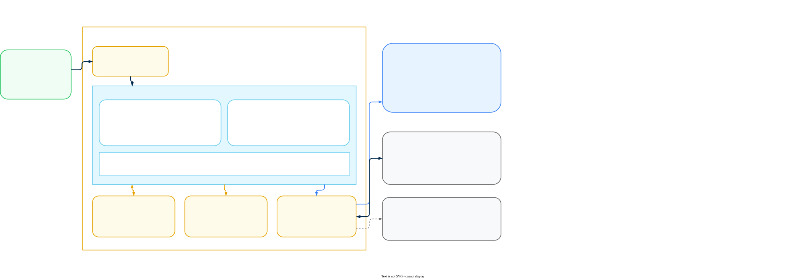

# AI Gateway on EKS, AKS, and GKE

Deploy a Prisma AIRS AI Gateway hybrid data plane on Amazon EKS, Azure AKS, or Google GKE with Helm, from cluster preparation through the cache and log store, workload identity, `values.yaml`, ingress, outbound connectivity to the management plane, and end-to-end verification.

**Related:** [Deployment Guide](ai-gateway-deployment.html) | [Hybrid Infrastructure](hybrid-infrastructure.md) | [ECS and Container Apps](serverless-deployment.md) | [LLM API Key Management](llm-api-key-management.html)

---

## Guide Approach

This is a companion to the [AI Gateway Deployment Guide](ai-gateway-deployment.html) and to the [AI Gateway Hybrid Infrastructure](hybrid-infrastructure.md) guide. It covers the three managed Kubernetes platforms: Amazon EKS, Azure AKS, and Google GKE. All three are delivered by Helm and a `values.yaml` file, so the workflow is the same on each and only the cloud-specific pieces differ.

It does not repeat licensing, activation, or the Strata Cloud Manager (SCM) configuration that follows deployment. Those live in the deployment guide and you need them whichever platform you land on. It also does not repeat the two-plane architecture discussion or the platform comparison, which live in the hybrid infrastructure guide. If you are not on Kubernetes, the Terraform path for Amazon ECS and Azure Container Apps is in [ECS and Container Apps](serverless-deployment.md).

It does assume you can reach a Kubernetes cluster. If you do not have one, or you have never created one, step 0 builds the account, the tooling, and the cluster from nothing on whichever of the three platforms you choose. Readers who already run clusters should skip that phase and begin at step 1.

Two terms carry the whole guide. The **data plane** is the gateway you run in your own cluster: the pods, the cache, the log store, and the load balancer in front of them. The **management plane** is the Palo Alto Networks service that holds configuration, policy, and analytics, and that you reach through Strata Cloud Manager.

Prisma AIRS AI Gateway is the Portkey gateway, acquired by Palo Alto Networks. You will see the name Portkey throughout: in chart names, repository URLs, environment variable names, hostnames, and the vendor's own documentation. The rebrand has not reached the code, so treat `portkey` and `AIRS AI Gateway` as the same product wherever they appear below.

> **Warning: Two different Helm charts exist, and this guide follows one of them.**
>
> - **`airs-gw`**, from `https://portkey-ai.github.io/airs-gw-helm`, is what the SCM Gateway Registration wizard generates. It is a shorter, opinionated install driven by the values the wizard hands you. That path is documented in Phase 2 of the [AI Gateway Deployment Guide](ai-gateway-deployment.html).
> - **`portkey-ai/gateway`**, from `https://portkey-ai.github.io/helm`, is the full chart the platform deployment pages use. It exposes the cache, the log store, the Data Service, the MCP gateway, ingress, and workload identity as configuration. This guide follows that chart.
>
> Pick one and stay on it. The two charts use different release names and different value keys, and installing both into one namespace produces two gateway Deployments competing for the same registration.

> **Warning: Before you start.** Two things gate everything below.
>
> - **Licensing and activation** &mdash; [License and Activate](#license-and-activate), the first section of this guide, walks the whole procedure. The gateway will deploy without it, but it will not serve traffic.
> <!-- shared:begin id="aigw-credentials-request" -->
> <!-- Generated by sync-shared-content.js from docs/shared/snippets/aigw-credentials-request.md. Do not edit between the markers; edit the snippet and re-run the script. -->
> - **Credentials from Palo Alto Networks** &mdash; you send your Organisation ID and the email address used at signup; they return Docker registry credentials for the gateway images and a Client Auth Key. There is no self-service path to these, and nothing in this guide works without them. Request them early, because this is the step most likely to add days to a deployment.
> <!-- shared:end -->
>
> <!-- shared:begin id="aigw-support-channel"
>      vars='{
>        "channelNote": "Every later step that says \"contact the Palo Alto Networks team\" means the same channel."
>      }' -->
> <!-- Generated by sync-shared-content.js from docs/shared/snippets/aigw-support-channel.md. Do not edit between the markers; edit the snippet and re-run the script. -->
> <!-- TODO: verify the exact support case category with the product team -->
> Raise that request through your Palo Alto Networks account team, or open a case in the [Customer Support Portal](https://support.paloaltonetworks.com/) against Prisma AIRS AI Gateway. Every later step that says "contact the Palo Alto Networks team" means the same channel.
>
> Your Organisation ID is in the SCM browser URL: `https://stratacloudmanager.paloaltonetworks.com/<organisation_id>/`.
> <!-- shared:end -->

> **Note: Connectivity is outbound only.** Palo Alto Networks confirmed on 2026-09-27 that private link is not supported with Strata Cloud Manager and that the only connectivity between a gateway and the cloud is outbound from the gateway. The platform deployment pages still describe an inbound path, because they describe the Portkey product. Read [Connect the Planes](#7-connect-the-planes), step 7.4, before you build against one of those pages.

---

## Architecture

On Kubernetes the gateway is a Helm release in a namespace you own. The chart creates the Deployment, the Service, the ServiceAccount, the image pull secret, and the environment Secret. It can also create an in-cluster Redis and the optional Data Service. Everything outside the cluster, meaning the managed cache, the object store, the load balancer, and the cloud identity that ties them together, you create yourself and reference from `values.yaml`.

The shape of the deployment is the same on all three platforms: stateless gateway pods behind a load balancer, a Redis-compatible cache for synced configuration and counters, an object store for full request and response bodies, and an outbound link to the Palo Alto Networks management plane.

> **Note: Which platform should I pick?**
>
> - **Amazon EKS** &mdash; you are on AWS. Identity comes from IRSA or EKS Pod Identity, and ingress needs the AWS Load Balancer Controller installed before the chart.
> - **Azure AKS** &mdash; you are on Azure. Identity comes from workload identity, a managed identity, or an Entra app registration, and ingress uses the application routing add-on rather than a controller you install yourself.
> - **Google GKE** &mdash; you are on GCP. Identity comes from Workload Identity Federation, and ingress needs a `REGIONAL_MANAGED_PROXY` subnet in the VPC before anything else works.

### A. Amazon EKS



### B. Azure AKS


### C. Google GKE


---

## Deployment Requirements

### Node sizing

The published sizing is a floor for running the gateway, not a capacity model. No requests-per-second figures are published for any of the three platforms.

| Platform | Suggested node type | Minimum per node | Node count |
|---|---|---|---|
| Amazon EKS | `t4g.medium` | 2 vCPU, 4 GiB | 2, one per Availability Zone |
| Azure AKS | `B2ms` | 2 vCPU, 4 GiB | 2, one per Availability Zone |
| Google GKE | Any machine type meeting the floor | 2 vCPU, 4 GiB | 2, one per zone |

Log documents are roughly 10 KB each uncompressed. Multiply by your expected request rate and your retention window to size the bucket.

### Tooling

| Platform | Required on your workstation |
|---|---|
| Amazon EKS | AWS CLI, `eksctl`, `kubectl`, Helm v3 or above |
| Azure AKS | Azure CLI, `kubectl`, Helm v3 or above |
| Google GKE | gcloud CLI, `kubectl`, Helm v3 or above, `gke-gcloud-auth-plugin` |

If any of those are not installed and signed in yet, step 0.4 has the install commands for macOS, Linux, and WSL2, and step 0.5 covers signing in.

### What you request from Palo Alto Networks

Four of these block a step, so raise the ones you need before you start building.

| Request | Needed for | Blocks |
|---|---|---|
| Docker registry username and password | Pulling the gateway and Data Service images | Step 4.1 |
| Client Auth Key | `PORTKEY_CLIENT_AUTH` in `values.yaml` | Step 4.1 |
| AWS account ARN allow-listing | Outbound PrivateLink from EKS | Step 7.3 on AWS |
| Azure subscription allow-listing, then private endpoint approval | Outbound Private Link from AKS | Step 7.3 on Azure |
| GCP project allow-listing, then the service attachment URI and PSC connection approval | Outbound Private Service Connect from GKE | Step 7.3 on GCP |

Your Organisation ID is self-service. Read it out of the SCM browser URL.

> **Warning: `values.yaml` is a credential file.** It carries the Docker registry password and the Client Auth Key in plain text, and depending on your choices it may also carry a Redis password, an Entra client secret, or HMAC keys. Do not commit it. Add it to `.gitignore` before you write anything into it, and keep it in a secret manager or a password vault rather than in the repository that holds your cluster manifests.

---

## License and Activate

AI Gateway is licensed with **flex credits** and activated through a deployment profile in Strata Cloud Manager. None of the Helm work below produces a gateway that serves traffic until this is done, so it comes first. The four steps run in the Customer Support Portal and in SCM; no cluster is involved.

> **Note: If your organisation has already licensed AI Gateway.** Licensing is per tenant, not per data plane. If someone has already run this for your tenant, or you followed Phase 1 of the [AI Gateway Deployment Guide](ai-gateway-deployment.html), you do not repeat it. Jump to the verification at the end of Licensing step 4: if the AI Gateway card is on the AI Security Home page, you are licensed, and you can go straight to [step 0](#0-start-here-accounts-tools-and-a-cluster).

<!-- shared:begin id="aigw-licensing-activation"
     vars='{
       "stepPrereq": "the prerequisites above",
       "stepSizing": "Licensing step 1",
       "stepProfile": "Licensing step 2",
       "stepTsg": "Licensing step 3",
       "stepOpen": "Licensing step 4",
       "deploymentModelRef": "",
       "tsgConceptRef": "",
       "gatewayCardNext": "Seeing the card is all you need here; this guide installs the data plane with Helm rather than through those actions."
     }' -->
<!-- Generated by sync-shared-content.js from docs/shared/snippets/aigw-licensing-activation.md. Do not edit between the markers; edit the snippet and re-run the script. -->
### Licensing step 1: Size your license by monthly token consumption

All AI Gateway metering is token-based. Every AI transaction through the gateway (prompts, MCP interactions, and A2A traffic) draws down flex credits by token usage, and you license the instance against your **maximum expected monthly token consumption**.

The token conversion is the industry standard:

```
1 token = 4 characters of text

estimated monthly tokens = total characters sent and received per month / 4

billion tokens per month = estimated monthly tokens / 1,000,000,000

Example: 12,000,000,000 characters per month
  tokens   = 12,000,000,000 / 4 = 3,000,000,000
  billions = 3,000,000,000 / 1,000,000,000 = 3
```

To build the estimate, inventory the applications, agents, and MCP servers that will route through the gateway, and for each one approximate: requests per month, average prompt size (including system prompts and context), and average response size. Sum the character counts, divide by 4, and add headroom for growth.

> **Warning: Both directions count.** Metering covers the full transaction, not just what you send. Long model responses and large context windows (retrieved documents, tool schemas, conversation history) dominate token counts in most real workloads.

> **Verify.** You have a single number in billions of tokens per month (with growth headroom) to type into the **Billion tokens per month** field in the next step. Round up to a whole number of billions; enter `1` for anything under one billion.

<!-- TODO: verify whether the Billion tokens per month field accepts a decimal such as 0.5 -->

### Licensing step 2: Create the deployment profile and allocate flex credits

The deployment profile is the licensing object that funds AI Gateway. You create it in the **Customer Support Portal** (not Strata Cloud Manager), from the credit pool that holds your flex credits. Creating it and finishing setup (next step) is what activates the gateway for your tenant.

1. Log in to the [Palo Alto Networks Customer Support Portal](https://support.paloaltonetworks.com/).
2. In the left navigation, expand **Products** and select **Software NGFW Credits**. (Flex credits for every Software NGFW and Prisma AIRS product, AI Gateway included, come from the same pools, so this is the right page.)
3. Locate the credit pool that will fund the gateway and click its name (or its row) to open the pool page; if several are listed, pick one whose remaining credits cover your Licensing step 1 estimate. The pool page shows total credits, the allocated and consumed meters, the expiration date, and, at the bottom, the **Current Deployment Profiles** table.
4. Before creating anything, scroll to the **Current Deployment Profiles** table. If a row with product type **AI-GW** already exists from an earlier attempt, do not create another; it already holds a credit allocation. Skip to Licensing step 3 and use that row's **Finish Setup** link. If you created a profile by mistake, contact your Palo Alto Networks account team or CSP Super User to have it removed and its credits returned.
5. Click **Create New Profile** (above the Current Deployment Profiles table).
6. In the **Create Deployment Profile: STEP 1** dialog, the products are laid out in labeled columns. Find the column headed **Prisma AIRS:** and click **AI Gateway** within it so its option is selected. The dialog calls this the firewall type because the same wizard provisions Software NGFW products; AI Gateway is not a firewall, and selecting it here is correct. Click **Next**.
7. Complete the **FORM** stage:
   - **Deployment** &mdash; select the option matching your deployment model: **Managed Service** if you chose SaaS (Palo Alto Networks hosts the data plane), or **Self Service (DIY)** if you chose Hybrid (you host the data plane). This is recorded for tracking only and is not enforced: it does not affect the credit allocation or the usage limit, so a profile created as Managed Service works unchanged for a Hybrid deployment. If you are still undecided, choose Managed Service.
   - **Profile Name** &mdash; a descriptive name, for example `AI-Gateway-Deployment-Profile`.
   - **Billion tokens per month** &mdash; the billions figure you calculated in Licensing step 1.
   - **Bundled** &mdash; no action needed. **Strata Cloud Manager Pro** is bundled with AI Gateway automatically and cannot be deselected. Its cost is included in the credit estimate you see in the next item, so that estimate covers more than AI Gateway alone.
   - **Notes** &mdash; optional.
8. Click **Calculate Estimated Cost**. The dialog shows how many credits this profile will draw and how many remain available in the pool; this is the flex credit allocation.
9. Click **Create Deployment Profile**. The dialog closes and returns you to the **Software NGFW Credits** credit pool page, with your new profile listed in the **Current Deployment Profiles** table at the bottom.

<!-- TODO: verify whether the credit pool page offers a self-service delete for a deployment profile; if it does, name the control in item 4 above -->
<!-- TODO: verify that the Deployment field has no effect on the usage limit shown on the profile row -->

> **Verify.** The new profile appears in the **Current Deployment Profiles** table with product type **AI-GW**, your credit allocation under Credits Consumed / Allocated, a usage limit reflecting your token volume, and an **Auth Code**. Nothing in this guide asks you to enter the Auth Code. Treat it as confidential: do not paste it into tickets, chat, or screenshots you share. The **Finish Setup** link on this row is the entry point for the next step.

### Licensing step 3: Map the deployment profile to a Tenant Service Group

Mapping the deployment profile to a **Tenant Service Group (TSG)** is the link that connects Strata Cloud Manager and the Strata Logging Service to your AI Gateway. The TSG you map becomes the AI Gateway *organization*. The activation form labels the TSG as the **Tenant**.

1. On the same **Software NGFW Credits** credit pool page from Licensing step 2, scroll to the **Current Deployment Profiles** table and click the **Finish Setup** link on your AI-GW profile row. If you navigated away after the last step, get back via **Products > Software NGFW Credits** and reopen the same pool. The **Activate Subscriptions based on Deployment Profile(s)** page opens.
2. Under **Select Customer Support Account**, choose the support account used to create the deployment profile.
3. Under **Specify the Recipient**, select the **Tenant** that will own the gateway. This is the TSG. To confirm which name is yours, match it against the tenant name Strata Cloud Manager displays for the account you logged into in the prerequisites above. If only one tenant is listed, select it.
4. Under **Select Region**, choose your region (for example, **United States - Americas**). The form will not proceed without it.
5. Under **Select Deployment Profile(s)**, check the AI Gateway profile you created (its services column reads **Strata Cloud Manager Pro, AI Runtime Security Gateway**). Profiles already associated with this tenant are pre-checked; leave them checked, so the selected count will read higher than one. Unchecking a pre-checked profile removes its association when you activate. Click **Done**.
6. Leave **Data Loss Prevention** and **Additional Services** at their pre-populated defaults; AI Gateway requires neither. Pick a **Data Loss Prevention** instance from the dropdown, or check **Cloud Identity Engine** (CIE, the Palo Alto Networks directory integration service) and pick its instance, only if you are deliberately associating that service. A greyed-out DLP field means nothing is needed.
7. Check **Agree to the Terms and Conditions**, then click **Activate**.

<!-- TODO: verify the exact SCM location where the tenant name is shown and name it in item 3 above -->

> **Note: Checking whether activation already ran.** To check whether activation already happened, open **Products > Software NGFW Credits**, open the pool, and look at the AI-GW row: an activated profile shows the tenant it was associated with. If it does, do not run this step again; go to Licensing step 4 and wait out the delay there. Re-opening the activation form on an already-associated profile shows it pre-checked; clicking **Activate** again with it checked is harmless, but unchecking it removes the association.

<!-- TODO: verify the exact indicator on the AI-GW row after activation (tenant name in a Tenant column, or a status other than Available) -->

> **Verify.** After you click **Activate**, the form submits without an error message. If an error banner appears instead, correct the field it names and click **Activate** again. SCM and SLS are now linked to the gateway, which also enables Threat Log visibility in the SLS dashboard later. The functional check is the AI Gateway card appearing in Licensing step 4.

<!-- TODO: verify what the page shows after Activate (a confirmation message, a return to the credit pool page, or a status change on the profile row) and state it here -->

### Licensing step 4: Open the AI Gateway in Strata Cloud Manager

With licensing in place, complete setup from inside SCM:

1. Log in to [Strata Cloud Manager](https://stratacloudmanager.paloaltonetworks.com/).
2. In the left navigation, select **AI Security > Home**.
3. On the Home page, locate the **AI Gateway** card under **Select a feature to begin onboarding**. On a fresh tenant (status **Not Started**) it offers three actions: **Go to Gateway Registration**, **Launch AI Gateway**, and **Deploy Hybrid**. Seeing the card is all you need here; this guide installs the data plane with Helm rather than through those actions.

> **Verify.** The AI Gateway card appears on the AI Security Home page with its three actions available, confirming the deployment profile and TSG mapping took effect. A **Not Started** status on the card is expected at this point; it reflects onboarding progress, not a licensing problem. If the card or its actions are missing, wait up to 30 minutes (the deployment profile to TSG association can take that long), refresh, then recheck Licensing step 2 and Licensing step 3.
<!-- shared:end -->

---

## 0. Start Here: Accounts, Tools, and a Cluster

Everything from step 1 onwards assumes three things already exist: a running Kubernetes cluster, a terminal that can talk to it, and a cloud account with enough permission to create load balancers and identities. This phase builds all three from nothing.

If you already have a cluster and `kubectl get nodes` lists it, skip this phase and start at [step 1](#1-prepare-the-cluster).

> **Note: who this phase is for.** You are comfortable pasting commands into a terminal, but you have never created a Kubernetes cluster and you may never have opened your cloud provider's console. You do not need to know Kubernetes before you begin. Each step states what it creates, gives you the command, and tells you what a correct result looks like. The work is done from the command line rather than by clicking through the console, because commands can be copied exactly and reproduced later. The console is used for orientation and for checking results.

### 0.1 &mdash; The vocabulary you need

Eleven terms cover almost everything in this guide. Read them once and refer back when a later step uses one.

| Term | What it means here |
|---|---|
| **Cluster** | The whole Kubernetes system: a control plane run by your cloud provider, plus worker machines that run your software. You create one in step 0.7. |
| **Node** | One worker machine in the cluster, which is a virtual machine you pay for by the hour. This guide uses two so that losing one does not take the gateway down. |
| **Pod** | The smallest unit Kubernetes runs, normally one container. The gateway runs as several identical pods spread across your nodes. |
| **Namespace** | A folder inside the cluster that keeps one application's objects separate from another's. Everything in this guide goes into a namespace called `portkeyai`. |
| **Deployment** | The object that says "keep N copies of this pod running". If a pod dies, the Deployment replaces it. |
| **Service** | A stable internal address for a set of pods. Pod addresses change constantly; the Service address does not. |
| **Ingress** | The object that asks your cloud provider for a real load balancer so traffic from outside the cluster can reach a Service. Step 6 covers this. |
| **ServiceAccount** | An identity inside the cluster. Step 3 links it to a cloud identity so the gateway can reach your cache and your bucket without a stored password. |
| **kubectl** | The command line tool that talks to a cluster. Pronounced "cube control". |
| **Context** | Which cluster `kubectl` is currently pointed at. Getting this wrong is the most common way to configure the wrong cluster, so step 0.8 has you confirm it. |
| **Helm, chart, release** | Helm is a package manager for Kubernetes. A chart is the package. A release is one installation of a chart. `values.yaml` is the settings file you hand the chart, and you build it in step 4. |

> **Verify.** you can answer one question before moving on: what is the difference between a Deployment and a Service? The Deployment keeps the pods running. The Service gives them one address. Steps 5 and 6 create them in that order.

### 0.2 &mdash; What this costs, and how to stop paying

A cluster bills by the hour from the moment it is created, whether or not anything uses it. The charges do not stop when you close your laptop. Nothing in this phase is free tier on any of the three clouds once you add a second node and a load balancer.

| What charges you | Notes |
|---|---|
| Managed control plane | A flat hourly charge on EKS and on GKE. AKS charges nothing for the free tier control plane, which is the default. |
| Worker nodes | Ordinary virtual machine pricing, multiplied by node count. This is usually the largest line. |
| Load balancer | Created in step 6, charged hourly plus a data processing fee, and it keeps charging with zero traffic. |
| Managed cache | Created in step 2. The smallest tier is inexpensive but continuous. |
| Object storage and egress | Small for a trial. Log documents are roughly 10 KB each. |
| Private connectivity | If you complete step 7.3, a private endpoint carries its own hourly charge on all three clouds. |

Price the exact shape you intend to build before you build it, using [the AWS calculator](https://calculator.aws/), [the Azure calculator](https://azure.microsoft.com/pricing/calculator/), or [the Google Cloud calculator](https://cloud.google.com/products/calculator). Rates differ enough by region that a figure quoted here would mislead you.

> **Warning: set a budget alert now, not later.** Each cloud can email you when spend crosses a threshold: AWS Budgets, Azure Cost Management budgets, or Google Cloud budget alerts. Set one before you create the cluster. An alert is the only thing that catches a lab environment left running over a holiday. When you are finished, [Scaling, Upgrades, and Teardown](#scaling-upgrades-and-teardown) has the teardown commands. Delete the cluster rather than scaling it to zero, because the control plane, the load balancer, and the cache all keep billing after the pods are gone.

The remaining steps differ by platform. Pick yours below.

### A. Amazon EKS

#### 0.3 &mdash; Get an AWS account and find your way around the console

If your organisation already has AWS, ask for access to a sandbox or development account rather than a production one. If you are starting alone, create an account at [portal.aws.amazon.com](https://portal.aws.amazon.com/billing/signup). It needs a credit card and takes a few minutes to activate.

Sign in at [console.aws.amazon.com](https://console.aws.amazon.com/). Four controls matter and the rest can wait.

| Control | Where it is | Why you care |
|---|---|---|
| Region selector | Top right, next to your account name | Almost every resource belongs to one region. A cluster created in `us-east-1` is invisible while the console is set to `eu-west-1`. |
| Search bar | Top left | The fastest way to any service. Type `EKS` and press Enter rather than hunting through menus. |
| Account menu | Top right | Shows your 12 digit account ID, which step 3 needs when it builds IAM role ARNs. |
| CloudShell | Terminal icon in the top bar | A browser terminal with the AWS CLI already installed and already signed in. If installing tools locally turns into a fight, do this guide from CloudShell instead. |

> **Warning: the region selector causes more confusion than anything else in the console.** Pick one region now, write it down, and use it for every step in this guide. When a resource you just created does not appear in the console, check the region selector before you check anything else.

> **Verify.** you can sign in, you can read your 12 digit account ID from the account menu, and the region selector shows the region you intend to use.

#### 0.4 &mdash; Install the command line tools

You need four: the AWS CLI to talk to AWS, `eksctl` to create the cluster, `kubectl` to talk to the cluster, and Helm to install the gateway.

**macOS**, using [Homebrew](https://brew.sh/):

```bash
brew install awscli eksctl kubernetes-cli helm
```

**Linux**, x86_64:

```bash
# AWS CLI v2
curl "https://awscli.amazonaws.com/awscli-exe-linux-x86_64.zip" -o awscliv2.zip
unzip -q awscliv2.zip && sudo ./aws/install

# eksctl
curl -sL "https://github.com/eksctl-io/eksctl/releases/latest/download/eksctl_Linux_amd64.tar.gz" \
  | tar xz -C /tmp
sudo mv /tmp/eksctl /usr/local/bin/

# kubectl
curl -LO "https://dl.k8s.io/release/$(curl -sL https://dl.k8s.io/release/stable.txt)/bin/linux/amd64/kubectl"
sudo install -m 0755 kubectl /usr/local/bin/kubectl

# Helm
curl -fsSL https://raw.githubusercontent.com/helm/helm/main/scripts/get-helm-3 | bash
```

> **Note: on Windows, use WSL2.** Every command in this guide is bash, and several use shell features that PowerShell does not share. Install [WSL2 with Ubuntu](https://learn.microsoft.com/windows/wsl/install), open the Ubuntu terminal, and follow the Linux instructions. Trying to translate these commands into PowerShell will cost you more time than installing WSL2.

If a package name has drifted, the vendor instructions are authoritative: [AWS CLI](https://docs.aws.amazon.com/cli/latest/userguide/getting-started-install.html), [eksctl](https://docs.aws.amazon.com/eks/latest/eksctl/installation.html), [kubectl](https://kubernetes.io/docs/tasks/tools/), [Helm](https://helm.sh/docs/intro/install/).

```bash
aws --version      # aws-cli/2.x
eksctl version     # 0.2xx.x
kubectl version --client
helm version       # v3.x
```

> **Verify.** All four print a version. The AWS CLI must report version 2, and Helm must report version 3. Version 1 of the AWS CLI and version 2 of Helm both behave differently enough to break later steps.

#### 0.5 &mdash; Sign in from the terminal

Installing the CLI does not sign you in. There are two ways to do it and the right one depends on how your account is managed.

**If your organisation uses AWS IAM Identity Center or single sign-on**, which most do, this is the preferred path because it issues short lived credentials:

```bash
aws configure sso
# Answer the prompts, then sign in in the browser window it opens.
# Give the profile a name you will remember, then export it:
export AWS_PROFILE=<PROFILE_NAME>
```

**If you are using a standalone account**, create an access key under IAM, then:

```bash
aws configure
# AWS Access Key ID:     paste from the IAM console
# AWS Secret Access Key: paste from the IAM console
# Default region name:   the region you chose in step 0.3
# Default output format: json
```

> **Warning: never create an access key for the root user.** The root user is the email address you signed up with. Create an IAM user or an Identity Center user instead, and turn on multi-factor authentication for the root user while you are in the console. A leaked root access key gives away the entire account with no way to limit the damage.

```bash
aws sts get-caller-identity
```

> **Verify.** This prints your account ID, your user ID, and your ARN. If it reports `Unable to locate credentials`, the sign in did not take. If it prints a different account than you expected, you have another profile set in `AWS_PROFILE`.

#### 0.6 &mdash; Confirm you have enough permission

`eksctl` builds the cluster through CloudFormation, so it needs to create far more than EKS alone: a VPC, subnets, route tables, NAT gateways, security groups, EC2 instances, IAM roles, and an OIDC identity provider. Later steps add ElastiCache, S3, an Elastic Load Balancer, and a PrivateLink endpoint.

In a personal or sandbox account, attach `AdministratorAccess` to your user and move on. In a corporate account, send your cloud administrator the [eksctl minimum IAM policies](https://docs.aws.amazon.com/eks/latest/eksctl/minimum-iam-policies.html) and ask for those plus ElastiCache, S3, and VPC endpoint permissions.

```bash
aws eks list-clusters --region <AWS_REGION>
aws ec2 describe-vpcs --region <AWS_REGION> --max-items 1 >/dev/null && echo "ec2 ok"
aws iam list-roles --max-items 1 >/dev/null && echo "iam ok"
```

> **Verify.** All three succeed. An empty cluster list is a correct answer. An `AccessDenied` on any of them means step 0.7 will fail partway through and leave a half built CloudFormation stack behind, which is tedious to clean up. Resolve the permission first.

#### 0.7 &mdash; Create the cluster

This single command creates a VPC across two Availability Zones, an EKS control plane, a managed node group with two nodes, and the IAM OIDC provider that step 1.3 would otherwise ask you to add by hand.

```bash
cluster_name=aigw-cluster        # lower case, starts with a letter, hyphens allowed
region=<AWS_REGION>              # the region you chose in step 0.3

eksctl create cluster \
  --name $cluster_name \
  --region $region \
  --version 1.31 \
  --nodegroup-name aigw-nodes \
  --node-type t4g.medium \
  --nodes 2 \
  --nodes-min 2 \
  --nodes-max 4 \
  --with-oidc \
  --managed
```

Expect this to take 15 to 20 minutes. It prints a long stream of CloudFormation progress lines and appears to hang at several points. That is normal. Do not interrupt it, because a cancelled run leaves a partial stack that you then have to delete by hand.

| Flag | Why it is there |
|---|---|
| `--node-type t4g.medium` | Matches the floor in [Deployment Requirements](#deployment-requirements): 2 vCPU and 4 GiB. These are Arm nodes and the gateway image supports them. If you hit an image architecture error later, switch to `t3.medium` and recreate the node group. |
| `--nodes 2` | Two nodes, which eksctl spreads across Availability Zones. One node means a single zone failure takes the gateway down. |
| `--with-oidc` | Creates and associates the IAM OIDC provider. This is exactly what step 1.3 does, so doing it here means step 1.3 becomes a check rather than a task. |
| `--managed` | AWS manages the node group lifecycle, including upgrades and replacement. |
| `--version 1.31` | Pins the Kubernetes version so you get a predictable result. Substitute a version your organisation supports if it has a standard. |

> **Note: if it fails in us-east-1.** AWS documents an `UnsupportedAvailabilityZoneException` that occurs most often in `us-east-1`. The error text names the zones that do work. Re-run with those added, for example `--zones=us-east-1a,us-east-1b,us-east-1d`.

```bash
aws eks describe-cluster --name $cluster_name --region $region \
  --query cluster.status --output text
```

> **Verify.** Returns `ACTIVE`. In the console, search for `EKS`, open **Clusters**, and confirm your cluster is listed with status **Active**. If the list is empty, check the region selector.

#### 0.8 &mdash; Point kubectl at the cluster

`eksctl` writes the kubeconfig entry for you, so this usually works already. Run the update command anyway, because it is also how you recover if the file is lost or you move to another workstation.

```bash
aws eks update-kubeconfig --name $cluster_name --region $region

kubectl config current-context
kubectl get nodes
```

> **Warning: check the context before every destructive command.** `kubectl` remembers every cluster you have ever connected to and points at whichever was last selected. If you work with more than one cluster, run `kubectl config current-context` before anything that changes state. Configuring the wrong cluster is the single most common mistake in this phase.

> **Verify.** `kubectl get nodes` lists two nodes, both `Ready`, and `kubectl config current-context` names the cluster you just created. A node stuck in `NotReady` for more than five minutes usually means the node group could not reach the control plane. `kubectl describe node <NAME>` names the reason.

### B. Azure AKS

#### 0.3 &mdash; Get an Azure subscription and find your way around the portal

If your organisation already has Azure, ask for Contributor access to a development subscription. If you are starting alone, sign up at [azure.microsoft.com/free](https://azure.microsoft.com/free/).

Sign in at [portal.azure.com](https://portal.azure.com/). Azure organises things differently from AWS, and two concepts explain most of it.

| Concept | What it does |
|---|---|
| **Subscription** | The billing and quota boundary. You may have access to several, so every command in this guide has to run against the right one. Step 0.5 sets it explicitly. |
| **Resource group** | A named container that holds related resources. Everything you create in this guide goes into one resource group, which makes teardown a single command. There is no AWS equivalent. |
| **Search bar** | Top centre. Type `Kubernetes services` to reach AKS. Faster than the menu. |
| **Cloud Shell** | Terminal icon in the top bar. A browser terminal with the Azure CLI, `kubectl`, and Helm already installed and signed in. A good fallback if local installation gives you trouble. |

Regions exist on Azure too, but they are a property of each resource rather than a global selector, so the portal shows you resources from every region at once. That removes the AWS style "where did it go" problem and replaces it with needing to be deliberate about which region each resource lands in.

> **Verify.** you can sign in, and **Subscriptions** in the portal lists at least one subscription that is **Active**. Note its name or ID; step 0.5 needs it.

#### 0.4 &mdash; Install the command line tools

You need three: the Azure CLI, `kubectl`, and Helm.

**macOS**:

```bash
brew install azure-cli kubernetes-cli helm
```

**Linux**, Debian or Ubuntu:

```bash
# Azure CLI
curl -sL https://aka.ms/InstallAzureCLIDeb | sudo bash

# kubectl, installed through the Azure CLI
sudo az aks install-cli

# Helm
curl -fsSL https://raw.githubusercontent.com/helm/helm/main/scripts/get-helm-3 | bash
```

> **Note: on Windows, use WSL2.** Every command in this guide is bash. Install [WSL2 with Ubuntu](https://learn.microsoft.com/windows/wsl/install) and follow the Linux instructions rather than translating to PowerShell.

Vendor instructions, if a package name has drifted: [Azure CLI](https://learn.microsoft.com/cli/azure/install-azure-cli), [kubectl](https://kubernetes.io/docs/tasks/tools/), [Helm](https://helm.sh/docs/intro/install/).

```bash
az version
kubectl version --client
helm version       # v3.x
```

> **Verify.** All three print a version, and Helm reports version 3.

#### 0.5 &mdash; Sign in and select your subscription

```bash
az login
# Opens a browser. Sign in there, then return to the terminal.

# List what you can see, then pin the one you want
az account list --output table
az account set --subscription "<SUBSCRIPTION_NAME_OR_ID>"
```

Setting the subscription explicitly matters more on Azure than the equivalent step does elsewhere, because the CLI silently uses a default subscription that may not be the one you intend.

```bash
az account show --query "{name:name, id:id, user:user.name}" -o table
```

> **Verify.** The subscription named is the one you intend to build in.

#### 0.6 &mdash; Confirm you have enough permission

Two Azure roles matter here, and having only the first is a common way to get stuck in step 3.

- **Contributor** &mdash; creates the resource group, the cluster, the cache, and the storage account. Enough for steps 0.7 through 2.
- **User Access Administrator**, or **Owner**, or **Role Based Access Control Administrator** &mdash; creates role assignments. Step 3 grants the gateway's managed identity access to your storage account, and a Contributor cannot do that.

If you only hold Contributor, you can still finish this phase. Raise the access request now so it is resolved before you reach step 3.

```bash
az role assignment list \
  --assignee $(az ad signed-in-user show --query id -o tsv) \
  --query "[].roleDefinitionName" -o tsv
```

> **Verify.** The output includes `Owner`, or both `Contributor` and one of the access administrator roles. Subscription level assignments may be inherited from a management group and not appear here, so an empty result is not conclusive. If it is empty, ask your Azure administrator to confirm rather than assuming you are blocked.

#### 0.7 &mdash; Create the resource group and the cluster

The resource group comes first, because on Azure everything has to live inside one.

```bash
RESOURCE_GROUP=aigw-rg
CLUSTER_NAME=aigw-cluster
LOCATION=<AZURE_REGION>          # for example eastus, westeurope

az group create \
  --name ${RESOURCE_GROUP} \
  --location ${LOCATION}

az aks create \
  --resource-group ${RESOURCE_GROUP} \
  --name ${CLUSTER_NAME} \
  --node-count 2 \
  --node-vm-size Standard_B2ms \
  --zones 1 2 \
  --enable-oidc-issuer \
  --enable-workload-identity \
  --generate-ssh-keys
```

Expect 5 to 10 minutes for the cluster.

| Flag | Why it is there |
|---|---|
| `--node-vm-size Standard_B2ms` | Matches the floor in [Deployment Requirements](#deployment-requirements): 2 vCPU and 4 GiB. |
| `--zones 1 2` | Spreads the two nodes across Availability Zones. Not every Azure region offers zones; if the command rejects this flag, drop it and accept that the cluster is single zone. |
| `--enable-oidc-issuer` and `--enable-workload-identity` | These are precisely what step 1.3 applies with `az aks update`. Setting them at creation means step 1.3 becomes a check rather than a task, and you avoid the node pool restart that enabling them later can trigger. |

> **Note: if the command reports that a resource provider is not registered.** A new subscription sometimes has not registered the required providers. Register them, wait a minute, and re-run.
>
> ```bash
> az provider register --namespace Microsoft.ContainerService
> az provider register --namespace Microsoft.Network
> az provider register --namespace Microsoft.Compute
> ```

```bash
az aks show --name ${CLUSTER_NAME} --resource-group ${RESOURCE_GROUP} \
  --query provisioningState -o tsv
```

> **Verify.** Returns `Succeeded`. In the portal, search for **Kubernetes services** and confirm the cluster is listed with status **Succeeded**.

#### 0.8 &mdash; Point kubectl at the cluster

```bash
az aks get-credentials \
  --resource-group ${RESOURCE_GROUP} \
  --name ${CLUSTER_NAME}

kubectl config current-context
kubectl get nodes
```

> **Warning: check the context before every destructive command.** `kubectl` points at whichever cluster was selected last. If you work with more than one, run `kubectl config current-context` before anything that changes state.

> **Verify.** `kubectl get nodes` lists two nodes, both `Ready`, and the current context names your cluster. A node stuck in `NotReady` for more than five minutes needs `kubectl describe node <NAME>` to explain itself.

### C. Google GKE

#### 0.3 &mdash; Get a Google Cloud project and find your way around the console

If your organisation already has Google Cloud, ask for Editor access to a development project. If you are starting alone, sign up at [console.cloud.google.com/freetrial](https://console.cloud.google.com/freetrial).

Sign in at [console.cloud.google.com](https://console.cloud.google.com/). Three things govern everything else.

| Concept | What it does |
|---|---|
| **Project** | The container for all resources, and the equivalent of an AWS account boundary rather than a resource group. The project selector sits in the top bar next to the logo, and picking the wrong project is the Google Cloud version of picking the wrong AWS region. |
| **Billing account** | Must be linked to the project or every create command fails. A new project created outside a trial often has no billing link, and the error message does not always make that obvious. |
| **APIs** | Each service is switched off until you enable its API. This has no equivalent on AWS and catches people constantly. Step 0.6 enables the two you need. |
| **Cloud Shell** | Terminal icon in the top bar. Has gcloud, kubectl, and Helm preinstalled and already signed in. A good fallback. |

> **Verify.** you can sign in, the project selector shows a project you intend to use, and **Billing** shows that project linked to an active billing account.

#### 0.4 &mdash; Install the command line tools

You need the gcloud CLI, `kubectl`, Helm, and one extra component that is easy to miss.

**macOS**:

```bash
brew install --cask google-cloud-sdk
brew install kubernetes-cli helm
gcloud components install gke-gcloud-auth-plugin
```

**Linux**:

```bash
# gcloud CLI
curl -sSL https://sdk.cloud.google.com | bash
exec -l $SHELL

# kubectl and the auth plugin, both through gcloud
gcloud components install kubectl gke-gcloud-auth-plugin

# Helm
curl -fsSL https://raw.githubusercontent.com/helm/helm/main/scripts/get-helm-3 | bash
```

> **Warning: `gke-gcloud-auth-plugin` is required, and its absence produces a confusing error.** Without it, `kubectl` fails against a GKE cluster with a message about no auth provider or an executable not being found, which reads like a broken kubeconfig rather than a missing package. Install it now, in step 0.4, rather than debugging it in step 0.8.

> **Note: on Windows, use WSL2.** Every command in this guide is bash. Install [WSL2 with Ubuntu](https://learn.microsoft.com/windows/wsl/install) and follow the Linux instructions.

Vendor instructions: [gcloud CLI](https://cloud.google.com/sdk/docs/install), [kubectl](https://kubernetes.io/docs/tasks/tools/), [Helm](https://helm.sh/docs/intro/install/).

```bash
gcloud version
kubectl version --client
helm version
gke-gcloud-auth-plugin --version
```

> **Verify.** All four print a version. The fourth is the one people skip, and it is the one that breaks step 0.8.

#### 0.5 &mdash; Sign in and select your project

```bash
gcloud auth login
# Opens a browser. Sign in there, then return to the terminal.

PROJECT_ID_A=<PROJECT_ID>         # the project ID, not the display name
REGION=<GKE_CLUSTER_REGION>      # for example us-central1

gcloud config set project ${PROJECT_ID_A}
gcloud config set compute/region ${REGION}

# Credentials for tools and libraries, which is separate from the CLI sign in
gcloud auth application-default login
```

> **Note: project ID is not project name.** The display name is what you typed at creation. The project ID is the globally unique string Google derived from it, often with digits appended, and it is what every command wants. Read it from the project selector in the console or from `gcloud projects list`.

```bash
gcloud config list
gcloud auth list
```

> **Verify.** The project shown matches `${PROJECT_ID_A}` and your account is marked as active.

#### 0.6 &mdash; Enable the APIs and confirm your permission

Nothing works until the APIs are on. Enabling one takes a few seconds and is safe to repeat.

```bash
gcloud services enable \
  container.googleapis.com \
  compute.googleapis.com \
  iam.googleapis.com \
  storage.googleapis.com
```

For permission, the `roles/container.admin` and `roles/compute.admin` roles cover this phase, and step 3 additionally needs `roles/iam.serviceAccountAdmin` to bind a Kubernetes service account to a Google service account. In a personal project, `roles/owner` covers all of it.

```bash
gcloud services list --enabled --filter="name:container.googleapis.com OR name:compute.googleapis.com" \
  --format="value(config.name)"
```

> **Verify.** Both API names are listed. If the enable command failed with a billing error, the project is not linked to a billing account. Fix that in the console under **Billing** before continuing.

#### 0.7 &mdash; Create the cluster

This creates a regional cluster with Workload Identity Federation already enabled, which is what step 1.3 checks for.

```bash
CLUSTER_NAME=aigw-cluster

gcloud container clusters create ${CLUSTER_NAME} \
  --location=${REGION} \
  --workload-pool=${PROJECT_ID_A}.svc.id.goog \
  --machine-type=e2-standard-2 \
  --num-nodes=1 \
  --enable-ip-alias
```

Expect 5 to 10 minutes.

| Flag | Why it is there |
|---|---|
| `--location=${REGION}` | A region rather than a single zone, so GKE spreads nodes across the zones in that region. Later steps in this guide use `--region`, which remains valid for regional clusters. |
| `--num-nodes=1` | On a regional cluster this is nodes *per zone*, not in total. A three zone region therefore gives you three nodes, which satisfies the two node floor. Check the actual count in the verify step rather than assuming. |
| `--machine-type=e2-standard-2` | 2 vCPU and 8 GiB, which clears the floor in [Deployment Requirements](#deployment-requirements). |
| `--workload-pool` | Turns on Workload Identity Federation. This is what step 1.3 verifies and what step 3 builds on. |
| `--enable-ip-alias` | VPC-native networking, which the load balancer path in step 6 requires. |

> **Note: this uses the default VPC.** Without a `--network` flag the cluster lands in the project's `default` VPC. Step 1.4 asks for `VPC_NAME` when it creates the proxy subnet, so set `VPC_NAME=default` unless you created the cluster in a VPC of your own.

```bash
gcloud container clusters describe ${CLUSTER_NAME} --location=${REGION} \
  --format="value(status)"
```

> **Verify.** Returns `RUNNING`. In the console, open **Kubernetes Engine** and then **Clusters**, and confirm a green tick next to your cluster. If the page offers to enable the API, step 0.6 did not complete.

#### 0.8 &mdash; Point kubectl at the cluster

```bash
gcloud container clusters get-credentials ${CLUSTER_NAME} --location=${REGION}

kubectl config current-context
kubectl get nodes
```

> **Note: if kubectl reports a missing auth provider or plugin.** That is the `gke-gcloud-auth-plugin` from step 0.4. Install it, then re-run `get-credentials` so the kubeconfig entry is rewritten to use it.
>
> ```bash
> gcloud components install gke-gcloud-auth-plugin
> gcloud container clusters get-credentials ${CLUSTER_NAME} --location=${REGION}
> ```

> **Verify.** `kubectl get nodes` lists at least two nodes, all `Ready`, spread across more than one zone, and the current context names your cluster. If you see only one node, the region has a single zone and you should recreate with `--num-nodes=2`.

### You now have what step 1 assumes

A running cluster with at least two nodes, a terminal signed in to your cloud, and `kubectl` pointed at the right place. Creating the cluster the way this phase does also completes some of what follows.

| Later step | State after Phase 0 |
|---|---|
| 1.1 Set your environment variables | Still to do. It re-declares the same variables, which matters if you open a new shell, and it creates the `portkeyai` namespace and the `values.yaml` working directory. |
| 1.2 Confirm node count and sizing | Already satisfied. Run the check anyway; it takes a second. |
| 1.3 Identity prerequisites | Already done on all three platforms. `--with-oidc` on EKS, `--enable-oidc-issuer` with `--enable-workload-identity` on AKS, `--workload-pool` on GKE. Treat step 1.3 as a check. |
| 1.4 Ingress prerequisites | Still to do on every platform. The AWS Load Balancer Controller, the AKS application routing add-on, and the GKE proxy subnet are all separate installs. |

---

## 1. Prepare the Cluster

The chart assumes a cluster that already exists, already has two or more worker nodes spread across zones, and already has the platform features that identity and ingress depend on. Turning those on afterwards usually means recreating something, so do this first.

If you built your cluster in step 0, the identity prerequisite in step 1.3 is already satisfied and you only need to confirm it. Step 1.1 and the ingress prerequisite in step 1.4 still apply.

### A. Amazon EKS

#### 1.1 &mdash; Set your environment variables

Every command below reuses these. Keep the shell open for the rest of the guide, or put them in a file you source.

```bash
cluster_name=<EKS_CLUSTER_NAME>               # The EKS cluster where the gateway will run
namespace=portkeyai                           # Namespace for the gateway
service_account_name=gateway-sa               # Service account the gateway pods will use
region=<AWS_REGION>

kubectl create namespace $namespace --dry-run=client -o yaml | kubectl apply -f -

mkdir -p portkey-gateway && cd portkey-gateway
printf 'values.yaml\n' >> .gitignore
touch values.yaml
```

> **Verify.** `aws eks describe-cluster --name $cluster_name --region $region --query cluster.status --output text` returns `ACTIVE`.

#### 1.2 &mdash; Confirm node count and sizing

```bash
kubectl get nodes -o custom-columns=NAME:.metadata.name,ZONE:.metadata.labels.'topology\.kubernetes\.io/zone',TYPE:.metadata.labels.'node\.kubernetes\.io/instance-type'
```

> **Verify.** at least two nodes appear, in at least two different zones, each `t4g.medium` or larger. If they are all in one zone, a single AZ failure takes the gateway down.

#### 1.3 &mdash; Associate an IAM OIDC provider

IRSA needs the cluster's OIDC issuer registered as an IAM identity provider. Skip this only if you have chosen EKS Pod Identity instead, which is covered in step 3.1.

```bash
oidc_issuer=$(aws eks describe-cluster --name $cluster_name \
  --query "cluster.identity.oidc.issuer" --output text | sed -e "s~https://~~")

# Check whether a provider already exists
aws iam list-open-id-connect-providers | grep $oidc_issuer

# If nothing is returned, create one
eksctl utils associate-iam-oidc-provider --cluster $cluster_name --approve
```

> **Verify.** re-run the `grep` and confirm it now prints a provider ARN ending in your issuer path.

#### 1.4 &mdash; Install the AWS Load Balancer Controller

Both ingress options in step 6 depend on this controller. Install it from the [AWS documentation](https://docs.aws.amazon.com/eks/latest/userguide/lbc-helm.html) if it is not already running, and confirm your VPC and subnets carry the [required tags](https://docs.aws.amazon.com/eks/latest/userguide/network-reqs.html).

```bash
kubectl get deployment -n kube-system aws-load-balancer-controller
```

> **Verify.** the deployment exists and reports its replicas as ready. Without it, an Ingress or a `LoadBalancer` Service will be created in Kubernetes and no AWS load balancer will ever appear.

### B. Azure AKS

#### 1.1 &mdash; Set your environment variables

```bash
CLUSTER_NAME=<AKS_CLUSTER_NAME>
RESOURCE_GROUP=<RESOURCE_GROUP_NAME>
NAMESPACE=portkeyai
SERVICE_ACCOUNT_NAME=gateway-sa

kubectl create namespace ${NAMESPACE} --dry-run=client -o yaml | kubectl apply -f -

mkdir -p portkey-gateway && cd portkey-gateway
printf 'values.yaml\n' >> .gitignore
touch values.yaml
```

> **Verify.** `az aks show --name $CLUSTER_NAME --resource-group $RESOURCE_GROUP --query provisioningState -o tsv` returns `Succeeded`.

#### 1.2 &mdash; Confirm node count and sizing

```bash
kubectl get nodes -o custom-columns=NAME:.metadata.name,ZONE:.metadata.labels.'topology\.kubernetes\.io/zone',TYPE:.metadata.labels.'node\.kubernetes\.io/instance-type'
```

> **Verify.** at least two nodes, in at least two zones, each `B2ms` or larger.

#### 1.3 &mdash; Enable the OIDC issuer and workload identity

Workload identity is the cleanest of the three Azure authentication modes because no secret ends up in `values.yaml`. It has to be enabled on the cluster before you can federate a credential against it.

```bash
az aks update \
  --resource-group ${RESOURCE_GROUP} \
  --name ${CLUSTER_NAME} \
  --enable-oidc-issuer \
  --enable-workload-identity

OIDC_ISSUER=$(az aks show \
  --name ${CLUSTER_NAME} \
  --resource-group ${RESOURCE_GROUP} \
  --query "oidcIssuerProfile.issuerUrl" -o tsv)
echo ${OIDC_ISSUER}
```

> **Verify.** `${OIDC_ISSUER}` prints an `https://` URL. An empty value means the update did not take, and step 3 will fail when it tries to federate against it.

#### 1.4 &mdash; Enable the application routing add-on

This is what gives you a managed NGINX ingress controller on AKS. Pass `--nginx None` so the add-on installs without creating a default controller, then create the controller you actually want in step 6.

```bash
az aks approuting enable \
  --resource-group ${RESOURCE_GROUP} \
  --name ${CLUSTER_NAME} \
  --nginx None
```

> **Verify.** `kubectl get pods -n app-routing-system` lists running pods. Skip this step if you plan to use the Azure Load Balancer with a Kubernetes Service instead of an Ingress.

### C. Google GKE

#### 1.1 &mdash; Set your environment variables

```bash
CLUSTER_NAME=<GKE_CLUSTER_NAME>
PROJECT_ID_A=<PROJECT_ID>
REGION=<GKE_CLUSTER_REGION>
VPC_NAME=<VPC_NAME>
NAMESPACE=portkeyai
KSA=gateway-sa

kubectl create namespace ${NAMESPACE} --dry-run=client -o yaml | kubectl apply -f -

mkdir -p portkey-gateway && cd portkey-gateway
printf 'values.yaml\n' >> .gitignore
touch values.yaml
```

> **Verify.** `gcloud container clusters describe ${CLUSTER_NAME} --region ${REGION} --format="value(status)"` returns `RUNNING`.

#### 1.2 &mdash; Confirm node count and sizing

```bash
kubectl get nodes -o custom-columns=NAME:.metadata.name,ZONE:.metadata.labels.'topology\.kubernetes\.io/zone',TYPE:.metadata.labels.'node\.kubernetes\.io/instance-type'
```

> **Verify.** at least two nodes, in at least two zones, each with 2 vCPU and 4 GiB or more.

#### 1.3 &mdash; Confirm Workload Identity is enabled

```bash
gcloud container clusters describe ${CLUSTER_NAME} \
  --region ${REGION} \
  --format="value(workloadIdentityConfig.workloadPool)"
```

> **Verify.** the command prints `${PROJECT_ID_A}.svc.id.goog`. If it prints nothing, enable it with `gcloud container clusters update ${CLUSTER_NAME} --region ${REGION} --workload-pool=${PROJECT_ID_A}.svc.id.goog` and confirm again before moving on.

#### 1.4 &mdash; Create the regional managed proxy subnet

GCP load balancers need an `ACTIVE` subnet with purpose `REGIONAL_MANAGED_PROXY` in the cluster's VPC. A GKE ingress that never receives an address is usually missing this subnet, and the failure is silent.

```bash
# <SUBNET_CIDR> must fall inside the VPC CIDR, for example 10.0.2.0/23
gcloud compute networks subnets create lb-subnet \
  --purpose=REGIONAL_MANAGED_PROXY \
  --role=ACTIVE \
  --region=${REGION} \
  --network=${VPC_NAME} \
  --range=<SUBNET_CIDR>
```

> **Verify.**
>
> ```bash
> gcloud compute networks subnets list \
>   --filter="purpose=REGIONAL_MANAGED_PROXY AND region:${REGION}" \
>   --format="table(name,ipCidrRange,role)"
> ```
>
> The subnet appears with role `ACTIVE`. Also confirm the HTTP Load Balancing add-on is enabled on the cluster, because the ingress path in step 6 depends on it.

---

## 2. Provision the Cache and the Log Store

The gateway needs a Redis-compatible cache for synced configuration, rate limit counters, and budget counters. It optionally needs an object store for full prompt and completion bodies. Create both now so that step 3 can scope its permissions to real resources.

> **Note: The built-in Redis is the shortcut, not the answer.** The chart ships a single-pod Redis that needs no permissions and no networking. It is fine for a proof of concept. It holds no data across a pod restart, it does not scale with the gateway, and it gives you nothing to monitor, so do not carry it into production.

> **Warning: The log store does not keep prompt content out of the cloud.** In the current AIRS release, prompt and completion bodies reach the Strata Cloud Manager backend regardless of where your log store points. A bucket in your own account is an additional copy, not a residency control. Treat it that way in any data handling conversation.

### A. Amazon EKS

#### 2.1 &mdash; Create the S3 log bucket

```bash
bucket_name=<S3_BUCKET_NAME>
aws s3api create-bucket --bucket $bucket_name --region $region \
  --create-bucket-configuration LocationConstraint=$region
aws s3api put-public-access-block --bucket $bucket_name \
  --public-access-block-configuration "BlockPublicAcls=true,IgnorePublicAcls=true,BlockPublicPolicy=true,RestrictPublicBuckets=true"
```

> **Verify.** `aws s3api get-public-access-block --bucket $bucket_name` reports all four settings as `true`. Note the bucket name and region for step 4.

#### 2.2 &mdash; Provision ElastiCache

Create an ElastiCache for Redis OSS or Valkey cache in the same VPC as the cluster. Then open the path from the nodes to it.

```bash
# Allow the EKS node security group to reach the cache
aws ec2 authorize-security-group-ingress \
  --group-id <ELASTICACHE_SG_ID> \
  --protocol tcp --port 6379 \
  --source-group <EKS_NODE_SG_ID>
```

> **Verify.** from a pod in the cluster, `nc -vz <ElastiCache_Endpoint> 6379` connects. Record the endpoint: use the **Configuration Endpoint** if cluster mode is enabled, and the **Primary Endpoint** if it is not. Using the wrong one produces a connection that appears to work and then fails on the first keyspace operation.

### B. Azure AKS

#### 2.1 &mdash; Create the storage account and container

```bash
STORAGE_ACCOUNT_NAME=<STORAGE_ACCOUNT_NAME>
CONTAINER_NAME=<CONTAINER_NAME>

az storage account create \
  --name ${STORAGE_ACCOUNT_NAME} \
  --resource-group ${RESOURCE_GROUP} \
  --sku Standard_LRS \
  --allow-blob-public-access false

az storage container create \
  --name ${CONTAINER_NAME} \
  --account-name ${STORAGE_ACCOUNT_NAME} \
  --auth-mode login
```

> **Verify.** `az storage container show --name ${CONTAINER_NAME} --account-name ${STORAGE_ACCOUNT_NAME} --auth-mode login` returns the container. Note both names for step 4.

#### 2.2 &mdash; Provision Azure Managed Redis

Create an Azure Managed Redis instance reachable from the AKS cluster. If you intend to authenticate with workload identity, a managed identity, or Entra ID rather than an access key, [enable Microsoft Entra Authentication](https://learn.microsoft.com/en-us/azure/azure-cache-for-redis/cache-azure-active-directory-for-authentication) on the instance now. It cannot be added later without a restart.

> **Verify.** from a pod in the cluster, `nc -vz <Azure_Redis_Endpoint> <Port>` connects. Record the endpoint and port.

### C. Google GKE

#### 2.1 &mdash; Create the GCS log bucket

```bash
GCS_BUCKET_NAME=<GCS_BUCKET_NAME>
gcloud storage buckets create gs://${GCS_BUCKET_NAME} \
  --project=${PROJECT_ID_A} \
  --location=${REGION} \
  --uniform-bucket-level-access \
  --public-access-prevention
```

> **Verify.** `gcloud storage buckets describe gs://${GCS_BUCKET_NAME} --format="value(name,location)"` returns the bucket. Note the name and region for step 4.

#### 2.2 &mdash; Provision Memorystore

Create a Memorystore for Redis or Valkey instance in the same VPC as the cluster, then confirm the firewall permits the cluster to reach it.

> **Verify.** from a pod in the cluster, `nc -vz <MEMORY_STORE_IP> <Port>` connects.

If TLS is enabled on the instance, download its `server-ca.pem` and load it into the cluster now. The gateway reads it from a mounted volume.

```bash
kubectl create secret generic memorystore-tls-certs \
  --from-file=server-ca.pem -n ${NAMESPACE}
```

> **Verify.** `kubectl get secret memorystore-tls-certs -n ${NAMESPACE}` shows one key. You will mount it in step 4.

---

## 3. Grant the Gateway an Identity

The gateway pods need a cloud identity to write logs to the object store, and, if you chose IAM authentication on the cache, to connect to the cache. Each platform binds a cloud identity to the Kubernetes service account named in `values.yaml`, so the service account name has to match exactly across this section and step 4.

### A. Amazon EKS

#### 3.1 &mdash; Create the IAM role

Two mechanisms are available. IRSA is the older and more widely supported one, and it annotates the service account with a role ARN. EKS Pod Identity is newer, needs the Pod Identity Agent installed on the cluster, and needs no annotation. Choose one.

**IRSA:**

```bash
role_name=<IAM_ROLE_NAME>
aws_account_id=$(aws sts get-caller-identity --query Account --output text)
oidc_issuer=$(aws eks describe-cluster --name $cluster_name \
  --query "cluster.identity.oidc.issuer" --output text | sed -e "s~https://~~")

cat >trust-relationship.json <<EOF
{
  "Version": "2012-10-17",
  "Statement": [
    {
      "Effect": "Allow",
      "Principal": {
        "Federated": "arn:aws:iam::${aws_account_id}:oidc-provider/${oidc_issuer}"
      },
      "Action": "sts:AssumeRoleWithWebIdentity",
      "Condition": {
        "StringEquals": {
          "${oidc_issuer}:aud": "sts.amazonaws.com",
          "${oidc_issuer}:sub": "system:serviceaccount:${namespace}:${service_account_name}"
        }
      }
    }
  ]
}
EOF

aws iam create-role --role-name $role_name \
  --assume-role-policy-document file://trust-relationship.json

role_arn=$(aws iam get-role --role-name $role_name --query "Role.Arn" --output text)
echo "$role_arn"
```

**EKS Pod Identity:** install the Pod Identity Agent first, then create a role that trusts the EKS service and associate it.

```bash
role_name=<IAM_ROLE_NAME>
cat >trust-relationship.json <<EOF
{
  "Version": "2012-10-17",
  "Statement": [
    {
      "Sid": "AllowEksAuthToAssumeRoleForPodIdentity",
      "Effect": "Allow",
      "Principal": { "Service": "pods.eks.amazonaws.com" },
      "Action": ["sts:AssumeRole", "sts:TagSession"]
    }
  ]
}
EOF

aws iam create-role --role-name $role_name \
  --assume-role-policy-document file://trust-relationship.json

aws_account_id=$(aws sts get-caller-identity --query Account --output text)
aws eks create-pod-identity-association \
  --cluster-name $cluster_name \
  --role-arn "arn:aws:iam::${aws_account_id}:role/${role_name}" \
  --namespace $namespace \
  --service-account $service_account_name
```

> **Verify.** `echo "$role_arn"` prints the ARN. Record it. IRSA needs it in `values.yaml`; Pod Identity does not.

#### 3.2 &mdash; Attach the S3 policy

```bash
cat >s3-access-policy.json <<EOF
{
  "Version": "2012-10-17",
  "Statement": [
    {
      "Effect": "Allow",
      "Action": ["s3:PutObject", "s3:GetObject"],
      "Resource": ["arn:aws:s3:::${bucket_name}/*"]
    }
  ]
}
EOF

aws iam put-role-policy --role-name $role_name \
  --policy-name s3-access-policy --policy-document file://s3-access-policy.json
```

> **Verify.** `aws iam list-role-policies --role-name $role_name` lists `s3-access-policy`.

#### 3.3 &mdash; Attach the ElastiCache and Bedrock policies

Attach the ElastiCache policy only if you chose IAM authentication on the cache in step 4. Attach the Bedrock policy only if the gateway routes to Bedrock models using this role rather than an API key.

```bash
elasticache_cluster_arn=<ELASTICACHE_REPLICATION_GROUP_ARN>
elasticache_user_arn=<ELASTICACHE_USER_ARN>

cat >elasticache-access-policy.json <<EOF
{
  "Version": "2012-10-17",
  "Statement": [
    {
      "Effect": "Allow",
      "Action": ["elasticache:Connect"],
      "Resource": ["${elasticache_cluster_arn}", "${elasticache_user_arn}"]
    }
  ]
}
EOF

aws iam put-role-policy --role-name $role_name \
  --policy-name elasticache-access-policy --policy-document file://elasticache-access-policy.json

cat >bedrock-access-policy.json <<EOF
{
  "Version": "2012-10-17",
  "Statement": [
    {
      "Effect": "Allow",
      "Action": ["bedrock:InvokeModel", "bedrock:InvokeModelWithResponseStream"],
      "Resource": [
        "arn:aws:bedrock:<region>::foundation-model/<model-id>",
        "arn:aws:bedrock:<region>:<account-id>:provisioned-model/<model-id>"
      ]
    }
  ]
}
EOF

aws iam put-role-policy --role-name $role_name \
  --policy-name bedrock-access-policy --policy-document file://bedrock-access-policy.json
```

> **Verify.** `aws iam list-role-policies --role-name $role_name` lists every policy you attached.

### B. Azure AKS

#### 3.1 &mdash; Create a user-assigned managed identity

```bash
MANAGED_IDENTITY_NAME=portkey-gateway-identity

az identity create \
  --name ${MANAGED_IDENTITY_NAME} \
  --resource-group ${RESOURCE_GROUP}

MANAGED_IDENTITY_CLIENT_ID=$(az identity show \
  --name ${MANAGED_IDENTITY_NAME} \
  --resource-group ${RESOURCE_GROUP} \
  --query clientId -o tsv)
echo ${MANAGED_IDENTITY_CLIENT_ID}
```

> **Verify.** a GUID prints. Record it; `values.yaml` needs it as the service account annotation.

#### 3.2 &mdash; Federate the Kubernetes service account

This is what lets the pod exchange its projected service account token for an Azure token. The `--subject` value has to match the namespace and service account name exactly.

```bash
az identity federated-credential create \
  --name portkey-gateway-federated-cred \
  --identity-name ${MANAGED_IDENTITY_NAME} \
  --resource-group ${RESOURCE_GROUP} \
  --issuer ${OIDC_ISSUER} \
  --subject system:serviceaccount:${NAMESPACE}:${SERVICE_ACCOUNT_NAME} \
  --audiences api://AzureADTokenExchange
```

> **Verify.** `az identity federated-credential list --identity-name ${MANAGED_IDENTITY_NAME} --resource-group ${RESOURCE_GROUP} --query "[].subject" -o tsv` prints your namespace and service account. A mismatch here produces an authentication failure at runtime rather than at deploy time.

#### 3.3 &mdash; Grant access to the container and the cache

```bash
STORAGE_ID=$(az storage account show \
  --name ${STORAGE_ACCOUNT_NAME} \
  --resource-group ${RESOURCE_GROUP} --query id -o tsv)

az role assignment create \
  --assignee ${MANAGED_IDENTITY_CLIENT_ID} \
  --role "Storage Blob Data Contributor" \
  --scope "${STORAGE_ID}/blobServices/default/containers/${CONTAINER_NAME}"
```

If you chose workload identity on the cache, also assign a Redis data access policy.

```bash
REDIS_NAME=<REDIS_NAME>
MANAGED_IDENTITY_OBJECT_ID=$(az identity show \
  --name ${MANAGED_IDENTITY_NAME} \
  --resource-group ${RESOURCE_GROUP} \
  --query principalId -o tsv)

az redisenterprise database access-policy-assignment create \
  --access-policy-assignment-name portkeyGatewayRedisAccess \
  --cluster-name ${REDIS_NAME} \
  --database-name default \
  --resource-group ${RESOURCE_GROUP} \
  --access-policy-name default \
  --object-id ${MANAGED_IDENTITY_OBJECT_ID}
```

If the gateway routes to Azure OpenAI or Azure AI Foundry using this identity rather than an API key, also grant `Cognitive Services OpenAI User` on that resource.

> **Verify.** `az role assignment list --assignee ${MANAGED_IDENTITY_CLIENT_ID} --all -o table` lists the role and the container scope.

### C. Google GKE

#### 3.1 &mdash; Create the Google service account

```bash
GSA=<GSA_NAME>

gcloud iam service-accounts create ${GSA} \
  --display-name="Portkey Gateway Service Account"
```

> **Verify.** `gcloud iam service-accounts describe ${GSA}@${PROJECT_ID_A}.iam.gserviceaccount.com` returns the account.

#### 3.2 &mdash; Bind it to the Kubernetes service account

```bash
gcloud iam service-accounts \
  add-iam-policy-binding ${GSA}@${PROJECT_ID_A}.iam.gserviceaccount.com \
  --role roles/iam.workloadIdentityUser \
  --member "serviceAccount:${PROJECT_ID_A}.svc.id.goog[${NAMESPACE}/${KSA}]"
```

> **Verify.** `gcloud iam service-accounts get-iam-policy ${GSA}@${PROJECT_ID_A}.iam.gserviceaccount.com` shows the binding with your namespace and KSA name.

#### 3.3 &mdash; Grant the project roles

Grant `roles/storage.objectAdmin` for the log bucket. Add `roles/redis.dbConnectionUser` only if you chose IAM authentication on Memorystore, and `roles/aiplatform.user` only if the gateway invokes Vertex AI models with this identity.

```bash
for ROLE in roles/storage.objectAdmin roles/redis.dbConnectionUser roles/aiplatform.user; do
  gcloud projects add-iam-policy-binding ${PROJECT_ID_A} \
    --member="serviceAccount:${GSA}@${PROJECT_ID_A}.iam.gserviceaccount.com" \
    --role="${ROLE}"
done
```

If the bucket, the cache, or Vertex AI lives in a different project, run the same binding against that project ID while keeping the member pointed at the service account's own project.

> **Verify.** `gcloud projects get-iam-policy ${PROJECT_ID_A} --flatten="bindings[].members" --filter="bindings.members:${GSA}@${PROJECT_ID_A}.iam.gserviceaccount.com" --format="value(bindings.role)"` lists each role you granted.

---

## 4. Build values.yaml

Everything the chart needs lives in one file. Build it in four passes: the common block, then the cache, then the log store, then the optional components. Keep the file out of version control.

### 4.1 &mdash; The common block (all platforms)

This part is identical on EKS, AKS, and GKE. `SERVICE_NAME` is a label you choose. `PORTKEY_CLIENT_AUTH` and the registry credentials come from Palo Alto Networks. `ORGANISATIONS_TO_SYNC` is your Organisation ID from the SCM URL.

```yaml
imageCredentials:
  - name: portkey-enterprise-registry-credentials
    create: true
    registry: https://index.docker.io/v1/
    username: <PROVIDED BY PALO ALTO NETWORKS>
    password: <PROVIDED BY PALO ALTO NETWORKS>

images:
  gatewayImage:
    repository: "docker.io/portkeyai/gateway_enterprise"
    pullPolicy: IfNotPresent
    tag: "2.13.0"          # chart default; check the changelog for current
  dataserviceImage:
    repository: "docker.io/portkeyai/data-service"
    pullPolicy: IfNotPresent
    tag: "1.9.0"
  redisImage:
    repository: "docker.io/redis"
    pullPolicy: IfNotPresent
    tag: "7.2-alpine"

environment:
  create: true
  secret: true
  data:
    ANALYTICS_STORE: control_plane
    SERVICE_NAME: <SERVICE_NAME>
    PORTKEY_CLIENT_AUTH: <PROVIDED BY PALO ALTO NETWORKS>
    ORGANISATIONS_TO_SYNC: <ORGANISATION_ID>
```

> **Warning: Pin the image version.** The gateway is versioned and released roughly weekly. The vendor's Enterprise Gateway changelog lists 130 releases, the most recent being `v2.22.0` on 2026-09-11, so `latest` is never your only option. Running `tag: "latest"` with `pullPolicy: Always` means a pod restart can pull a build you never tested, and nothing afterwards records which version was running when something broke.
>
> The chart does not track `latest` either. As of the documentation mirror taken 2026-09-21, its `values.yaml` shipped `gateway_enterprise:2.13.0` and `data-service:1.9.0`. The data service default was the current release; the gateway default sat nine minor versions behind the newest one. Read that as a tested pairing rather than a stale file.
>
> Either omit the `images` block and inherit those defaults, or pin explicitly as shown above and treat a bump as a deliberate change. Check the changelog for the current version before you pin. <!-- TODO: confirm with the product team whether the chart's pinned defaults are the supported pairing, and whether any compatibility matrix exists for running a newer gateway image against an older chart -->

### A. Amazon EKS

#### 4.2 &mdash; The cache block

Add one of these to `values.yaml`, merging into the `environment.data` map you already have.

Built-in Redis, for a proof of concept only:

```yaml
environment:
  data:
    CACHE_STORE: redis
    REDIS_URL: "redis://redis:6379"
    REDIS_TLS_ENABLED: "false"
```

ElastiCache with IAM authentication, which is the option that keeps a password out of the file:

```yaml
serviceAccount:
  create: true
  automount: true
  name: <SERVICE_ACCOUNT_NAME>
  annotations:
    eks.amazonaws.com/role-arn: <ROLE_ARN>        # IRSA only; omit for Pod Identity

environment:
  data:
    CACHE_STORE: aws-elastic-cache
    REDIS_URL: "redis://<ElastiCache_Endpoint>:<Port>"
    REDIS_TLS_ENABLED: "true"
    REDIS_MODE: cluster                            # Only when cluster mode is enabled
    AWS_REDIS_AUTH_MODE: iam
    AWS_REDIS_CLUSTER_NAME: <ELASTICACHE_CLUSTER_NAME>
    REDIS_USERNAME: <ELASTICACHE_USER_ID>
```

ElastiCache with an auth token instead sets `REDIS_PASSWORD: <Auth_Token>` and drops the three IAM keys. ElastiCache with no auth drops the password as well and sets `REDIS_TLS_ENABLED: "false"`.

#### 4.3 &mdash; The log store block

```yaml
serviceAccount:
  create: true
  automount: true
  name: <SERVICE_ACCOUNT_NAME>
  annotations:
    eks.amazonaws.com/role-arn: <ROLE_ARN>        # IRSA only; omit for Pod Identity

environment:
  data:
    LOG_STORE: s3_assume
    LOG_STORE_REGION: "<AWS_BUCKET_REGION>"
    LOG_STORE_GENERATIONS_BUCKET: "<AWS_BUCKET_NAME>"
```

### B. Azure AKS

#### 4.2 &mdash; The cache block

Add one of these to `values.yaml`, merging into the `environment.data` map you already have.

Azure Managed Redis with workload identity:

```yaml
serviceAccount:
  create: true
  automount: true
  name: <SERVICE_ACCOUNT_NAME>
  annotations:
    azure.workload.identity/client-id: <MANAGED_IDENTITY_CLIENT_ID>

podLabels:
  azure.workload.identity/use: "true"

environment:
  data:
    CACHE_STORE: azure-redis
    REDIS_URL: "redis://<Azure_Redis_Endpoint>:<Port>"
    REDIS_TLS_ENABLED: "true"
    REDIS_MODE: cluster                            # Only when cluster mode is enabled
    AZURE_REDIS_AUTH_MODE: workload
```

The other three modes are `password` (with `rediss://`, `REDIS_PASSWORD`, and no identity), `managed` (with `AZURE_REDIS_MANAGED_CLIENT_ID`), and `entra` (with `AZURE_REDIS_ENTRA_CLIENT_ID`, `AZURE_REDIS_ENTRA_CLIENT_SECRET`, and `AZURE_REDIS_ENTRA_TENANT_ID`). The `podLabels` entry is mandatory for `workload`, and a deployment that omits it fails to authenticate with no obvious cause.

#### 4.3 &mdash; The log store block

```yaml
environment:
  data:
    LOG_STORE: azure
    AZURE_STORAGE_ACCOUNT: <STORAGE_ACCOUNT_NAME>
    AZURE_STORAGE_CONTAINER: <STORAGE_CONTAINER>
    AZURE_AUTH_MODE: workload
```

Set `AZURE_AUTH_MODE: managed` with `AZURE_MANAGED_CLIENT_ID`, or `entra` with the three `AZURE_ENTRA_*` keys, if you chose one of those modes in step 3.

### C. Google GKE

#### 4.2 &mdash; The cache block

Add one of these to `values.yaml`, merging into the `environment.data` map you already have.

Memorystore with Workload Identity Federation:

```yaml
serviceAccount:
  create: true
  automount: true
  name: <KSA>
  annotations:
    iam.gke.io/gcp-service-account: <GSA>@<PROJECT_ID_A>.iam.gserviceaccount.com

environment:
  data:
    CACHE_STORE: gcp-memory-store
    GCP_REDIS_AUTH_MODE: workload
    REDIS_URL: "redis://<MEMORY_STORE_IP>:<Port>"
    REDIS_TLS_ENABLED: "false"
    REDIS_MODE: cluster                            # Only when cluster mode is enabled
```

If TLS is enabled on the instance, add the mount for the secret you created in step 2.2:

```yaml
environment:
  data:
    REDIS_TLS_CERTS: /etc/ssl/certs/server-ca.pem
    REDIS_TLS_ENABLED: "true"

volumes:
  - name: memorystore-tls-certs
    secret:
      secretName: memorystore-tls-certs

volumeMounts:
  - name: memorystore-tls-certs
    mountPath: /etc/ssl/certs/server-ca.pem
    subPath: server-ca.pem
```

An AUTH string instead sets `REDIS_PASSWORD` and drops `GCP_REDIS_AUTH_MODE`.

#### 4.3 &mdash; The log store block

```yaml
environment:
  data:
    LOG_STORE: gcs_assume
    GCP_AUTH_MODE: workload
    LOG_STORE_REGION: <GCS_BUCKET_REGION>
    LOG_STORE_GENERATIONS_BUCKET: <GCS_BUCKET_NAME>
```

HMAC access instead uses `LOG_STORE: gcs` with `LOG_STORE_ACCESS_KEY` and `LOG_STORE_SECRET_KEY`, and needs no service account annotation. It also puts two long-lived keys into the file, so prefer Workload Identity Federation.

### 4.4 &mdash; Optional components (all platforms)

The MCP gateway is off by default. `SERVER_MODE` accepts `""` for the AI gateway alone, `"mcp"` for the MCP gateway alone, and `"all"` for both. Leave `MCP_GATEWAY_BASE_URL` unset on the first install, because the load balancer that it points at does not exist yet. Set it on a second pass after step 6.

```yaml
environment:
  data:
    SERVER_MODE: "all"
    MCP_PORT: "8788"
    MCP_GATEWAY_BASE_URL: "https://<MCP hostname>"   # Second pass only
```

The Data Service handles batch processing, fine-tuning, and log exports. Enable it only if you need one of those.

```yaml
dataservice:
  name: "dataservice"
  enabled: true
  env:
    DEBUG_ENABLED: false
    SERVICE_NAME: "portkeyenterprise-dataservice"
  serviceAccount:
    create: false
    name: <SERVICE_ACCOUNT_NAME>
```

> **Warning: `SERVER_MODE: "all"` forces host-based ingress.** Running both gateways behind one load balancer requires `ingress.hostBased: true`, a hostname for each gateway, and two DNS records. Decide this before step 6, because switching later means rebuilding the ingress and the DNS records.

### 4.5 &mdash; Service type and health probes (all platforms)

Two chart defaults are worth setting deliberately rather than inheriting. Both are visible in the chart's `values.yaml`, and neither is called out on the platform deployment pages.

> **Warning: always set `service.type` explicitly.** The chart ships `service.type: NodePort`. If you leave it out, Kubernetes opens a high-numbered port on every node in the cluster and forwards it to the gateway, so anything that can reach a node IP reaches the gateway directly. That path skips your ingress, and with it the TLS you configure in step 6, while the gateway API key still travels as a bearer header in plain HTTP. Every example in step 6 sets `type:` explicitly for this reason: `ClusterIP` when an Ingress fronts the gateway, `LoadBalancer` when the Service itself is the entry point.

The chart also defines liveness and readiness probes against `/v1/health` on the gateway port, so you do not need to write them. What you may want to change is the timing:

```yaml
service:
  type: ClusterIP        # or LoadBalancer; never inherit the NodePort default
  port: 8787

livenessProbe:
  httpGet:
    path: /v1/health     # port omitted: the chart targets the active server port
  initialDelaySeconds: 5
  periodSeconds: 10      # chart default is 60
  timeoutSeconds: 3
  failureThreshold: 3
readinessProbe:
  httpGet:
    path: /v1/health
  initialDelaySeconds: 5
  periodSeconds: 10      # chart default is 60
  timeoutSeconds: 3
  successThreshold: 1
  failureThreshold: 3
```

At the chart's 60-second period and a failure threshold of 3, both probes take roughly two minutes to react. A wedged pod keeps its place in the Service endpoints and keeps taking requests for that whole window. Dropping the period to 10 seconds cuts it to about 30 seconds at a negligible cost, since `/v1/health` is a local check.

The chart defines no `startupProbe`. With liveness on the same endpoint, a pod that is slow to start gets restarted at around the two-minute mark and then restarts again on the next attempt. If your first sync with the management plane is slow, or the node is pulling the image cold, add a `startupProbe` on `/v1/health` with a high `failureThreshold`: Kubernetes suspends liveness until the startup probe passes, so a slow start no longer looks like a failure.

If you enabled the Data Service in step 4.4, note that it uses a different endpoint: `/health` on port `8081`, not `/v1/health` on `8787`. The chart already ships startup, liveness, and readiness probes for it on a 10-second period, so there is nothing to tune there.

> **Verify.** After the install in step 5, confirm the Service type is what you set and that no unexpected node port was allocated:
>
> ```bash
> kubectl get svc -n $namespace -o custom-columns=NAME:.metadata.name,TYPE:.spec.type,PORTS:.spec.ports[*].port,NODEPORTS:.spec.ports[*].nodePort
> ```
>
> The `NODEPORTS` column reads `<none>` on a `ClusterIP` Service. A number there on a Service you expected to be internal means the gateway is reachable on every node.

---

## 5. Install the Chart

### 5.1 &mdash; Add the repository and install

```bash
helm repo add portkey-ai https://portkey-ai.github.io/helm
helm repo update

helm upgrade --install portkey-ai portkey-ai/gateway \
  -f ./values.yaml -n $namespace --create-namespace
```

On AKS and GKE substitute `${NAMESPACE}` for `$namespace`, matching the variable you set in step 1.1.

> **Verify.** `helm status portkey-ai -n $namespace` reports `STATUS: deployed`.

### 5.2 &mdash; Confirm the pods are running

```bash
kubectl get pods -n $namespace
```

> **Verify.** every pod reports `Running` and shows its containers ready. A gateway pod, and a Redis pod if you kept the built-in cache, and a Data Service pod if you enabled it.

If a pod sits in `Pending`, `ImagePullBackOff`, or `CrashLoopBackOff`, read the events and the logs before changing anything:

```bash
kubectl describe pod <POD_NAME> -n $namespace
kubectl logs <POD_NAME> -n $namespace --tail=100
```

`ImagePullBackOff` almost always means the registry credentials in step 4.1 are wrong or were never applied. `CrashLoopBackOff` with an authentication error in the logs points at the cache or log store identity from step 3.

---

## 6. Expose the Gateway

Your applications need a stable address for the gateway. Each platform offers an Ingress path and a Service path, and the choice changes which load balancer the cloud creates. Add the block to `values.yaml` and re-run the `helm upgrade --install` command from step 5.1.

> **Warning: Add TLS before real traffic reaches the gateway.** The vendor's published examples all listen on port 80 with no certificate. The gateway carries workspace API keys in a bearer header and full prompt and response bodies, so anything beyond a lab test needs a certificate in front of it.
>
> The chart does support this. `ingress.tls` is listed in the chart's `Configuration.md` as "TLS configuration for ingress", an array defaulting to `[]`. What you put in it depends on the controller, because the three platforms source a certificate in different ways:
>
> | Platform | Certificate source | Uses `ingress.tls`? |
> |---|---|---|
> | EKS &mdash; ALB | An ACM certificate named in an annotation. The ALB terminates TLS itself. | No, annotation only |
> | AKS &mdash; NGINX | A Kubernetes Secret holding the certificate and key, usually issued by cert-manager. | Yes |
> | GKE &mdash; GCE | A Google-managed certificate by annotation, or your own Secret. | Either |
>
> Each platform section below adds the TLS lines to its own example. <!-- TODO: verify the recommended cipher suite and minimum TLS version with the product team; confirm the chart template renders ingress.tls into the Ingress spec.tls field (chart templates are not in the doc mirror, only values.yaml and Configuration.md) -->

### A. Amazon EKS

#### 6.1 &mdash; Choose ALB with an Ingress, or NLB with a Service

An ALB gives you layer-7 routing, host-based routing for `SERVER_MODE: all`, and per-path health checks. An NLB gives you layer-4 pass-through and a static IP per zone. Both require the AWS Load Balancer Controller from step 1.4.

ALB with an Ingress:

```yaml
service:
  type: ClusterIP
  port: 8787

ingress:
  enabled: true
  ingressClassName: "alb"
  # hostname: "<AI Gateway Hostname>"
  # hostBased: false
  # mcpHostname: "<MCP Gateway Hostname>"
  annotations:
    alb.ingress.kubernetes.io/load-balancer-name: portkey-gateway
    alb.ingress.kubernetes.io/scheme: internal            # 'internet-facing' to expose publicly
    alb.ingress.kubernetes.io/target-type: ip
    alb.ingress.kubernetes.io/healthcheck-path: /v1/health
    alb.ingress.kubernetes.io/inbound-cidrs: <X.X.X.X/Y>  # Your application CIDRs only
    alb.ingress.kubernetes.io/manage-backend-security-group-rules: "true"
    # TLS: the ALB terminates it, so leave ingress.tls empty and point at ACM
    alb.ingress.kubernetes.io/certificate-arn: arn:aws:acm:<region>:<account-id>:certificate/<cert-id>
    alb.ingress.kubernetes.io/listen-ports: '[{"HTTPS":443}]'
```

Listing only `HTTPS` in `listen-ports` means no port 80 listener is created, so there is nothing to redirect and no plaintext path to leave open by accident. If you do add an `HTTP` entry, pair it with `alb.ingress.kubernetes.io/ssl-redirect: "443"`.

NLB with a Service:

```yaml
service:
  type: LoadBalancer
  port: 80
  containerPort: 8787
  annotations:
    service.beta.kubernetes.io/aws-load-balancer-type: "nlb"
    service.beta.kubernetes.io/aws-load-balancer-internal: "true"
    service.beta.kubernetes.io/aws-load-balancer-nlb-target-type: "ip"
    service.beta.kubernetes.io/aws-load-balancer-healthcheck-path: "/v1/health"
    service.beta.kubernetes.io/aws-load-balancer-healthcheck-protocol: "http"
    service.beta.kubernetes.io/aws-load-balancer-healthcheck-port: "8787"
    service.beta.kubernetes.io/aws-load-balancer-manage-backend-security-group-rules: "true"
```

`service.containerPort` must equal `environment.data.PORT`. The chart defaults both to `8787`, so leave them alone unless you have a reason.

> **Verify.**
>
> ```bash
> kubectl get ingress -n $namespace          # ALB path
> kubectl get svc -n $namespace              # NLB path
> ```
>
> An address appears within a few minutes. If the `ADDRESS` column stays empty, check the controller logs with `kubectl logs -n kube-system deployment/aws-load-balancer-controller`.

#### 6.2 &mdash; Restrict the source range

`inbound-cidrs` on the ALB path, or the security group the controller manages on the NLB path, decides who can reach the gateway. Set it to the CIDRs your applications run in. Do not leave it at `0.0.0.0/0`, and do not add any Palo Alto Networks address; see step 7.4.

> **Verify.** from outside the allowed range, a request to the load balancer times out. From inside it, step 8 succeeds.

### B. Azure AKS

#### 6.1 &mdash; Create the NGINX ingress controller

This path uses the application routing add-on you enabled in step 1.4. Create the controller you want, external with a static public IP or internal with a private IP.

External with a static IP:

```bash
STATIC_IP_NAME=portkey-lb-static-ip

az network public-ip create \
  --resource-group ${RESOURCE_GROUP} \
  --name ${STATIC_IP_NAME} \
  --sku Standard \
  --allocation-method static

CLIENT_ID=$(az aks show --name ${CLUSTER_NAME} --resource-group ${RESOURCE_GROUP} --query identity.principalId -o tsv)
RG_SCOPE=$(az group show --name ${RESOURCE_GROUP} --query id -o tsv)
az role assignment create \
  --assignee ${CLIENT_ID} \
  --role "Network Contributor" \
  --scope ${RG_SCOPE}

kubectl apply -f - <<EOF
apiVersion: approuting.kubernetes.azure.com/v1alpha1
kind: NginxIngressController
metadata:
  name: nginx-static
spec:
  ingressClassName: nginx-static
  controllerNamePrefix: nginx-static
  loadBalancerAnnotations:
    service.beta.kubernetes.io/azure-pip-name: "${STATIC_IP_NAME}"
    service.beta.kubernetes.io/azure-load-balancer-resource-group: "${RESOURCE_GROUP}"
EOF
```

Internal with a private IP:

```bash
kubectl apply -f - <<EOF
apiVersion: approuting.kubernetes.azure.com/v1alpha1
kind: NginxIngressController
metadata:
  name: nginx-internal
spec:
  ingressClassName: nginx-internal
  controllerNamePrefix: nginx-internal
  loadBalancerAnnotations:
    service.beta.kubernetes.io/azure-load-balancer-internal: "true"
EOF
```

> **Verify.** `kubectl get nginxingresscontroller` reports the controller as available.

#### 6.2 &mdash; Point the chart at the controller

```yaml
ingress:
  enabled: true
  ingressClassName: "nginx-internal"     # or 'nginx-static'
  hostname: "<AI Gateway Hostname>"
  # hostBased: true
  # mcpHostname: "<MCP Gateway Hostname>"
  annotations:
    service.beta.kubernetes.io/azure-load-balancer-health-probe-request-path: "/v1/health"
    cert-manager.io/cluster-issuer: "<your-cluster-issuer>"   # omit if you supply the Secret yourself
  tls:
    - secretName: aigw-tls
      hosts:
        - "<AI Gateway Hostname>"
```

NGINX reads the certificate from the Secret named in `tls.secretName`. With the cert-manager annotation present, cert-manager creates that Secret for you and renews it; without it, create the Secret yourself with `kubectl create secret tls aigw-tls --cert=<file> --key=<file> -n ${NAMESPACE}`. The `hosts` entry has to match `hostname`, or NGINX serves its own default certificate and clients see a name mismatch.

If you set `hostBased: true` for a separate MCP hostname, add that hostname to the same `hosts` list, or give it its own `tls` entry.

The alternative, skipping NGINX entirely, is an Azure Load Balancer fronting a Kubernetes Service:

```yaml
service:
  type: LoadBalancer
  port: 80
  containerPort: 8787
  annotations:
    service.beta.kubernetes.io/azure-load-balancer-internal: "true"
    service.beta.kubernetes.io/azure-load-balancer-health-probe-protocol: "http"
    service.beta.kubernetes.io/azure-load-balancer-health-probe-request-path: "/v1/health"
    service.beta.kubernetes.io/azure-allowed-ip-ranges: <X.X.X.X/Y>
```

Set `azure-allowed-ip-ranges` to your application CIDRs. The published example uses `0.0.0.0/0`, which exposes the gateway to everything that can route to it.

> **Verify.**
>
> ```bash
> IP=$(kubectl get ingress portkey-ai-gateway -n ${NAMESPACE} -o jsonpath='{.status.loadBalancer.ingress[0].ip}')
> echo ${IP}
> ```
>
> An address prints. Then create a DNS record in your public or private zone pointing at it. With `SERVER_MODE: all` you create two records, one per hostname, both pointing at the same address.

### C. Google GKE

#### 6.1 &mdash; Choose the Ingress or the Service

Both depend on the `REGIONAL_MANAGED_PROXY` subnet from step 1.4 and on the HTTP Load Balancing add-on.

Application Load Balancer with an Ingress:

```yaml
ingress:
  enabled: true
  ingressClassName: gce                  # 'gce-internal' for an internal load balancer
  # hostname: "<AI Gateway Hostname>"
  # hostBased: true
  # mcpHostname: "<MCP Gateway Hostname>"
  annotations:
    kubernetes.io/ingress.class: gce     # 'gce-internal' for an internal load balancer
    ingress.gcp.kubernetes.io/healthcheck-path: /v1/health
    networking.gke.io/managed-certificates: "aigw-cert"   # external only; see below
  # Bring your own certificate instead of a Google-managed one:
  # tls:
  #   - secretName: aigw-tls
  #     hosts:
  #       - "<AI Gateway Hostname>"
```

GKE offers two certificate mechanisms and the load balancer scheme decides which is available to you.

- **Google-managed certificate** &mdash; create a `ManagedCertificate` resource named `aigw-cert` and reference it by annotation. Google provisions and renews it, but only for an external load balancer, and the hostname must already resolve publicly to the ingress IP before provisioning completes.
- **Your own Secret** &mdash; uncomment the `tls` block. This is the only option on `gce-internal`, since managed certificates do not support internal load balancers.

A managed certificate stays in `Provisioning` until DNS resolves to the ingress address, which can take up to roughly fifteen minutes after the record propagates. Check it with `kubectl describe managedcertificate aigw-cert -n ${NAMESPACE}` and wait for `Active` before testing over HTTPS.

Load balancer with a Service:

```yaml
service:
  type: LoadBalancer
  port: 80
  containerPort: 8787
  annotations:
    cloud.google.com/l4-rbs: "enabled"                    # External load balancer
    # networking.gke.io/load-balancer-type: "Internal"    # Internal load balancer
    spec.loadBalancerSourceRanges: "<X.X.X.X/Y>"
```

> **Verify.**
>
> ```bash
> kubectl get ingress -n ${NAMESPACE}
> kubectl get svc -n ${NAMESPACE}
> ```
>
> An address appears. A GKE ingress can take several minutes and will stay blank indefinitely if the proxy subnet from step 1.4 is missing or not `ACTIVE`, so re-check that first when nothing happens.

#### 6.2 &mdash; Restrict the source range

Set `spec.loadBalancerSourceRanges` on the Service path, or a Cloud Armor policy on the Ingress path, to your application CIDRs.

> **Verify.** a request from outside the range fails, and step 8 succeeds from inside it.

---

## 7. Connect the Planes

The gateway registers itself, pulls configuration and policy, and reports metrics and usage over an outbound connection to the management plane. Only one direction is required, and it is outbound from the gateway. The platform deployment pages also describe an inbound direction; do not build it, for the reasons in step 7.4.

### 7.1 &mdash; Allow outbound egress (all platforms)

Kubernetes permits all egress by default. If your cluster applies NetworkPolicies that restrict it, the gateway needs an explicit allowance or it will never register.

```yaml
apiVersion: networking.k8s.io/v1
kind: NetworkPolicy
metadata:
  name: allow-gateway-egress
  namespace: portkeyai
spec:
  podSelector: {}
  policyTypes:
    - Egress
  egress:
    - to:
        - ipBlock:
            cidr: 0.0.0.0/0
```

Narrow that CIDR to the destinations the gateway actually needs, which are the management plane endpoints, your cache, your log store, and every model provider you route to. A broad rule is the published example, not a recommendation.

> **Verify.** `kubectl exec -n $namespace <POD_NAME> -- curl -sS -o /dev/null -w '%{http_code}\n' https://albus.portkey.ai` returns an HTTP status rather than hanging.

### 7.2 &mdash; Reach the management plane over the internet (all platforms)

The simplest path is over the internet. The gateway needs outbound access to two endpoints and nothing else changes in `values.yaml`.

- `https://aigw.portkey.ai`
- `https://albus.portkey.ai`

If you need the traffic to stay off the public internet, each cloud has a private outbound path. All three need Palo Alto Networks to allow-list your account first, so raise that request before you start.

### A. Amazon EKS

#### 7.3 &mdash; Private outbound over AWS PrivateLink

1. Send your AWS account ARN to the Palo Alto Networks team and wait for confirmation that it is allow-listed.
2. In the VPC console, in the region where the gateway runs, create an endpoint under **PrivateLink Ready partner services**.
3. For **Service name**, enter `com.amazonaws.vpce.us-east-1.vpce-svc-0c2c1c323d9f56d95`. If the gateway is outside `us-east-1`, select **Enable Cross Region endpoint**, choose `us-east-1`, and click **Verify service**.
4. Under **Network settings**, choose the gateway's VPC and at least two subnets in different Availability Zones. Attach a security group that allows inbound TCP 443 from the gateway pods.
5. Wait for the status to reach `Available`, then choose **Actions > Modify private DNS name** and enable it for the endpoint.
6. Add the basepaths to `values.yaml` and re-run the install.

```yaml
environment:
  create: true
  secret: true
  data:
    ALBUS_BASEPATH: "https://aws-cp.portkey.ai/albus"
    CONTROL_PLANE_BASEPATH: "https://aws-cp.portkey.ai/api/v1"
    SOURCE_SYNC_API_BASEPATH: "https://aws-cp.portkey.ai/api/v1/sync"
    CONFIG_READER_PATH: "https://aws-cp.portkey.ai/api/model-configs"
```

> **Verify.** from a gateway pod, `nslookup aws-cp.portkey.ai` resolves to a private address inside your VPC. A public address means private DNS is not enabled on the endpoint.

### B. Azure AKS

#### 7.3 &mdash; Private outbound over Azure Private Link

1. Send your Azure subscription ID to the Palo Alto Networks team and wait for confirmation.
2. Create the private endpoint in the subnet where the gateway runs. `<SUBNET_ID>` is the full resource ID, not the name.

```bash
az network private-endpoint create \
  --name portkey-cp-pvt-endpoint \
  --resource-group ${RESOURCE_GROUP} \
  --subnet <SUBNET_ID> \
  --private-connection-resource-alias "portkey-privatelink-pls.4c0cb660-8f0d-49ad-beee-b234fa25cb40.eastus2.azure.privatelinkservice" \
  --connection-name portkey-cp-pvt-connection

PE_IP=$(az network nic show --ids $(az network private-endpoint show \
  --name portkey-cp-pvt-endpoint --resource-group ${RESOURCE_GROUP} \
  --query "networkInterfaces[0].id" -o tsv) \
  --query "ipConfigurations[0].privateIPAddress" -o tsv)
echo ${PE_IP}
```

3. Send the endpoint name to the Palo Alto Networks team and wait for the connection to be approved.
4. Create the private DNS zone and link it to the AKS **node group's** VNet. That VNet is in the `MC_*` resource group, not the one holding the cluster object, and `<VNET_ID>` must be the full resource ID. Getting this wrong is the usual cause of a connection that approves cleanly and then never resolves.

```bash
az network private-dns zone create \
  --resource-group ${RESOURCE_GROUP} \
  --name privatelink-az.portkey.ai

az network private-dns link vnet create \
  --resource-group ${RESOURCE_GROUP} \
  --zone-name privatelink-az.portkey.ai \
  --name portkey-gateway-vnet-link \
  --virtual-network "<VNET_ID>" \
  --registration-enabled false

az network private-dns record-set a add-record \
  --resource-group ${RESOURCE_GROUP} \
  --zone-name privatelink-az.portkey.ai \
  --record-set-name azure-cp \
  --ipv4-address ${PE_IP}
```

5. Add the basepaths and re-run the install.

```yaml
environment:
  create: true
  secret: true
  data:
    ALBUS_BASEPATH: "https://private.azure-cp.portkey.ai/albus"
    CONTROL_PLANE_BASEPATH: "https://private.azure-cp.portkey.ai/api/v1"
    SOURCE_SYNC_API_BASEPATH: "https://private.azure-cp.portkey.ai/api/v1/sync"
    CONFIG_READER_PATH: "https://private.azure-cp.portkey.ai/api/model-configs"
```

> **Verify.** from a gateway pod, `nslookup azure-cp.privatelink-az.portkey.ai` returns `${PE_IP}`.

### C. Google GKE

#### 7.3 &mdash; Private outbound over GCP Private Service Connect

1. Create a subnet in `us-east4` if you do not already have one, and an address for the endpoint.

```bash
gcloud compute networks subnets create psc-endpoint-subnet \
  --network=${VPC_NAME} \
  --range=<SUBNET_CIDR> \
  --region=us-east4

gcloud compute addresses create psc-endpoint-ip \
  --region=us-east4 \
  --subnet=psc-endpoint-subnet
```

2. Send your GCP project ID to the Palo Alto Networks team and request private connectivity. They return a `SERVICE_ATTACHMENT_URI`.
3. Create the forwarding rule against that attachment.

```bash
gcloud compute forwarding-rules create portkey-cp-pvt-endpoint-rule \
  --region=us-east4 \
  --network=${VPC_NAME} \
  --address=psc-endpoint-ip \
  --target-service-attachment=<SERVICE_ATTACHMENT_URI>

# If the cluster is outside us-east4
gcloud compute forwarding-rules update portkey-cp-pvt-endpoint-rule \
  --region=us-east4 \
  --allow-psc-global-access
```

4. Send the connection ID for approval, then confirm the status.

```bash
gcloud compute forwarding-rules describe portkey-cp-pvt-endpoint-rule \
  --region=us-east4 --format="value(pscConnectionId)"

gcloud compute forwarding-rules describe portkey-cp-pvt-endpoint-rule \
  --region=us-east4 --format="get(pscConnectionStatus)"
# Should return ACCEPTED
```

5. Create the private zone and the A record.

```bash
PSC_IP=$(gcloud compute addresses describe psc-endpoint-ip \
  --region=us-east4 --format="value(address)")

gcloud dns managed-zones create portkey-control-plane-pdz \
  --dns-name="privatelink-gcp.portkey.ai." \
  --description="DNS resolution for the AI Gateway management plane endpoint" \
  --visibility="private" \
  --networks="${VPC_NAME}"

gcloud dns record-sets create "us-east4-gcp-cp.privatelink-gcp.portkey.ai." \
  --rrdatas="${PSC_IP}" \
  --type="A" \
  --ttl=300 \
  --zone="portkey-control-plane-pdz"
```

6. Add the basepaths and re-run the install.

```yaml
environment:
  create: true
  secret: true
  data:
    ALBUS_BASEPATH: "https://us-east4-gcp-cp.privatelink-gcp.portkey.ai/albus"
    CONTROL_PLANE_BASEPATH: "https://us-east4-gcp-cp.privatelink-gcp.portkey.ai/api/v1"
    SOURCE_SYNC_API_BASEPATH: "https://us-east4-gcp-cp.privatelink-gcp.portkey.ai/api/v1/sync"
    CONFIG_READER_PATH: "https://us-east4-gcp-cp.privatelink-gcp.portkey.ai/api/model-configs"
```

> **Verify.** the gateway pod logs show no DNS resolution or connection timeout errors after the restart.

### 7.4 &mdash; Inbound is not supported with Strata Cloud Manager (all platforms)

All three platform deployment pages describe a second direction, running from the management plane inbound to your gateway over AWS PrivateLink, Azure Private Link, or GCP Private Service Connect, with IP whitelisting as the alternative. Do not build it.

Palo Alto Networks confirmed on 2026-09-27 that private link is not supported with Strata Cloud Manager today, and that the only network connectivity between a gateway and the cloud is outbound from the gateway. Those procedures describe the Portkey product, which shares the charts and the tooling but not this part of the architecture.

In practice that means three things you do not do:

- Do not create a VPC endpoint service, a Private Link Service, or a published Private Service Connect service for the gateway.
- Do not authorise `arn:aws:iam::299329113195:root`, or any Palo Alto Networks principal, into your account.
- Do not add `54.81.226.149`, `34.200.113.35`, or `44.221.117.129` to `inbound-cidrs`, `azure-allowed-ip-ranges`, `spec.loadBalancerSourceRanges`, or any security group rule. Your load balancer admits your own applications and nothing else.

A gateway registers and stays visible in Strata Cloud Manager on outbound connectivity alone. If it does not appear, the cause is in step 7.1, 7.2, or 7.3.

> **Warning: An inbound path built earlier is now an unused hole.** If a deployment predates 2026-09-27 and followed the platform pages, it may have an endpoint service with a Palo Alto Networks principal authorised, or three management plane addresses in a security group. Nothing uses either one. Remove them, and tell your account team you have done so in case they still hold a connection on their side.

> **Note: This is also the likely reason a local log store breaks the SCM log views.** On the Portkey product the Backend retrieves an individual log body from your bucket on demand, over exactly this inbound path, which is what makes a customer-held log store workable there. Without the path, Strata Cloud Manager has no way to fetch a log it does not hold. Treat that as an inference rather than a published explanation. <!-- TODO: verify whether inbound private link returns to AIRS, and whether restoring it is what unblocks SCM log views on a local log store. Tracked as question 5 in workspace/airs/aigw-product-questions.md. -->

---

## 8. Verify

Test the gateway from inside the cluster first, then through the load balancer, then confirm the request reached the management plane. Each step isolates a different failure.

### 8.1 &mdash; Test the pod directly

```bash
kubectl port-forward <POD_NAME> -n $namespace 9000:8787
```

In a second terminal:

```bash
OPENAI_API_KEY=<OPENAI_API_KEY>
PORTKEY_API_KEY=<GATEWAY_API_KEY>       # Created in Strata Cloud Manager

curl 'http://localhost:9000/v1/chat/completions' \
  -H "Content-Type: application/json" \
  -H "Authorization: Bearer $OPENAI_API_KEY" \
  -H "x-portkey-provider: openai" \
  -H "x-portkey-api-key: $PORTKEY_API_KEY" \
  -d '{
    "model": "gpt-4o-mini",
    "messages": [{"role": "user", "content": "What is a fractal?"}]
  }'
```

> **Verify.** a completion returns. A 401 means the gateway API key is wrong or the gateway has not finished syncing with the management plane. A connection error means the pod is not serving on `8787`.

> **Note: The gateway API key is shown once.** Create it in Strata Cloud Manager and copy it immediately. It cannot be retrieved afterwards, only replaced.

### 8.2 &mdash; Test through the load balancer

```bash
curl 'http://<LB_ADDRESS>:<LISTENER_PORT>/v1/chat/completions' \
  -H "Content-Type: application/json" \
  -H "Authorization: Bearer $OPENAI_API_KEY" \
  -H "x-portkey-provider: openai" \
  -H "x-portkey-api-key: $PORTKEY_API_KEY" \
  -d '{
    "model": "gpt-4o-mini",
    "messages": [{"role": "user", "content": "What is a fractal?"}]
  }'
```

> **Verify.** the same completion returns. If step 8.1 worked and this does not, the problem is the load balancer, the health check, or the source range from step 6, and not the gateway.

On the LoadBalancer path the listener port is 80. All three platform pages set `service.port: 80` against `containerPort: 8787`, and the AWS and GCP pages label that line as the load balancer listener port. On the Ingress path the Service is `ClusterIP` on 8787 and the listener comes from the Ingress and its annotations instead. Confirm against the object you actually created, because a values file you have edited governs over the vendor default.

### 8.3 &mdash; Confirm the request reached the management plane

Open Strata Cloud Manager and go to **Logs**. Your test request appears there, and selecting the entry shows the full prompt and completion.

> **Verify.** the entry is present and expands. If the gateway serves traffic but nothing appears in SCM, the outbound path in step 7.2 or 7.3 is the place to look. If entries appear but their bodies do not load, and you configured a log store of your own, read the note in step 7.4.

---

## Scaling, Upgrades, and Teardown

### Scale the gateway

The gateway pods are stateless, so scaling is a replica count. Set `replicaCount` in `values.yaml` and re-run the install, or attach a HorizontalPodAutoscaler against CPU. Keep replicas spread across zones with a pod topology spread constraint so that a zone failure does not take every replica.

No requests-per-second figure is published for any platform, so size from your own load test rather than from the documentation.

### Upgrade

```bash
helm repo update
helm upgrade --install portkey-ai portkey-ai/gateway \
  -f ./values.yaml -n $namespace
```

There is no published compatibility matrix between chart versions and gateway image versions, and no tested rollback procedure. Pin your image tag, upgrade in a non-production cluster first, and keep the previous `values.yaml` so that `helm rollback` has something consistent to return to.

### Tear down

```bash
helm uninstall portkey-ai --namespace $namespace
```

`helm uninstall` removes the release. It does not remove the namespace, the cloud identity from step 3, the cache, the log bucket, or a load balancer created outside the chart. Remove those in the reverse order you created them, and delete only what this deployment created.

---

## Reference

### Endpoints, addresses, and identifiers

| Value | What it is | Used in |
|---|---|---|
| `https://portkey-ai.github.io/helm` | Helm repository for the full `gateway` chart | Step 5.1 |
| `https://portkey-ai.github.io/airs-gw-helm` | Helm repository for the SCM wizard's `airs-gw` chart | Not used in this guide |
| `aigw.portkey.ai` | Management plane, outbound over the internet | Egress allow-list |
| `albus.portkey.ai` | Configuration sync, outbound over the internet | Egress allow-list |
| `aws-cp.portkey.ai` | Management plane over AWS PrivateLink | EKS step 7.3 |
| `private.azure-cp.portkey.ai` | Management plane over Azure Private Link | AKS step 7.3 |
| `us-east4-gcp-cp.privatelink-gcp.portkey.ai` | Management plane over GCP Private Service Connect | GKE step 7.3 |
| `com.amazonaws.vpce.us-east-1.vpce-svc-0c2c1c323d9f56d95` | Endpoint service name for outbound PrivateLink | EKS step 7.3 |
| `portkey-privatelink-pls.4c0cb660-8f0d-49ad-beee-b234fa25cb40.eastus2.azure.privatelinkservice` | Private Link Service alias for outbound Private Link | AKS step 7.3 |
| `arn:aws:iam::299329113195:root` | Management plane AWS principal, published for an inbound path AIRS does not support | Do not authorise; see 7.4 |
| `54.81.226.149`, `34.200.113.35`, `44.221.117.129` | Management plane source addresses, published for an inbound path AIRS does not support | Do not allow them; see 7.4 |
| `8787` | Gateway container port and the default `PORT` | All platforms |
| `8788` | MCP gateway container port | `SERVER_MODE: "mcp"` or `"all"` |
| `8081` | Data Service port, used only by its own probes | `dataservice.enabled: true` |
| `/v1/health` | Health check path for every load balancer, and for the chart's gateway probes | Steps 4.5 and 6 |
| `/health` | Data Service health path on port `8081`, not the gateway's | Step 4.5 |

### Platform differences

| | Amazon EKS | Azure AKS | Google GKE |
|---|---|---|---|
| Suggested node type | `t4g.medium` | `B2ms` | 2 vCPU, 4 GiB or larger |
| Extra CLI | `eksctl` | None | None |
| Identity mechanism | IRSA or Pod Identity | Workload identity, managed identity, or Entra | Workload Identity Federation |
| Service account annotation | `eks.amazonaws.com/role-arn` | `azure.workload.identity/client-id` | `iam.gke.io/gcp-service-account` |
| Cache value | `aws-elastic-cache` | `azure-redis` | `gcp-memory-store` |
| Log store value | `s3_assume` | `azure` | `gcs_assume` or `gcs` |
| Ingress prerequisite | AWS Load Balancer Controller | Application routing add-on | `REGIONAL_MANAGED_PROXY` subnet |
| Ingress class | `alb` | `nginx-static` or `nginx-internal` | `gce` or `gce-internal` |
| Private outbound region | `us-east-1` | `eastus2` | `us-east4` |

### Undocumented areas

These questions come up in the field and the published material does not currently answer them. Raise them with the product team rather than inferring an answer, and treat anything below as unresolved when writing a customer commitment.

- **Throughput sizing** &mdash; no requests-per-second figures for any of the three platforms. The published CPU and memory numbers are minimums to run, not a capacity model.
- **Image and chart compatibility** &mdash; versioned tags are published and the chart pins its own defaults, so pinning is straightforward (see [step 4](#4-build-valuesyaml)). What remains unpublished is whether the chart's pinned pairing is the *supported* pairing, and whether any matrix covers running a newer gateway image against an older chart.
- **Upgrade and rollback** &mdash; no supported upgrade path and no tested rollback procedure.
- **TLS policy on ingress** &mdash; the mechanism is settled: the chart exposes `ingress.tls` and each platform has a documented certificate source, all covered in [step 6](#6-expose-the-gateway). What remains unpublished is the policy: no recommended cipher suite, no minimum TLS version, and no statement on whether the gateway expects TLS to terminate at the load balancer or pass through to the pod. Every vendor example still serves plain HTTP.
- **Region placement and data residency** &mdash; Strata Cloud Manager runs in the Americas only today, with other regions planned, and prompt bodies land there regardless of the log store setting. Retention and custody for that store are still unpublished.
- **Air-gapped deployment** &mdash; no documented configuration for a cluster with no path to `portkey.ai`.
- **TLS inspection** &mdash; behavior of the outbound links through an intercepting proxy is not described, and streaming through one is untested.
- **Private outbound regions** &mdash; the private endpoint for each cloud lives in one fixed region, and no other region is offered. Cross-region access works but adds a hop and a cost. <!-- TODO: verify whether additional regions are planned -->

> **Note: The two documentation paths no longer disagree.** The SCM Gateway Registration wizard produces an outbound-only deployment, and the platform pages this guide follows describe an inbound path as well. Palo Alto Networks confirmed on 2026-09-27 that outbound-only is correct for AIRS, so the wizard's model is the accurate one and the platform pages are describing the Portkey product. Both send prompt content to the Strata Cloud Manager backend on the default log store, so the difference was never about residency.

### Sources

This guide is derived from the published self-hosting documentation for the three Kubernetes platforms.

- **Amazon EKS** &mdash; `self-hosting/hybrid-deployments/aws/eks`
- **Azure AKS** &mdash; `self-hosting/hybrid-deployments/azure/aks`
- **Google GKE** &mdash; `self-hosting/hybrid-deployments/gcp`
- **Architecture** &mdash; `self-hosting/hybrid-deployments/architecture`

The doc pages are published twice, on `docs.portkey.ai/docs/aigw/` and on `portkey.ai/docs/`, and the two versions differ. See [SOURCES.md](SOURCES.md) in this directory for which to prefer and where the local mirrors are.
