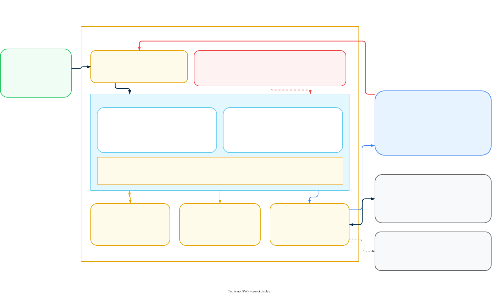
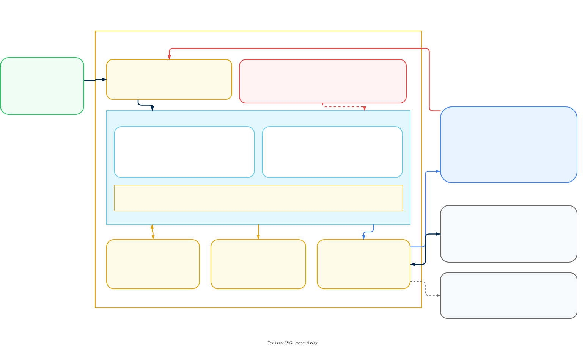

# AI Gateway on ECS and Container Apps

Deploy a Prisma AIRS AI Gateway hybrid data plane on Amazon ECS or Azure Container Apps with Terraform, covering architecture, requirements, secret preparation, the module configuration, ingress, connectivity to the management plane in both directions, and end-to-end verification.

**Related:** [Deployment Guide](ai-gateway-deployment.md) | [Hybrid Infrastructure](hybrid-infrastructure.md) | [LLM API Key Management](llm-api-key-management.md)

---

## Guide Approach

This is a companion to the [AI Gateway Deployment Guide](ai-gateway-deployment.md) and to the [AI Gateway Hybrid Infrastructure](hybrid-infrastructure.md) guide. It covers the two container platforms that are **not** Kubernetes: Amazon ECS and Azure Container Apps. Both are delivered by Terraform rather than Helm, which changes the workflow enough that the Kubernetes instructions do not transfer.

It does not repeat licensing, activation, or the Strata Cloud Manager (SCM) configuration that follows deployment. Those live in the deployment guide and you need them whichever platform you land on. It also does not repeat the two-plane architecture discussion or the platform comparison, which live in the hybrid infrastructure guide.

Prisma AIRS AI Gateway is the Portkey gateway, acquired by Palo Alto Networks. You will see the name Portkey throughout: in module paths, variable names, hostnames, secret names, and the vendor's own documentation. The rebrand has not reached the code, so treat `portkey` and `AIRS AI Gateway` as the same product wherever they appear below.

> **Warning: Before you start.** Everything below assumes two things are already done.
>
> - **Licensing and activation** &mdash; Phase 1 of the [AI Gateway Deployment Guide](ai-gateway-deployment.md). The gateway will deploy without it, but it will not serve traffic.
> - **Credentials from Palo Alto Networks** &mdash; you send your Organisation ID and the email address used at signup; they return Docker registry credentials for the gateway images and a Client Auth Key. There is no self-service path to these, and nothing in this guide works without them. Request them early, because this is the step most likely to add days to a deployment.
>
> Your Organisation ID is in the SCM browser URL: `https://stratacloudmanager.paloaltonetworks.com/<organisation_id>/`.

---

## Architecture

On ECS and Container Apps the gateway is a container image that Terraform places into a managed container runtime. There is no cluster to build, no Helm release, and no `values.yaml`. The module creates the network, the runtime, the cache, the log store, and the load balancer as one unit, and reads its secrets from the platform's own secret service.

The shape of the deployment is otherwise the same as on Kubernetes: a stateless gateway behind a load balancer, a Redis-compatible cache for synced configuration and counters, an object store for full request and response bodies, and a two-directional link to the Palo Alto Networks management plane.

> **Note: Which platform should I pick?**
>
> - **Amazon ECS** &mdash; you are on AWS, you want the deployment inside a VPC you control, and you want ALB or NLB semantics you already understand. This is the more configurable of the two and the one with a documented inbound PrivateLink path.
> - **Azure Container Apps** &mdash; you are on Azure and you want the least infrastructure. A VNet is optional here, which is unique among the five supported platforms: the simplest ACA deployment has no network of your own at all.

### A. Amazon ECS



Reading the flows in order:

1. Your applications send OpenAI-shaped requests to the load balancer. They hold a gateway workspace key, never a provider key.
2. The load balancer distributes to gateway tasks on container port `8787`.
3. Tasks read the Docker credentials, Client Auth Key, and Organisation ID from Secrets Manager at start. The task definition holds secret ARNs, so raw values never enter Terraform state.
4. Tasks read synced configuration and write rate limit and budget counters to the cache store.
5. Tasks write full prompt and completion bodies to your S3 bucket. This is the only place that content lands, and it is inside your own account.
6. All other egress leaves through the NAT gateway.
7. The gateway reports configuration sync, metrics, and usage to the management plane. No prompt content travels on this path.
8. The gateway makes the actual model call. Provider egress rules now follow the gateway, not your applications.
9. Image pulls happen at install and upgrade only.
10. The management plane connects *inbound* to the gateway. This direction is required, and it is the step teams most often miss.

### B. Azure Container Apps



Reading the flows in order:

1. Your applications send OpenAI-shaped requests to the ingress. They hold a gateway workspace key, never a provider key.
2. The ingress distributes to gateway replicas on port `8787`.
3. The module resolves the Docker credentials, Client Auth Key, and Organisation ID from Key Vault at deploy time. You give it secret *names*, so raw values never enter Terraform state.
4. Replicas read synced configuration and write rate limit and budget counters to the cache store.
5. Replicas write full prompt and completion bodies to your Blob container. This is the only place that content lands, and it is inside your own subscription.
6. All other egress leaves through the environment's outbound path.
7. The gateway reports configuration sync, metrics, and usage to the management plane. No prompt content travels on this path.
8. The gateway makes the actual model call. Provider egress rules now follow the gateway, not your applications.
9. Image pulls happen at install and upgrade only.
10. The management plane connects *inbound* to the gateway. This direction is required, and it is the step teams most often miss.

> **Warning: Both directions are mandatory on this path.** There are two ways to stand up a hybrid data plane, and they disagree about connectivity. The Gateway Registration wizard in SCM produces an outbound-only deployment. The platform deployment pages, which are what this guide follows, require the management plane to reach your gateway *inbound* as well, over a private link or an IP allow-list.
>
> Configure outbound only and you get a gateway that serves traffic correctly but never appears in Strata Cloud Manager. That failure looks like a licensing or activation problem and is usually diagnosed as one, so settle the inbound path in [step 4](#4-connect-the-planes) before you conclude anything is wrong upstream.

---

## Deployment Requirements

The requirements split into three groups: what Palo Alto Networks has to give you, what you need installed locally, and what your cloud account has to allow.

### What Palo Alto Networks provides

All three items come from the same request. Send your Organisation ID and the signup email address to the Palo Alto Networks team.

| Item | Used for | Where it ends up |
|---|---|---|
| Docker registry username | Pulling the gateway image | Secrets Manager or Key Vault |
| Docker registry password | Pulling the gateway image | Secrets Manager or Key Vault |
| Client Auth Key | Authenticating the data plane to the management plane | `PORTKEY_CLIENT_AUTH` |

Your Organisation ID is yours to read off the SCM URL, and it becomes `ORGANISATIONS_TO_SYNC`. If you sync more than one organisation, the value is comma-separated.

> **Danger: Treat all four values as credentials.** The Client Auth Key authenticates your entire data plane. Put these values straight into the platform secret service as described in step 1 and never into a `.tfvars` file, a repository, a ticket, or a chat message. The module is deliberately designed so that raw values never reach Terraform state: do not undo that by inlining them.

### Tooling, permissions, and sizing

**A. Amazon ECS**

| Requirement | Detail |
|---|---|
| Account | AWS account with permissions to create ECS, EC2, VPC, ELB, IAM, S3, Secrets Manager, and CloudWatch resources |
| CLI | AWS CLI, configured with credentials |
| Terraform | v1.13 or later |
| Gateway sizing | 1 vCPU (1024 CPU units) and 2 GiB per task |
| Availability | Tasks across at least two Availability Zones, autoscaling enabled |
| Cache store | Built-in Redis task, or ElastiCache for Redis OSS or Valkey in the same VPC |
| Log store | S3 or any S3-compatible store. Optional, but see the note below |

**B. Azure Container Apps**

| Requirement | Detail |
|---|---|
| Subscription | Azure subscription with permissions to create Container Apps, Key Vault, Storage, VNet, and Application Gateway resources |
| CLI | Azure CLI, configured with credentials |
| Terraform | v1.5 or later |
| Gateway sizing | 1 vCPU and 2 GiB per replica |
| Availability | Autoscaling across multiple Availability Zones, which requires a VNet deployment |
| Cache store | Built-in Redis container app, or Azure Managed Redis |
| Log store | Azure Blob Storage or any S3-compatible store. Created for you if you do not name one |

> **Warning: Published sizing is a floor, not a production recommendation.** The per-task and per-replica figures above are the vendor's stated minimums. They are not throughput-derived, and no requests-per-second guidance is published for either platform. Treat 1 vCPU and 2 GiB as the smallest unit that runs, then size the *count* of tasks or replicas from your own load test. The gateway is stateless, so horizontal scaling is the lever that matters.
>
> Log volume is the one number you can plan against: each log document is roughly 10 kB uncompressed. Multiply by request volume and retention to size the bucket or container.

> **Note: The log store is optional in the module and mandatory in practice.** Both platforms list the log store as optional, and the gateway will run without one. What you lose is the full prompt and completion body for every request, which is the artifact most teams deployed the gateway to get. Metrics and analytics still reach Strata Cloud Manager either way. Configure the log store unless you have a specific reason not to retain request content.

### ECS Fargate — what is and is not supported

This question comes up on every AWS engagement, and the published documentation does not answer it, so here is what the module actually does.

With `create_cluster = true`, which is what every published example uses, the module builds an ECS cluster whose only capacity provider is backed by an EC2 Auto Scaling group. The `instance_type`, `min_asg_size`, `max_asg_size`, and `desired_asg_size` variables exist precisely because tasks run on container instances you own. **The documented path is EC2-backed ECS, not Fargate.**

The task definition itself is Fargate-capable. It declares `requires_compatibilities = ["EC2", "FARGATE"]` with `awsvpc` networking, and the service attaches through a capacity provider strategy rather than a hard-coded launch type. The gateway's 1024 CPU units and 2048 MiB are also a valid Fargate size combination. So the pieces are in place.

Reaching Fargate means bypassing the module's cluster creation:

- Create the ECS cluster yourself with the `FARGATE` and `FARGATE_SPOT` capacity providers registered.
- Set `create_cluster = false`, and supply `cluster_name` and `capacity_provider_name` pointing at that cluster.

> **Danger: Not a validated configuration.** The combination above is inferred from reading the module, not from vendor documentation or a tested deployment. No Palo Alto Networks or Portkey documentation describes a Fargate deployment, and the EC2 lifecycle hook and Auto Scaling resources the module ships alongside the cluster have no Fargate equivalent. Do not commit to Fargate for a customer deployment on the strength of this section. Confirm with the product team first, and treat the EC2-backed path as the supported one until they say otherwise.

If the requirement behind the question is "no servers to patch" rather than "Fargate specifically", Azure Container Apps satisfies it today with no such caveat, and on AWS a Bottlerocket-based Auto Scaling group gets most of the way there.

---

## 1. Prepare Secrets

The secrets go in before Terraform runs. The module reads them by reference, so this ordering is not optional.

### A. Amazon ECS — create two secrets in AWS Secrets Manager

Two secrets are needed: one holding the Docker registry credentials, one holding the Client Auth Key and Organisation ID.

```bash
project_name=portkey-gateway      # a name for this deployment
environment=dev                   # the environment name
aws_region=us-east-1              # the region you are deploying into

# Docker credentials issued by Palo Alto Networks
aws secretsmanager create-secret \
  --name ${project_name}/${environment}/docker-credentials \
  --region ${aws_region} \
  --secret-string '{"username":"<docker-username>","password":"<docker-password>"}'

# Client Auth Key and Organisation ID
aws secretsmanager create-secret \
  --name ${project_name}/${environment}/client-org \
  --region ${aws_region} \
  --secret-string '{"PORTKEY_CLIENT_AUTH":"<client-auth>","ORGANISATIONS_TO_SYNC":"<organisation-id>"}'
```

A CloudFormation template is published as an alternative: `cloudformation/secrets.yaml` in the [portkey-gateway-infrastructure](https://github.com/Portkey-AI/portkey-gateway-infrastructure) repository. It takes the same values as parameters and emits the same two ARNs as stack outputs.

> **Verify.** Both commands print an `ARN`. Record them. You need them in step 2, and the module will not accept anything else in their place.
>
> ```bash
> aws secretsmanager list-secrets --region ${aws_region} \
>   --query "SecretList[?starts_with(Name,'${project_name}/${environment}')].[Name,ARN]" \
>   --output table
> ```
>
> Two rows come back. If you see one, the second `create-secret` failed, most often because a secret of that name is pending deletion from an earlier attempt.

> **Warning: ARNs, not values.** The `secrets` block in the Terraform module takes Secrets Manager ARNs. The ECS task definition references the ARN and AWS injects the value at task start. Pasting the raw secret into that block puts your Client Auth Key into Terraform state in plain text.

### B. Azure Container Apps — create a Key Vault and store four secrets

The Key Vault needs RBAC authorisation enabled, and you need the Key Vault Administrator role on it before you can write secrets.

```bash
az login
sub_id=<your-subscription-id>
az account set --subscription ${sub_id}

rg=portkey-rg           # resource group name
kv=portkey-kv           # Key Vault name

# Create the resource group first if it does not exist:
# az group create --name ${rg} --location eastus

az keyvault create \
  --name ${kv} \
  --resource-group ${rg} \
  --location eastus \
  --enable-rbac-authorization true

user_id=$(az ad signed-in-user show --query id -o tsv)

az role assignment create \
  --role "Key Vault Administrator" \
  --assignee ${user_id} \
  --scope "/subscriptions/${sub_id}/resourceGroups/${rg}/providers/Microsoft.KeyVault/vaults/${kv}"
```

Now write the four secrets. The names matter: the module looks them up by name, and these are the names its examples expect.

```bash
az keyvault secret set --vault-name ${kv} --name docker-username        --value "<docker-username>"
az keyvault secret set --vault-name ${kv} --name docker-password        --value "<docker-password>"
az keyvault secret set --vault-name ${kv} --name portkey-client-auth    --value "<client-auth>"
az keyvault secret set --vault-name ${kv} --name organisations-to-sync  --value "<organisation-id>"
```

> **Verify.**
>
> ```bash
> az keyvault secret list --vault-name ${kv} --query "[].name" -o tsv
> ```
>
> Four names come back, matching the four above exactly. A role assignment can take a minute to propagate, so a `Forbidden` error on the first `secret set` usually means you ran it too quickly rather than that the assignment failed.

> **Warning: Names, not values.** The `secrets` block in the Terraform module takes Key Vault secret *names*. The module resolves them against the vault named in `secrets_key_vault`. Pasting raw values into that block puts your Client Auth Key into Terraform state in plain text.

---

## 2. Deploy with Terraform

One module call builds the whole data plane. The configuration below is the smallest deployment that is worth having: two Availability Zones, a log store, a load balancer, and secrets by reference.

### A. Amazon ECS

#### 2.1 — Set up the working directory and remote state

```bash
mkdir portkey-gateway-deployment
cd portkey-gateway-deployment
```

Remote state is optional for a first test and expected for anything else. State for this module contains resource identifiers and configuration, so treat the bucket as sensitive and keep versioning on.

```bash
aws s3api create-bucket \
  --bucket portkey-tfstate-<account-id> \
  --region us-east-1

aws s3api put-bucket-versioning \
  --bucket portkey-tfstate-<account-id> \
  --versioning-configuration Status=Enabled
```

Create `backend.config`:

```hcl
bucket = "portkey-tfstate-<account-id>"
key    = "portkey-gateway/dev.tfstate"
region = "us-east-1"
```

#### 2.2 — Write main.tf

Substitute the two ARNs from step 1 and your log bucket name. The `allowed_lb_cidrs` value is the only one with a security consequence: it is the set of CIDRs permitted to reach the load balancer, and for an internal load balancer the VPC CIDR is the usual answer.

```hcl
terraform {
  required_version = ">= 1.13"

  required_providers {
    aws = {
      source  = "hashicorp/aws"
      version = "~> 6.0"
    }
  }

  backend "s3" {
    use_lockfile = true
  }
}

provider "aws" {
  region = "us-east-1"

  default_tags {
    tags = {
      Environment = "dev"
      ManagedBy   = "Terraform"
      Project     = "portkey-gateway"
    }
  }
}

module "portkey_gateway" {
  source = "github.com/Portkey-AI/portkey-gateway-infrastructure//terraform/ecs?ref=v2.0.0"

  # Project
  project_name = "portkey-gateway"
  environment  = "dev"
  aws_region   = "us-east-1"

  # Docker credentials, by Secrets Manager ARN
  docker_cred_secret_arn = "<DockerCredentialsSecretArn>"

  # Network
  create_new_vpc     = true
  vpc_cidr           = "10.0.0.0/16"
  num_az             = 2
  single_nat_gateway = true

  # Cluster
  create_cluster   = true
  instance_type    = "t4g.medium"
  min_asg_size     = 1
  max_asg_size     = 2
  desired_asg_size = 1

  # "gateway" for the AI Gateway alone, "all" to add the MCP gateway
  server_mode = "gateway"

  gateway_config = {
    desired_task_count = 1
    cpu                = 1024
    memory             = 2048
    gateway_port       = 8787
    mcp_port           = 8788
  }

  # Built-in Redis. Swap for ElastiCache in production.
  redis_configuration = {
    redis_type = "redis"
    cpu        = 256
    memory     = 512
    endpoint   = ""
    tls        = false
    mode       = "standalone"
  }

  object_storage = {
    log_store_bucket = "<your-logs-bucket>"
    bucket_region    = "us-east-1"
  }

  create_lb        = true
  internal_lb      = true
  lb_type          = "network"
  allowed_lb_cidrs = ["10.0.0.0/16"]

  environment_variables = {
    gateway = {
      SERVICE_NAME    = "gateway"
      ANALYTICS_STORE = "control_plane"
      LOG_STORE       = "s3_assume"
    }
  }

  # Secrets Manager ARNs, not values
  secrets = {
    gateway = {
      PORTKEY_CLIENT_AUTH   = "<ClientOrgSecretNameArn>"
      ORGANISATIONS_TO_SYNC = "<ClientOrgSecretNameArn>"
    }
  }
}

output "load_balancer_dns_name" {
  value = module.portkey_gateway.load_balancer_dns_name
}

output "vpc_id" {
  value = module.portkey_gateway.vpc_id
}
```

> **Note: Pin the module version.** The `?ref=v2.0.0` suffix on the source is doing real work. Without it Terraform tracks the default branch and a later `apply` can pull an unrelated change into an unrelated deployment. Bump the ref deliberately, as described under Scaling and Upgrades.

> **Warning: Both secret keys point at the same ARN.** That is not a copy-and-paste error. `PORTKEY_CLIENT_AUTH` and `ORGANISATIONS_TO_SYNC` are two JSON keys inside the single `client-org` secret created in step 1, and the task definition pulls each key from the same ARN.

#### 2.3 — Apply

```bash
terraform init -backend-config=backend.config
terraform plan
terraform apply
```

> **Verify.** Terraform prints `load_balancer_dns_name`. Confirm the service reached a steady state before moving on:
>
> ```bash
> aws ecs describe-services \
>   --cluster portkey-gateway-cluster \
>   --services portkey-gateway-dev-gateway \
>   --region us-east-1 \
>   --query "services[0].{running:runningCount,desired:desiredCount,status:status}"
> ```
>
> `running` should equal `desired` and `status` should read `ACTIVE`. If tasks are cycling, the cause is almost always the image pull: check the stopped-task reason for an authentication failure, which points back at the Docker credentials secret from step 1.

### B. Azure Container Apps

#### 2.1 — Set up the working directory

```bash
mkdir portkey-gateway
cd portkey-gateway
```

The published ACA examples use local state. For anything beyond a first test, add an `azurerm` backend pointing at a storage account before the first `apply`: moving state afterwards is avoidable work.

#### 2.2 — Write main.tf

This is the simplest working configuration: no VNet, built-in ACA ingress, built-in Redis, and an auto-created storage account. Harden it in step 3.

```hcl
terraform {
  required_version = ">= 1.5"

  required_providers {
    azurerm = {
      source  = "hashicorp/azurerm"
      version = "~> 4.0"
    }
  }
}

provider "azurerm" {
  features {}
}

module "portkey_gateway" {
  source = "github.com/Portkey-AI/portkey-gateway-infrastructure//terraform/aca?ref=v1.1.3"

  # Project
  project_name        = "portkey-gateway"
  environment         = "dev"
  resource_group_name = "portkey-rg"

  # Docker credentials, by Key Vault secret name
  registry_type = "dockerhub"
  docker_credentials = {
    key_vault_name  = "portkey-kv"
    key_vault_rg    = "portkey-rg"
    username_secret = "docker-username"
    password_secret = "docker-password"
  }

  # "none" for no VNet. See step 3 for "new" and "existing".
  network_mode = "none"

  ingress_type   = "aca"
  public_ingress = true

  # "gateway" for the AI Gateway alone, "all" to add the MCP gateway
  server_mode = "gateway"

  gateway_image = {
    image = "portkeyai/gateway_enterprise"
    tag   = "2.2.2"
  }

  gateway_config = {
    cpu                 = 1
    memory              = "2Gi"
    min_replicas        = 1
    max_replicas        = 2
    port                = 8787
    cpu_scale_threshold = 70
  }

  # Built-in Redis. Swap for Azure Managed Redis in production.
  redis_config = {
    redis_type = "redis"
    cpu        = 1
    memory     = "2Gi"
  }

  environment_variables = {
    gateway = {
      LOG_LEVEL             = "info"
      NODE_ENV              = "development"
      ANALYTICS_STORE       = "control_plane"
      AZURE_MANAGED_VERSION = "2019-08-01"
    }
  }

  # Key Vault secret names, not values
  secrets = {
    gateway = {
      PORTKEY_CLIENT_AUTH   = "portkey-client-auth"
      ORGANISATIONS_TO_SYNC = "organisations-to-sync"
    }
  }

  secrets_key_vault = {
    name           = "portkey-kv"
    resource_group = "portkey-rg"
  }
}

output "gateway_url" {
  value = module.portkey_gateway.gateway_url
}
```

> **Note: Pin the module version and the image tag.** ACA pins in two places: `?ref=v1.1.3` on the module source and `tag` in `gateway_image`. They move independently. Note also that the ECS and ACA modules carry different version numbers despite living in the same repository, so do not copy a `ref` between platforms.

> **Warning: This configuration is public with no VNet.** `network_mode = "none"` with `public_ingress = true` gives the gateway a publicly resolvable FQDN reachable from anywhere. That is convenient for a first deployment and wrong for production. Step 3 covers both ways to close it.

#### 2.3 — Apply

```bash
terraform init
terraform plan
terraform apply
```

> **Verify.** Terraform prints `gateway_url`. Confirm the container app is running and the revision is healthy:
>
> ```bash
> az containerapp show \
>   --name portkey-gateway-dev-gateway \
>   --resource-group portkey-rg \
>   --query "{state:properties.runningStatus,fqdn:properties.configuration.ingress.fqdn}" -o table
> ```
>
> `state` should read `Running`. If the revision is failing, check the image pull first: an unauthorised pull means the module could not read the Docker credentials from Key Vault, which is a role assignment problem rather than a bad password.

---

## 3. Expose the Gateway

Two decisions here. What sits in front of the gateway, and whether the connection to it is encrypted. The second is not optional: applications send a gateway workspace key on every request, and that key is a bearer credential.

> **Danger: Terminate TLS before you send real traffic.** The minimal configurations in step 2 expose the gateway over plain HTTP on ECS, which puts the workspace key on the wire in cleartext. Azure Container Apps gives you HTTPS on the built-in FQDN by default, so ACA is safe on this point from the first deploy. On ECS you must add TLS yourself, either with an ALB and an ACM certificate, or by keeping the listener private and terminating TLS elsewhere.

### A. Amazon ECS

#### 3.1 — Choose ALB or NLB

The choice is genuinely consequential on ECS, because it decides whether inbound PrivateLink works directly in step 4.

| You need | Use |
|---|---|
| TLS termination, WAF, access logs | ALB |
| Host-based routing, required when `server_mode = "all"` | ALB |
| Inbound PrivateLink to the management plane, directly | NLB |
| Layer-4 pass-through and lowest latency | NLB |

An ALB with TLS:

```hcl
create_lb           = true
internal_lb         = false   # true for an internal ALB
lb_type             = "application"
tls_certificate_arn = "arn:aws:acm:us-east-1:123456789012:certificate/xxxxxxxx"
allowed_lb_cidrs    = ["<X.X.X.X/Y>"]
```

With `server_mode = "all"`, add host-based routing and point both names at the ALB:

```hcl
alb_routing_configuration = {
  enable_host_based_routing = true
  gateway_host              = "gateway.example.com"
  mcp_host                  = "mcp.example.com"
}

# DNS
# gateway.example.com  A/CNAME  <alb-dns-name>
# mcp.example.com      A/CNAME  <alb-dns-name>
```

An NLB, which is the default in step 2:

```hcl
create_lb        = true
internal_lb      = true    # false for internet-facing
lb_type          = "network"
allowed_lb_cidrs = ["10.0.0.0/16"]
```

> **Warning: The trap, ALB plus inbound PrivateLink.** An AWS VPC endpoint service can only be created against a Network Load Balancer or a Gateway Load Balancer. If you pick an ALB, which `server_mode = "all"` forces you to, you cannot hand that ALB to the endpoint service in step 4. You will need a separate NLB in front of the ALB, provisioned outside this module, using a target group of type `alb`. Decide this now rather than after the ALB is carrying traffic.

> **Warning: Raise the idle timeout.** A streaming completion holds the connection open for the length of the generation. Load balancer idle timeouts are commonly shorter than a long response, and the failure looks like a truncated stream rather than a timeout, which sends people looking at the model instead of the load balancer. Set the idle timeout above your longest expected generation.

#### 3.2 — Optional: move the cache store to ElastiCache

The built-in Redis task from step 2 is a single container with no persistence and no failover. It is fine for a first deployment and not fine for production, where losing it drops synced configuration and every rate limit and budget counter at once.

Point the module at an ElastiCache cluster in the same VPC instead, and store the password as a further Secrets Manager entry rather than inline.

> **Note: Same VPC, not just reachable.** The cache store must sit in the same VPC as the gateway. This is stated as a requirement rather than a recommendation, so a peered or transit-attached cluster in another VPC is outside what is documented.

### B. Azure Container Apps

#### 3.1 — Choose built-in ingress or Application Gateway

Built-in ACA ingress, which is what step 2 configures, gives a managed HTTPS FQDN with a valid certificate and no VNet. Application Gateway adds WAF, your own certificate and hostname, and host-based routing for MCP, and it requires a VNet.

To move into a VNet, replace `network_mode = "none"` with either:

```hcl
# Let the module build the VNet
network_mode = "new"
vnet_cidr    = "10.0.0.0/16"
```

```hcl
# Or bring your own
network_mode           = "existing"
vnet_id                = "/subscriptions/<sub>/resourceGroups/<rg>/providers/Microsoft.Network/virtualNetworks/<vnet>"
aca_subnet_id          = "<vnet-id>/subnets/<aca-subnet>"
private_link_subnet_id = "<vnet-id>/subnets/<private-link-subnet>"
app_gateway_subnet_id  = "<vnet-id>/subnets/<app-gateway-subnet>"
```

Then add Application Gateway:

```hcl
ingress_type = "application_gateway"

app_gateway_config = {
  sku_name     = "WAF_v2"
  sku_tier     = "WAF_v2"
  capacity     = 2
  enable_waf   = true
  public       = true      # false for a private Application Gateway
  routing_mode = "host"
  gateway_host = "gateway.example.com"
  mcp_host     = "mcp.example.com"   # only when server_mode = "all"
}
```

For your own TLS certificate, import the PFX into Key Vault and reference it:

```bash
az keyvault certificate import \
  --vault-name my-ssl-kv \
  --name my-ssl-cert \
  --file certificate.pfx \
  --password "<pfx-password>"
```

```hcl
app_gateway_config = {
  # ... as above ...
  ssl_cert_key_vault_secret_id = "https://my-ssl-kv.vault.azure.net/secrets/my-ssl-cert"
  ssl_cert_key_vault_rg        = "my-ssl-kv-rg"
}
```

> **Verify.** Point DNS at the Application Gateway public IP and confirm the certificate served is yours, not the ACA default:
>
> ```bash
> curl -sv https://gateway.example.com/ 2>&1 | grep -E "subject:|issuer:"
> ```

> **Warning: Raise the request timeout.** Application Gateway's default backend request timeout is shorter than a long streaming completion. Raise it above your longest expected generation, or streamed responses will be cut off in a way that looks like a model fault rather than a proxy timeout.

#### 3.2 — Optional: Azure Managed Redis and your own storage

The built-in Redis container app from step 2 has no persistence and no failover. For production, point the module at Azure Managed Redis over TLS:

```hcl
redis_config = {
  redis_type = "azure-redis"
  endpoint   = "rediss://<name>.redis.cache.windows.net:6380"
  tls        = true
  mode       = "standalone"
}

secrets = {
  gateway = {
    PORTKEY_CLIENT_AUTH   = "portkey-client-auth"
    ORGANISATIONS_TO_SYNC = "organisations-to-sync"
    REDIS_PASSWORD        = "<redis-password-secret-name>"   # create this in Key Vault first
  }
}
```

By default the module creates a storage account and container for the log store. To use one you already have, with a managed identity rather than a key:

```hcl
storage_config = {
  resource_group = "my-storage-account-rg"
  auth_mode      = "managed"
  account_name   = "my-storage-account-name"
  container_name = "my-container-name"
}
```

---

## 4. Connect the Planes

Two directions, configured separately, both required. Outbound carries configuration sync, metrics, and usage from your gateway to Palo Alto Networks. Inbound lets the management plane reach your gateway, which is what makes it manageable from Strata Cloud Manager.

> **Note: Neither direction carries prompt content.** Worth stating plainly for the security review: configuration, anonymised metrics, and usage counts cross these links. Full prompt and completion bodies go to your own log store and stay there. The privacy question and the connectivity question are separate, and the answer to the first does not depend on which option you pick for the second.

### A. Amazon ECS

#### 4.1 — Outbound: over the internet

The simple option. Allow the gateway egress to two hostnames on 443:

- `https://aigw.portkey.ai`
- `https://albus.portkey.ai`

No module configuration is needed if the VPC already has outbound internet through the NAT gateway. If you filter egress by FQDN, these are the two entries to add.

#### 4.2 — Outbound: over AWS PrivateLink

Keeps the traffic off the internet entirely. It needs a whitelisting step at Palo Alto Networks first, so start it early.

1. Send your AWS account ARN to the Palo Alto Networks team and wait for confirmation that it is allow-listed.
2. In the [VPC console](https://console.aws.amazon.com/vpc/), in the region where the gateway runs, go to **Endpoints** and select **Create endpoint**.
3. Choose the **PrivateLink Ready partner services** category and enter the service name:

   ```
   com.amazonaws.vpce.us-east-1.vpce-svc-0c2c1c323d9f56d95
   ```

4. If the gateway is outside `us-east-1`, tick **Enable Cross Region endpoint**, pick `us-east-1`, and select **Verify service**.
5. Under **Network settings**, select the gateway's VPC and at least two subnets in different Availability Zones. Attach a security group that allows inbound 443 from the gateway tasks.
6. Select **Create endpoint** and wait for the status to reach `Available`.
7. Select **Actions**, then **Modify private DNS name**, and enable it for the endpoint.

Then repoint the gateway at the private endpoint and re-apply:

```hcl
environment_variables = {
  gateway = {
    SERVICE_NAME             = "gateway"
    ANALYTICS_STORE          = "control_plane"
    LOG_STORE                = "s3_assume"
    ALBUS_BASEPATH           = "https://aws-cp.portkey.ai/albus"
    CONTROL_PLANE_BASEPATH   = "https://aws-cp.portkey.ai/api/v1"
    SOURCE_SYNC_API_BASEPATH = "https://aws-cp.portkey.ai/api/v1/sync"
    CONFIG_READER_PATH       = "https://aws-cp.portkey.ai/api/model-configs"
  }
}
```

```bash
terraform apply
```

> **Verify.** From a host in the VPC, confirm the private DNS name resolves to a private address rather than a public one:
>
> ```bash
> dig +short aws-cp.portkey.ai
> ```
>
> An RFC 1918 address means private DNS is working. A public address means the endpoint's private DNS name is not enabled, and the gateway will still be egressing over the internet.

#### 4.3 — Inbound: VPC endpoint service, or an IP allow-list

This is the direction that is easy to skip and expensive to skip. Pick one of the two.

**Option A — VPC endpoint service (PrivateLink)**

Requires an NLB. If you deployed with `lb_type = "network"` the module already made one. If you are on an ALB, build an NLB in front of it first, with a target group of type `alb` and a listener forwarding to the ALB's port.

1. In the VPC console, in the gateway's region, create an **Endpoint service** against that NLB. Select IPv4, and decide whether connection requests need acceptance.
2. If you enable a private DNS name, verify domain ownership: **Actions**, then **Verify domain ownership for private DNS name**, create the record it gives you, then **Verify**.
3. Authorise the management plane to connect. **Actions**, then **Allow principals**, and add:

   ```
   arn:aws:iam::299329113195:root
   ```

4. Send the Palo Alto Networks team the service name, DNS names, private DNS name, region, and the load balancer's listener port.
5. They initiate a connection request. Approve it under **Endpoint connections**.

**Option B — IP allow-list**

Needs a publicly reachable endpoint. Permit the three management plane addresses on the listener port:

```hcl
allowed_lb_cidrs = ["54.81.226.149/32", "34.200.113.35/32", "44.221.117.129/32"]
```

Then send the public endpoint to the Palo Alto Networks team so they can complete the integration on their side.

> **Warning: Allow-listing replaces your own CIDRs, it does not extend them.** `allowed_lb_cidrs` is the complete list. Setting it to the three management plane addresses alone will lock out your own applications. Include your client CIDRs in the same list.

> **Note: Hard-coded addresses are a maintenance item.** Three fixed IPv4 addresses and one account ARN are published values that can change without appearing in your monitoring. Record where you used them so a future change is a lookup rather than an investigation.

### B. Azure Container Apps

#### 4.1 — Outbound: over the internet

Allow the gateway egress to two hostnames on 443:

- `https://aigw.portkey.ai`
- `https://albus.portkey.ai`

No configuration is needed if the environment already has outbound internet access. With `network_mode = "none"` it does, by default.

#### 4.2 — Outbound: over Azure Private Link

Requires a VNet deployment, so `network_mode` must be `new` or `existing`. This is the main reason to leave `none` behind.

1. Send your Azure subscription ID to the Palo Alto Networks team and wait for confirmation that it is allow-listed.
2. Enable the outbound private link in `terraform.tfvars`:

   ```hcl
   control_plane_private_link = {
     outbound = true
   }
   ```

3. Apply. This creates a private endpoint in your VNet, the `privatelink-az.portkey.ai` private DNS zone, an `azure-cp` A record, and the VNet link.

   ```bash
   terraform apply
   ```

4. Send them the private endpoint resource ID and wait for approval:

   ```bash
   terraform output control_plane_private_endpoint_id
   ```

> **Verify approval before continuing.**
>
> ```bash
> az network private-endpoint show \
>   --ids $(terraform output -raw control_plane_private_endpoint_id) \
>   --query 'privateLinkServiceConnections[0].privateLinkServiceConnectionState.status' -o tsv
> ```
>
> This must return `Approved`. Repointing the gateway at the private hostnames before approval lands will break outbound sync.

Once approved, repoint the gateway and re-apply:

```hcl
environment_variables = {
  gateway = {
    ALBUS_BASEPATH           = "https://private.azure-cp.portkey.ai/albus"
    CONTROL_PLANE_BASEPATH   = "https://private.azure-cp.portkey.ai/api/v1"
    SOURCE_SYNC_API_BASEPATH = "https://private.azure-cp.portkey.ai/api/v1/sync"
    CONFIG_READER_PATH       = "https://private.azure-cp.portkey.ai/api/model-configs"
  }
}
```

#### 4.3 — Inbound: private endpoint, or an IP allow-list

Inbound on ACA targets the Container Apps environment itself rather than a load balancer, which means it works with the built-in ingress and does not force you onto Application Gateway.

**Option A — Azure Private Link**

1. Collect the two values they need:

   ```bash
   terraform output container_app_environment_id
   terraform output inbound_gateway_fqdn
   ```

2. Send both to the Palo Alto Networks team. They create a private endpoint in their subscription targeting your environment.
3. Watch for the pending connection:

   ```bash
   az network private-endpoint-connection list \
     --id $(terraform output -raw container_app_environment_id) \
     --type Microsoft.App/managedEnvironments \
     --query "[].{Name:name, Status:properties.privateLinkServiceConnectionState.status}"
   ```

4. Approve it:

   ```bash
   az network private-endpoint-connection approve \
     --id "<connection-id>" \
     --description "Approved for AIRS AI Gateway control plane"
   ```

The portal path is the same thing: **Container Apps Environment**, then **Networking**, then **Private endpoint connections**.

**Option B — IP allow-list**

Needs a publicly reachable endpoint. Add an inbound rule on the NSG or firewall permitting the three management plane addresses on the listener port:

```
54.81.226.149
34.200.113.35
44.221.117.129
```

Then send the public endpoint to the Palo Alto Networks team so they can complete the integration.

> **Note: These are the same three addresses as on AWS.** The management plane egresses from AWS regardless of which cloud your data plane runs in. That is expected, not a documentation error, and it is worth saying out loud in an Azure security review before someone else raises it.

---

## 5. Verify

One request proves the whole chain: ingress, gateway, provider egress, log store, and the link to the management plane.

Replace `<GATEWAY_ENDPOINT>` with the load balancer DNS name, the Container Apps FQDN, or your custom hostname. Use `https` wherever you configured TLS in step 3.

```bash
export OPENAI_API_KEY=<your-openai-key>
export PORTKEY_API_KEY=<your-gateway-workspace-key>

curl 'https://<GATEWAY_ENDPOINT>/v1/chat/completions' \
  -H "Content-Type: application/json" \
  -H "Authorization: Bearer $OPENAI_API_KEY" \
  -H "x-portkey-provider: openai" \
  -H "x-portkey-api-key: $PORTKEY_API_KEY" \
  -d '{
    "model": "gpt-4o-mini",
    "messages": [{"role": "user", "content": "What is a fractal?"}]
  }'
```

> **Verify.** A normal chat completion comes back. Then open [Strata Cloud Manager](https://stratacloudmanager.paloaltonetworks.com/) and go to **Logs**. The request should be listed, and selecting it should show the full prompt and completion.

> **Note: Reading a partial success.**
>
> - **Completion returns, nothing in Logs** &mdash; the data plane works and the management plane link does not. Almost always the inbound direction in step 4.3. Check that the endpoint service connection or private endpoint connection was actually approved, not merely requested.
> - **Completion returns, log entry has no body** &mdash; the log store is not wired up. Check `LOG_STORE` and the task or replica identity's permission on the bucket or container.
> - **401 from the gateway** &mdash; the workspace key is wrong, or the gateway has not finished its first configuration sync. Check outbound reachability to `albus.portkey.ai`.
> - **Connection resets on long responses** &mdash; load balancer idle timeout, not the model. See step 3.

---

## Scaling and Upgrades

### Autoscaling

**A. Amazon ECS**

Target tracking on CPU and memory, with separate cooldowns so scale-out is faster than scale-in:

```hcl
gateway_autoscaling = {
  enable_autoscaling        = true
  autoscaling_min_capacity  = 3
  autoscaling_max_capacity  = 20
  target_cpu_utilization    = 70
  target_memory_utilization = 80
  scale_in_cooldown         = 120
  scale_out_cooldown        = 60
}
```

Remember that task autoscaling and the Auto Scaling group behind the capacity provider are two separate limits. Raising `autoscaling_max_capacity` without raising `max_asg_size` gives you tasks that cannot be placed.

**B. Azure Container Apps**

Container Apps can scale on CPU, memory, or concurrent HTTP requests. Set the threshold you want and null out the others.

```hcl
# CPU, the default
gateway_config = {
  cpu                 = 1
  memory              = "2Gi"
  min_replicas        = 2
  max_replicas        = 10
  cpu_scale_threshold = 70
}
```

```hcl
# Concurrent requests, usually the better fit for a gateway
gateway_config = {
  cpu                            = 1
  memory                         = "2Gi"
  min_replicas                   = 2
  max_replicas                   = 10
  cpu_scale_threshold            = null
  http_scale_concurrent_requests = 100
}
```

HTTP-based scaling tends to track gateway load better than CPU, because a request waiting on a slow model provider consumes a connection without consuming much processor time.

> **Warning: Do not leave min_replicas at 1.** At one replica, any restart or platform-initiated move is a full outage. Set it to at least 2 for anything carrying real traffic.

### Deployment strategies (ECS only)

The ECS module supports blue/green and canary rollouts through `gateway_deployment_configuration`. Container Apps handles this with its own revision model instead, so there is no equivalent block on ACA.

```hcl
# Blue/green
gateway_deployment_configuration = {
  enable_blue_green = true
}
```

```hcl
# Canary
gateway_deployment_configuration = {
  enable_blue_green = false
  canary_configuration = {
    canary_bake_time_in_minutes = 5
    canary_percent              = 10
  }
}
```

### Version pinning and upgrades

Two things carry versions and they are not linked: the Terraform module, pinned by the `?ref=` on the source, and on ACA the gateway image, pinned by `gateway_image.tag`.

```hcl
# Pinned, the only correct form for a deployment you care about
source = "github.com/Portkey-AI/portkey-gateway-infrastructure//terraform/ecs?ref=v2.0.0"
```

To upgrade, change the ref, run `terraform init -upgrade`, read the plan carefully, and apply to a non-production environment first.

> **Warning: No published compatibility matrix.** There is no documented statement of which module versions work with which gateway image versions, nor a supported upgrade path between module releases, nor a tested rollback procedure. Changing a pinned ref is therefore an untested change until you test it. Keep a non-production deployment on the same pins as production so upgrades have somewhere to fail first.

### Multiple environments

Separate state per environment, one backend config each. On ECS:

```hcl
# dev/backend.config
bucket = "portkey-tfstate-<account-id>"
key    = "portkey-gateway/dev.tfstate"
region = "us-east-1"

# prod/backend.config
bucket = "portkey-tfstate-<account-id>"
key    = "portkey-gateway/prod.tfstate"
region = "us-east-1"
```

```bash
terraform init -reconfigure -backend-config=dev/backend.config
terraform apply -var-file=dev/dev.tfvars
```

Keep `environment` distinct per deployment. It feeds resource naming, and two environments sharing a value will collide.

### Removing the gateway

```bash
terraform destroy
```

> **Warning: What destroy leaves behind, and what it takes with it.** The secrets you created in step 1 are outside the module, so they survive. So does an existing log store you brought yourself. A storage account or bucket the module created for you does **not** survive, and it holds every prompt and completion body the gateway has written. Copy anything you need to keep before destroying, and tell the Palo Alto Networks team to tear down their side of any private link.

---

## Reference

### Endpoints, addresses, and identifiers

| Value | What it is | Used in |
|---|---|---|
| `aigw.portkey.ai` | Management plane, outbound over the internet | Egress allow-list |
| `albus.portkey.ai` | Configuration sync, outbound over the internet | Egress allow-list |
| `aws-cp.portkey.ai` | Management plane over AWS PrivateLink | ECS outbound private path |
| `private.azure-cp.portkey.ai` | Management plane over Azure Private Link | ACA outbound private path |
| `com.amazonaws.vpce.us-east-1.vpce-svc-0c2c1c323d9f56d95` | Endpoint service name for outbound PrivateLink | ECS step 4.2 |
| `arn:aws:iam::299329113195:root` | Management plane AWS principal | ECS step 4.3, allowed principals |
| `54.81.226.149`, `34.200.113.35`, `44.221.117.129` | Management plane source addresses | Inbound IP allow-list, both platforms |
| `8787` | Gateway container port | Both platforms |
| `8788` | MCP gateway container port | `server_mode = "all"` |

### Platform differences at a glance

| | Amazon ECS | Azure Container Apps |
|---|---|---|
| Terraform minimum | v1.13 | v1.5 |
| Module path | `//terraform/ecs` | `//terraform/aca` |
| Secret service | Secrets Manager, referenced by ARN | Key Vault, referenced by name |
| Network required | Yes, a VPC | No, VNet is optional |
| TLS out of the box | No, add an ALB and a certificate | Yes, on the built-in FQDN |
| Managed cache option | ElastiCache for Redis OSS or Valkey | Azure Managed Redis |
| Log store | S3 or S3-compatible | Blob Storage or S3-compatible |
| Inbound private link target | Network Load Balancer only | Container Apps environment |
| Blue/green and canary | Yes, in the module | No, use ACA revisions |
| Compute model | EC2-backed by default | Fully managed |

### What is not yet documented

Questions that come up in the field and that the published material does not currently answer. Raise these with the product team rather than inferring an answer, and treat anything below as unresolved when writing a customer commitment.

- **Throughput sizing** &mdash; no requests-per-second figures for either platform. The published CPU and memory numbers are minimums to run, not a capacity model.
- **ECS Fargate** &mdash; not documented. See the Fargate section under Deployment Requirements for what the module actually supports.
- **Upgrade and rollback** &mdash; no compatibility matrix between module versions and gateway image versions, no supported upgrade path, no tested rollback.
- **Region placement and data residency** &mdash; the management plane egresses from AWS `us-east-1` addresses regardless of data plane location. Where management plane metadata is processed and stored is not documented, which matters for EU deals.
- **Air-gapped deployment** &mdash; no documented configuration for an environment with no path to `portkey.ai`.
- **TLS inspection** &mdash; behaviour of the outbound links through an intercepting proxy is not described, and streaming through one is untested.
- **On-premises** &mdash; confirmed supported but with no published procedure for these two platforms.

> **Note: Two documentation paths disagree, deliberately.** The SCM Gateway Registration wizard produces an outbound-only deployment. The platform pages this guide follows require inbound as well. Both are real and neither is a typo, but they are not interchangeable, and a customer who reads the wizard documentation and then deploys from a platform page will end up with a gateway that does not register. Establish which path a deployment is on before troubleshooting it.

### Source documentation

This guide is derived from the published self-hosting documentation and from the Terraform module source.

- **ECS** &mdash; `self-hosting/hybrid-deployments/aws/ecs`
- **Azure Container Apps** &mdash; `self-hosting/hybrid-deployments/azure/aca`
- **Architecture** &mdash; `self-hosting/hybrid-deployments/architecture`
- **Terraform modules** &mdash; [Portkey-AI/portkey-gateway-infrastructure](https://github.com/Portkey-AI/portkey-gateway-infrastructure), paths `terraform/ecs` and `terraform/aca`, each with its own `docs/` directory and variables reference

The doc pages are published twice, on `docs.portkey.ai/docs/aigw/` and on `portkey.ai/docs/`, and the two versions differ. See [SOURCES.md](SOURCES.md) in this directory for which to prefer and where the local mirrors are.
