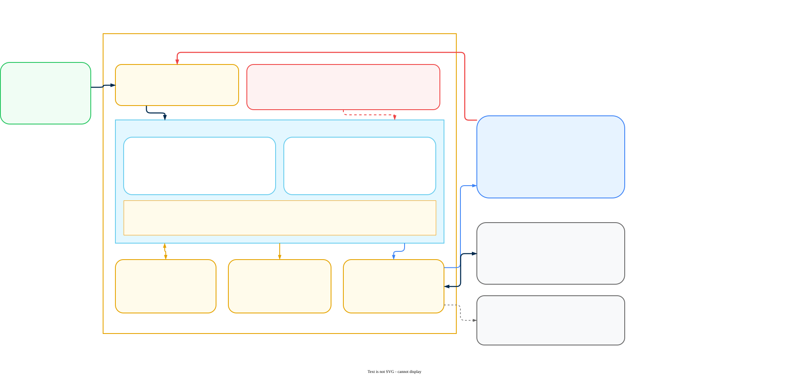
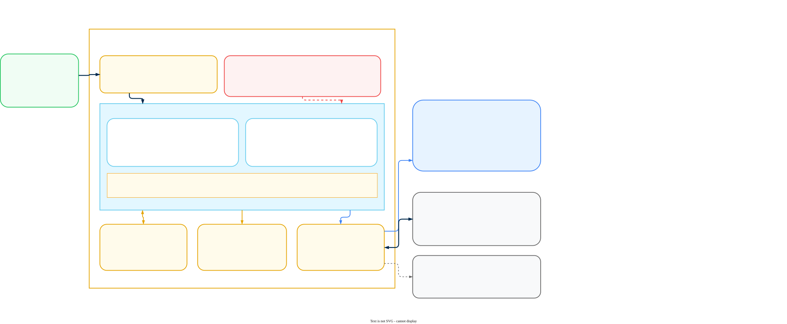

# AI Gateway on ECS and Container Apps

Deploy a Prisma AIRS AI Gateway hybrid data plane on Amazon ECS or Azure Container Apps with Terraform, from secret preparation through ingress, outbound connectivity to the management plane, and end-to-end verification.

**Related:** [Deployment Guide](ai-gateway-deployment.html) | [Hybrid Infrastructure](hybrid-infrastructure.md) | [EKS, AKS, and GKE](kubernetes-deployment.md) | [LLM API Key Management](llm-api-key-management.html)

---

## Guide Approach

This is a companion to the [AI Gateway Deployment Guide](ai-gateway-deployment.html) and to the [AI Gateway Hybrid Infrastructure](hybrid-infrastructure.md) guide. It covers the two container platforms that are **not** Kubernetes: Amazon ECS and Azure Container Apps. Both are delivered by Terraform rather than Helm, which changes the workflow enough that the Kubernetes instructions do not transfer.

It does not repeat licensing, activation, or the Strata Cloud Manager (SCM) configuration that follows deployment. Those live in the deployment guide and you need them whichever platform you land on. It also does not repeat the two-plane architecture discussion or the platform comparison, which live in the hybrid infrastructure guide.

Two terms carry the whole guide. The **data plane** is the gateway you run in your own AWS account or Azure subscription: the container, its cache, its log store, and the network in front of them. The **management plane** is the Palo Alto Networks service that holds configuration, policy, and analytics, and that you reach through Strata Cloud Manager. The [AI Gateway Hybrid Infrastructure](hybrid-infrastructure.md) guide covers the deeper architecture behind that split.

Prisma AIRS AI Gateway is the Portkey gateway, acquired by Palo Alto Networks. You will see the name Portkey throughout: in module paths, variable names, hostnames, secret names, and the vendor's own documentation. The rebrand has not reached the code, so treat `portkey` and `AIRS AI Gateway` as the same product wherever they appear below.

> **Warning: Before you start.** Everything below assumes two things are already done.
>
> - **Licensing and activation** &mdash; Phase 1 of the [AI Gateway Deployment Guide](ai-gateway-deployment.html). The gateway will deploy without it, but it will not serve traffic.
> - **Credentials from Palo Alto Networks** &mdash; you send your Organisation ID and the email address used at signup; they return Docker registry credentials for the gateway images and a Client Auth Key. There is no self-service path to these, and nothing in this guide works without them. Request them early, because this is the step most likely to add days to a deployment.
>
> Raise that request through your Palo Alto Networks account team, or open a case in the [Customer Support Portal](https://support.paloaltonetworks.com/) against Prisma AIRS AI Gateway. <!-- TODO: verify the exact support case category with the product team --> Every later step that says "send this to the Palo Alto Networks team" means the same channel. There are six such requests in this guide; they are listed in [Deployment Requirements](#deployment-requirements) so you can raise the early ones before you start building.
>
> Your Organisation ID is in the SCM browser URL: `https://stratacloudmanager.paloaltonetworks.com/<organisation_id>/`.

---

## Architecture

On ECS and Container Apps the gateway is a container image that Terraform places into a managed container runtime. There is no cluster to build, no Helm release, and no `values.yaml`. The module creates the network, the runtime, the cache, the log store, and the load balancer as one unit, and reads its secrets from the platform's own secret service.

The shape of the deployment is otherwise the same as on Kubernetes: a stateless gateway behind a load balancer, a Redis-compatible cache for synced configuration and counters, an object store for full request and response bodies, and an outbound link to the Palo Alto Networks management plane.

> **Note: Which platform should I pick?**
>
> - **Amazon ECS** &mdash; you are on AWS, you want the deployment inside a VPC you control, and you want ALB or NLB semantics you already understand. This is the more configurable of the two, and the one where you pick the load balancer type yourself.
> - **Azure Container Apps** &mdash; you are on Azure and you want the least infrastructure. A VNet is optional here, which is unique among the five supported platforms: the simplest ACA deployment has no network of your own at all.

### A. Amazon ECS



Reading the flows in order:

1. Your applications send OpenAI-shaped requests to the load balancer. They hold a gateway workspace key, never a provider key.
2. The load balancer distributes to gateway tasks on container port `8787`.
3. Tasks read the Docker credentials, Client Auth Key, and Organisation ID from Secrets Manager at start. The task definition holds secret ARNs, so raw values never enter Terraform state.
4. Tasks read synced configuration and write rate limit and budget counters to the cache store.
5. Tasks write full prompt and completion bodies to your S3 bucket. In the current AIRS release that content also reaches the Strata Cloud Manager backend, so the bucket is not the only copy. See [Connect the Planes](#4-connect-the-planes).
6. All other egress leaves through the NAT gateway.
7. The gateway reports configuration sync, metrics, and usage to the management plane. No prompt content travels on this path.
8. The gateway makes the actual model call. Provider egress rules now follow the gateway, not your applications.
9. Image pulls happen at install and upgrade only.

### B. Azure Container Apps



Reading the flows in order:

1. Your applications send OpenAI-shaped requests to the ingress. They hold a gateway workspace key, never a provider key.
2. The ingress distributes to gateway replicas on port `8787`.
3. You give the module secret *names*, not values. For the Client Auth Key, the Organisation ID, and the Docker password it composes a Key Vault secret URI and attaches the user-assigned managed identity, so Container Apps resolves each value at runtime and Terraform never reads it. Those values do not enter Terraform state. The Docker username is the exception: the module reads it with a `data` block to build the registry block, so it does land in state in plain text. This is verified against `terraform/aca` at `v1.1.3`, the version pinned in step 2.2.
4. Replicas read synced configuration and write rate limit and budget counters to the cache store.
5. Replicas write full prompt and completion bodies to your Blob container. In the current AIRS release that content also reaches the Strata Cloud Manager backend, so the container is not the only copy. See [Connect the Planes](#4-connect-the-planes).
6. All other egress leaves through the environment's outbound path.
7. The gateway reports configuration sync, metrics, and usage to the management plane. No prompt content travels on this path.
8. The gateway makes the actual model call. Provider egress rules now follow the gateway, not your applications.
9. Image pulls happen at install and upgrade only.

> **Warning: The platform deployment pages describe a connection you should not build.** Those pages require the management plane to reach your gateway inbound, over a private link or an IP allow-list. Palo Alto Networks confirmed on 2026-09-27 that private link is not supported with Strata Cloud Manager today and that connectivity is outbound from the gateway only.
>
> Build the outbound direction in [step 4](#4-connect-the-planes) and stop there. If you follow the platform pages literally you will authorise a Palo Alto Networks account into your VPC, or put three management plane addresses into a load balancer allow-list, for a path that nothing uses.

---

## Deployment Requirements

The requirements split into four groups: what Palo Alto Networks has to give you, the requests you have to send them and wait on, what you need installed locally, and what your cloud account has to allow.

### What Palo Alto Networks provides

All three items come from the same request. Send your Organisation ID and the signup email address to the Palo Alto Networks team.

| Item | Used for | Where it ends up |
|---|---|---|
| Docker registry username | Pulling the gateway image | Secrets Manager or Key Vault |
| Docker registry password | Pulling the gateway image | Secrets Manager or Key Vault |
| Client Auth Key | Authenticating the whole data plane to the management plane. The scope is the organisation, so one key covers every environment you deploy under it | `PORTKEY_CLIENT_AUTH` |

The Client Auth Key has a lifecycle you do not control. Because the scope is the organisation, the same key authenticates your non-production deployments, so treat a development copy with production care. No expiry period and no rotation procedure are published, so plan on a request to Palo Alto Networks whenever you need either. <!-- TODO: verify expiry and rotation with the product team --> If the key is exposed, request a replacement through the same channel, then re-run step 1 and step 2 in every environment that holds it.

You read your Organisation ID off the SCM URL, and it becomes `ORGANISATIONS_TO_SYNC`. If you sync more than one organisation, the value is comma-separated.

> **Danger: Treat these values as credentials.** The Client Auth Key authenticates your entire data plane: anything holding it can register as your gateway. Scope, expiry, and rotation are set by Palo Alto Networks, not by you, so to revoke or rotate it you raise the same request that issued it. Put all four values (the two Docker registry values, the Client Auth Key, and your Organisation ID) into the platform secret service in step 1, and never into a `.tfvars` file, a repository, a ticket, or a chat message.

### Requests to Palo Alto Networks

Six steps in this guide require you to send something to Palo Alto Networks and wait for someone on their side to act. Each one blocks the step it sits in, and the first two can be raised before you build anything, so raise them now rather than at the step that needs them. Use the channel named in the **Before you start** callout for all of them.

| Request | What you send | Raise it | It blocks |
|---|---|---|---|
| Initial credentials | Organisation ID and the signup email address | Now | Step 1, and everything after it |
| Account allow-listing for outbound PrivateLink (ECS) | Your AWS account root ARN | Now, it depends on nothing Terraform builds | Step 4.2, ECS |
| Subscription allow-listing for outbound Private Link (ACA) | Your Azure subscription ID | Now, it depends on nothing Terraform builds | Step 4.2, ACA |
| Teardown | A request to remove their side of any private link | Before `terraform destroy` | Clean removal, see Scaling and Upgrades |

No turnaround is published for any of these requests, so treat each one as an unknown wait when you schedule the work. The two allow-listing requests are the ones worth raising on day one: without them, step 4 stops while infrastructure built in step 2 sits idle.

### Tooling, permissions, and sizing

**A. Amazon ECS**

| Requirement | Detail |
|---|---|
| Account | AWS account with permissions to create ECS, EC2, VPC, ELB, IAM, S3, Secrets Manager, and CloudWatch resources |
| CLI | AWS CLI, configured with credentials |
| Terraform | v1.13 or later |
| Identities the module creates | A gateway task role, to which the module attaches a policy granting `s3:PutObject` and `s3:GetObject` on the buckets you configure and nothing wider, and an ECS task execution role that reads the two secrets from step 1. The execution role's exact secrets-read grant is not documented; confirm it in the plan output |
| Gateway sizing | 1 vCPU (1024 CPU units) and 2 GiB per task |
| Availability (production target) | Tasks across at least two Availability Zones, autoscaling enabled. The step 2 configuration is below this deliberately; raise it as described under Scaling and Upgrades |
| Cache store | Built-in Redis task, or ElastiCache for Redis OSS or Valkey in the same VPC |
| Log store | S3 or any S3-compatible store. Optional in the module; this guide configures one, created in step 2.1b |

**B. Azure Container Apps**

| Requirement | Detail |
|---|---|
| Subscription | Azure subscription with permissions to create Container Apps, Key Vault, Storage, VNet, and Application Gateway resources |
| CLI | Azure CLI, configured with credentials |
| Terraform | v1.5 or later |
| Identities the module creates | Not documented. The principal that reads the Key Vault secrets and the identity the container app uses to write to the log store are both unstated upstream; read them out of the plan output before you approve the deployment |
| Gateway sizing | 1 vCPU and 2 GiB per replica |
| Availability (production target) | Autoscaling across multiple Availability Zones, which requires a VNet deployment. The step 2 configuration is below this deliberately; raise it as described under Scaling and Upgrades |
| Cache store | Built-in Redis container app, or Azure Managed Redis |
| Log store | Azure Blob Storage or any S3-compatible store. Created for you if you do not name one; step 2.2 names one |

Both tables ask for rights to create roles or role assignments, which is close to account-wide privilege on AWS and subscription-wide on Azure. Review the plan output for any policy broader than the rows above before applying. The deploying principal needs role-creation rights for the duration of the apply; scope it to the deployment's resource group or use a dedicated deployment role rather than a standing grant. Whether Owner is required on Azure to create the step 1 Key Vault role assignment is not documented; User Access Administrator on the vault's resource group is the narrower grant to try first. <!-- TODO: verify the minimum Azure role for the step 1.1 role assignment -->

> **Warning: Published sizing figures are vendor minimums.** The per-task and per-replica figures above are the vendor's stated minimums. They are not throughput-derived, and no requests-per-second guidance is published for either platform. Treat 1 vCPU and 2 GiB as the smallest unit that runs, then size the *count* of tasks or replicas from your own load test. The gateway is stateless, so horizontal scaling is the lever that matters.
>
> Log volume is the one number you can plan against: each log document is roughly 10 kB uncompressed. Multiply by request volume and retention to size the bucket or container.

> **Note: Configure the log store even though the module treats it as optional.** Both platforms list the log store as optional, and the gateway will run without one. What you lose is the full prompt and completion body for every request, which is the artifact most teams deployed the gateway to get. Metrics and analytics still reach Strata Cloud Manager either way. Configure the log store unless you have a specific reason not to retain request content.

### ECS Fargate — what is and is not supported

This question comes up on every AWS engagement, and the published documentation does not answer it.

With `create_cluster = true`, which is what every published example uses, the module builds an ECS cluster whose only capacity provider is backed by an EC2 Auto Scaling group. The `instance_type`, `min_asg_size`, `max_asg_size`, and `desired_asg_size` variables exist precisely because tasks run on container instances you own. **The documented path is EC2-backed ECS, not Fargate.**

The task definition itself is Fargate-capable. It declares `requires_compatibilities = ["EC2", "FARGATE"]` with `awsvpc` networking, and the service attaches through a capacity provider strategy rather than a hard-coded launch type. The gateway's 1024 CPU units and 2048 MiB are also a valid Fargate size combination. The pieces for a Fargate deployment are therefore in place.

Reaching Fargate means bypassing the module's cluster creation:

- Create the ECS cluster yourself with the `FARGATE` and `FARGATE_SPOT` capacity providers registered.
- Set `create_cluster = false`, and supply `cluster_name` and `capacity_provider_name` pointing at that cluster.

> **Danger: Not a validated configuration.** The combination above is inferred from reading the module, not from vendor documentation or a tested deployment. No Palo Alto Networks or Portkey documentation describes a Fargate deployment, and the EC2 lifecycle hook and Auto Scaling resources the module ships alongside the cluster have no Fargate equivalent. Do not commit to Fargate for a customer deployment on the strength of this section. Confirm with the product team first, and treat the EC2-backed path as the supported one until they say otherwise.

If the requirement behind the question is "no servers to patch" rather than "Fargate specifically", Azure Container Apps satisfies it today with no such caveat, and on AWS a Bottlerocket-based Auto Scaling group gets most of the way there.

---

## 1. Prepare Secrets

The secrets go in before Terraform runs. The module reads them by reference, so this ordering is not optional.

### A. Amazon ECS — create two secrets in AWS Secrets Manager

Two secrets are needed: one holding the Docker registry credentials, one holding the Client Auth Key and Organisation ID.

Replace every angle-bracket placeholder with the real value before running these commands. The commands succeed with the placeholder text in place, and the failure only surfaces later as an image pull error.

```bash
project_name=portkey-gateway      # a name for this deployment
environment=dev                   # the environment name
aws_region=us-east-1              # the region you are deploying into

# Write the payloads to files. A --secret-string argument on the command
# line lands in your shell history and is readable in the process table.
cat > docker-credentials.json <<'JSON'
{"username":"<docker-username>","password":"<docker-password>"}
JSON

cat > client-org.json <<'JSON'
{"PORTKEY_CLIENT_AUTH":"<client-auth>","ORGANISATIONS_TO_SYNC":"<organisation-id>"}
JSON

# Docker credentials issued by Palo Alto Networks
aws secretsmanager create-secret \
  --name ${project_name}/${environment}/docker-credentials \
  --region ${aws_region} \
  --kms-key-id <your-kms-key-id> \
  --secret-string file://docker-credentials.json

# Client Auth Key and Organisation ID
aws secretsmanager create-secret \
  --name ${project_name}/${environment}/client-org \
  --region ${aws_region} \
  --kms-key-id <your-kms-key-id> \
  --secret-string file://client-org.json

# Delete the files once both commands have succeeded
rm -f docker-credentials.json client-org.json
```

The `--kms-key-id` value is a customer-managed KMS key in the same region. Delete the two files as shown, and check your shell history for any earlier attempt that passed a value inline.

A CloudFormation template is published as an alternative: `cloudformation/secrets.yaml` in the [portkey-gateway-infrastructure](https://github.com/Portkey-AI/portkey-gateway-infrastructure) repository. It takes the same values as parameters and emits the same two ARNs as stack outputs.

> **Verify.** Both commands print an `ARN`. Record them. You need them in step 2, and the module will not accept anything else in their place.
>
> ```bash
> aws secretsmanager list-secrets --region ${aws_region} \
>   --query "SecretList[?starts_with(Name,'${project_name}/${environment}')].[Name,ARN]" \
>   --output table
> ```
>
> Two rows come back. If you see one, the second `create-secret` failed, most often because a secret of that name already exists or is pending deletion from an earlier attempt.
>
> `create-secret` is not a re-runnable command. Pick the case that matches the error:
>
> ```bash
> # ResourceExistsException: the secret exists. Write a new version into it.
> aws secretsmanager put-secret-value \
>   --secret-id ${project_name}/${environment}/client-org \
>   --region ${aws_region} \
>   --secret-string file://client-org.json
>
> # InvalidRequestException: the secret is scheduled for deletion. Restore it,
> # then write the value with put-secret-value above.
> aws secretsmanager restore-secret \
>   --secret-id ${project_name}/${environment}/client-org \
>   --region ${aws_region}
>
> # Or purge it and create it again from scratch. This is not recoverable.
> aws secretsmanager delete-secret \
>   --secret-id ${project_name}/${environment}/client-org \
>   --region ${aws_region} \
>   --force-delete-without-recovery
> ```
>
> Re-run the list command and confirm two rows before moving to step 2.

> **Warning: Use Secrets Manager ARNs.** The `secrets` block in the Terraform module takes Secrets Manager ARNs. The ECS task definition references the ARN and AWS injects the value at task start. Pasting the raw secret into that block puts your Client Auth Key into Terraform state in plain text.

> **Warning: Lock down the secret store.** `create-secret` sets no access control of its own, so both secrets are readable by any principal in the account that holds the default Secrets Manager permissions. Before step 2, encrypt each secret with a customer-managed KMS key as shown above, attach a resource policy that limits `secretsmanager:GetSecretValue` to the ECS task execution role and the small set of humans who need it, and leave the default 30-day recovery window in place so an accidental delete is reversible.

### B. Azure Container Apps — create a Key Vault and store four secrets

The Key Vault needs RBAC authorization enabled, and you need a role that can write secrets on it before you begin.

Replace every angle-bracket placeholder with the real value before running these commands. The commands succeed with the placeholder text in place, and the failure only surfaces later as an image pull error. List your subscriptions first if you do not have the ID to hand:

```bash
az account list --query "[].{name:name,id:id}" -o table
```

The `id` column is the subscription ID the next block needs.

```bash
az login
sub_id=<your-subscription-id>
az account set --subscription ${sub_id}

rg=portkey-rg                    # resource group name
kv=portkey-kv-<unique-suffix>    # must be globally unique across all of Azure

# If the resource group already exists, this returns its details and changes nothing.
az group create --name ${rg} --location eastus

az keyvault create \
  --name ${kv} \
  --resource-group ${rg} \
  --location eastus \
  --enable-rbac-authorization true

user_id=$(az ad signed-in-user show --query id -o tsv)

az role assignment create \
  --role "Key Vault Secrets Officer" \
  --assignee ${user_id} \
  --scope "/subscriptions/${sub_id}/resourceGroups/${rg}/providers/Microsoft.KeyVault/vaults/${kv}"
```

> **Warning: Key Vault names are global and stay reserved after deletion.** A Key Vault name lives in a global DNS namespace, so `portkey-kv` on its own will usually be taken, and Azure holds a deleted name for 90 days. If `az keyvault create` reports the name is in use and the vault was yours, recover or purge it:
>
> ```bash
> az keyvault recover --name ${kv}
> az keyvault purge   --name ${kv}   # only if you want the name back empty
> ```
>
> Recovering keeps the secrets you already wrote, so check `az keyvault secret list --vault-name ${kv}` before writing them again.

Now write the four secrets. The names matter: the module looks them up by name, and these are the names its examples expect. These commands reuse the variables set above, so if you are resuming in a new terminal, set `sub_id`, `rg`, and `kv` again before running them.

```bash
az keyvault secret set --vault-name ${kv} --name docker-username        --value "<docker-username>"
az keyvault secret set --vault-name ${kv} --name docker-password        --value "<docker-password>"
az keyvault secret set --vault-name ${kv} --name portkey-client-auth    --value "<client-auth>"
az keyvault secret set --vault-name ${kv} --name organisations-to-sync  --value "<organisation-id>"
```

> **Verify.**
>
> ```bash
> az keyvault secret list --vault-name ${kv} --query "[].name" -o tsv
> ```
>
> Four names come back, matching the four above exactly. A role assignment can take a minute to propagate, so a `Forbidden` error on the first `secret set` usually means you ran it too quickly rather than that the assignment failed.
>
> Two identities are involved, and only one of them is yours. The module creates a user-assigned managed identity and grants it **Key Vault Secrets User** on this vault, and that is the identity Container Apps uses to resolve each secret reference at runtime. Your own principal is separate: it needs **Key Vault Secrets Officer** to write the secrets above, and it needs read access on every later `terraform apply`, because the module reads the Docker username through a `data` block as the deploying principal.
>
> Once the secrets are written you can drop from Officer to **Key Vault Secrets User** with `az role assignment delete --role "Key Vault Secrets Officer" --assignee ${user_id} --scope <vault-scope>` followed by an assignment of the lesser role. Do not remove your access altogether while you still plan to run Terraform against this vault, or the next apply fails with a Key Vault `Forbidden` error on the Docker username lookup. Verified against `terraform/aca` at `v1.1.3`.

> **Warning: Lock down the vault.** `az keyvault create` leaves the vault reachable from any network and readable by anyone holding a subscription-wide role. Before step 2, turn on purge protection and soft delete, restrict network access to your own ranges and the deployment network with `az keyvault network-rule add` and a `--default-action Deny`, and encrypt the vault with a customer-managed key if your policy requires one. Keep the RBAC grants on this vault to the deploying principal and the small set of humans who need them.

> **Warning: Use Key Vault secret names.** The `secrets` block in the Terraform module takes Key Vault secret *names*. The module turns each name into a Key Vault reference against the vault named in `secrets_key_vault`, and Container Apps resolves it at runtime using the managed identity. Pasting a raw value into that block puts your Client Auth Key into Terraform state in plain text, and the reference it builds will not resolve.

---

## 2. Deploy with Terraform

One module call builds the whole data plane. The configuration below is a single-task first deployment: a two-Availability-Zone network, one gateway task, a log store, a load balancer, and secrets by reference. It is deliberately below the availability requirements in the previous section so that the first apply is small and quick. Before it carries real traffic, raise the task or replica count and enable autoscaling as described under [Scaling and Upgrades](#scaling-and-upgrades).

### A. Amazon ECS

#### 2.0 — Decide the load balancer type first

The configuration in 2.2 creates a load balancer, so settle the type before you apply it. Changing the type afterwards replaces the load balancer rather than editing it, and the replacement takes a new DNS name with it.

| You need | Use |
|---|---|
| TLS termination, WAF, access logs | ALB |
| Host-based routing, required when `server_mode = "all"` | ALB |
| Layer-4 pass-through and lowest latency | NLB |

Set `lb_type` to match your answer in 2.2, then use the matching block in [step 3.1](#31--choose-alb-or-nlb) for the listener details.

#### 2.1 — Set up the working directory and remote state

```bash
mkdir portkey-gateway-deployment
cd portkey-gateway-deployment
```

This guide uses remote state throughout, so create the bucket now. The `main.tf` in step 2.2 and the `terraform init` command in step 2.3 both expect it. State for this module contains resource identifiers and configuration, so treat the bucket as sensitive.

The bucket name below embeds your AWS account ID. Read it with:

```bash
aws sts get-caller-identity --query Account --output text
```

```bash
aws s3api create-bucket \
  --bucket portkey-tfstate-<account-id> \
  --region us-east-1

aws s3api put-bucket-versioning \
  --bucket portkey-tfstate-<account-id> \
  --versioning-configuration Status=Enabled

aws s3api put-public-access-block \
  --bucket portkey-tfstate-<account-id> \
  --public-access-block-configuration \
    BlockPublicAcls=true,IgnorePublicAcls=true,BlockPublicPolicy=true,RestrictPublicBuckets=true

aws s3api put-bucket-encryption \
  --bucket portkey-tfstate-<account-id> \
  --server-side-encryption-configuration \
    '{"Rules":[{"ApplyServerSideEncryptionByDefault":{"SSEAlgorithm":"aws:kms","KMSMasterKeyID":"<your-kms-key-id>"},"BucketKeyEnabled":true}]}'

# Refuse any request that does not arrive over TLS
aws s3api put-bucket-policy \
  --bucket portkey-tfstate-<account-id> \
  --policy '{"Version":"2012-10-17","Statement":[{"Sid":"DenyInsecureTransport","Effect":"Deny","Principal":"*","Action":"s3:*","Resource":["arn:aws:s3:::portkey-tfstate-<account-id>","arn:aws:s3:::portkey-tfstate-<account-id>/*"],"Condition":{"Bool":{"aws:SecureTransport":"false"}}}]}'

# Versioning keeps every superseded state file, so expire the old ones
aws s3api put-bucket-lifecycle-configuration \
  --bucket portkey-tfstate-<account-id> \
  --lifecycle-configuration \
    '{"Rules":[{"ID":"expire-noncurrent-state","Status":"Enabled","Filter":{},"NoncurrentVersionExpiration":{"NoncurrentDays":90}}]}'
```

Create `backend.config`:

```hcl
bucket = "portkey-tfstate-<account-id>"
key    = "portkey-gateway/dev.tfstate"
region = "us-east-1"
```

> **Note: Recovering from an interrupted apply.** The backend in step 2.2 uses S3 native locking. If an apply is interrupted, the lock stays behind and the next command fails with `Error acquiring the state lock`. Confirm that no other apply is running, then release the lock with the ID printed in the error and re-run the apply, which picks up where it stopped:
>
> ```bash
> terraform force-unlock <LOCK_ID>
> terraform apply
> ```
>
> Do not run `terraform destroy` first. A half-built VPC is safe to apply over, and destroying it loses the resources that did complete.

#### 2.1b — Create the log bucket

The configuration in 2.2 names a bucket for the log store. Create it now, in the same region as the gateway:

```bash
aws s3api create-bucket \
  --bucket portkey-logs-<account-id> \
  --region us-east-1

aws s3api put-public-access-block \
  --bucket portkey-logs-<account-id> \
  --public-access-block-configuration \
    BlockPublicAcls=true,IgnorePublicAcls=true,BlockPublicPolicy=true,RestrictPublicBuckets=true

aws s3api put-bucket-encryption \
  --bucket portkey-logs-<account-id> \
  --server-side-encryption-configuration \
    '{"Rules":[{"ApplyServerSideEncryptionByDefault":{"SSEAlgorithm":"aws:kms","KMSMasterKeyID":"<your-kms-key-id>"},"BucketKeyEnabled":true}]}'
```

The module attaches an IAM policy to the gateway task role granting `s3:PutObject` and `s3:GetObject` on the bucket you name in 2.2, so no further permission work is needed for the gateway itself. Read access for people is yours to set: restrict it to the specific roles that need to read prompt content, and add a retention lifecycle rule that matches your retention policy.

> **Verify.**
>
> ```bash
> aws s3api get-bucket-encryption --bucket portkey-logs-<account-id>
> ```
>
> The command returns the encryption rule you set. If the bucket already exists, `create-bucket` reports that you already own it and no step here requires an empty bucket. Whether the gateway's write behavior differs against a bucket that already holds logs is not published, so use a new name if you need that guaranteed.

#### 2.2 — Write main.tf

Substitute the two ARNs from step 1 and the log bucket you created in 2.1b. The `docker-credentials` ARN from the 1.1 verification goes into `docker_cred_secret_arn`; the `client-org` ARN goes into both keys of the `secrets` block. The `allowed_lb_cidrs` value is the only one with a security consequence: it is the set of CIDRs permitted to reach the load balancer, and for an internal load balancer the VPC CIDR is the usual answer.

Leave `server_mode` as `gateway` unless you are also publishing MCP servers through this deployment. Choosing `all` on ECS forces an Application Load Balancer, so if you already applied step 2.2 with `lb_type = "network"` this replaces the load balancer.

```hcl
terraform {
  required_version = ">= 1.13"

  required_providers {
    aws = {
      source  = "hashicorp/aws"
      version = "~> 6.0"
    }
  }

  backend "s3" {
    use_lockfile = true
  }
}

provider "aws" {
  region = "us-east-1"

  default_tags {
    tags = {
      Environment = "dev"
      ManagedBy   = "Terraform"
      Project     = "portkey-gateway"
    }
  }
}

module "portkey_gateway" {
  source = "github.com/Portkey-AI/portkey-gateway-infrastructure//terraform/ecs?ref=v2.0.0"

  # Project
  project_name = "portkey-gateway"
  environment  = "dev"
  aws_region   = "us-east-1"

  # Docker credentials, by Secrets Manager ARN
  docker_cred_secret_arn = "<docker-credentials-arn>"

  # Network
  create_new_vpc     = true
  vpc_cidr           = "10.0.0.0/16"
  num_az             = 2
  single_nat_gateway = true

  # Cluster
  create_cluster   = true
  instance_type    = "t4g.medium"
  min_asg_size     = 1
  max_asg_size     = 2
  desired_asg_size = 1

  # "gateway" for the AI Gateway alone, "all" to add the
  # Model Context Protocol (MCP) gateway alongside it
  server_mode = "gateway"

  gateway_config = {
    desired_task_count = 1
    cpu                = 1024
    memory             = 2048
    gateway_port       = 8787
    mcp_port           = 8788
  }

  # Built-in Redis. Swap for ElastiCache in production.
  redis_configuration = {
    redis_type = "redis"
    cpu        = 256
    memory     = 512
    endpoint   = ""
    tls        = false
    mode       = "standalone"
  }

  object_storage = {
    log_store_bucket = "portkey-logs-<account-id>"   # created in step 2.1b
    bucket_region    = "us-east-1"
  }

  create_lb        = true
  internal_lb      = true
  lb_type          = "network"   # "application" for an ALB; see the decision table in 2.0
  allowed_lb_cidrs = ["10.0.0.0/16"]

  environment_variables = {
    gateway = {
      SERVICE_NAME    = "gateway"
      ANALYTICS_STORE = "control_plane"
      LOG_STORE       = "s3_assume"
    }
  }

  # Secrets Manager ARNs, not values
  secrets = {
    gateway = {
      PORTKEY_CLIENT_AUTH   = "<client-org-arn>"
      ORGANISATIONS_TO_SYNC = "<client-org-arn>"
    }
  }
}

output "load_balancer_dns_name" {
  value = module.portkey_gateway.load_balancer_dns_name
}

output "vpc_id" {
  value = module.portkey_gateway.vpc_id
}

# The 2.3 verification reads these rather than guessing the names.
output "cluster_name" {
  value = module.portkey_gateway.cluster_name
}

output "service_name" {
  value = module.portkey_gateway.service_name
}
```

`allowed_lb_cidrs` is the source list for the load balancer's inbound rule. The listener port and protocol the module configures are not documented upstream, so read them out of the plan output or the created listener before you write any firewall rule against them, and record the value, because your own firewall and security group rules depend on it. <!-- TODO: verify the NLB listener port and protocol against the created listener; not published in aws/ecs.md -->

> **Note: Pin the module version.** The `?ref=v2.0.0` suffix on the source matters. Without it Terraform tracks the default branch and a later `apply` can pull an unrelated change into an unrelated deployment. Bump the ref deliberately, as described under Scaling and Upgrades.

> **Warning: Both secret keys point at the same ARN.** That is not a copy-and-paste error. `PORTKEY_CLIENT_AUTH` and `ORGANISATIONS_TO_SYNC` are two JSON keys inside the single `client-org` secret created in step 1, and the task definition pulls each key from the same ARN.

> **Warning: The built-in cache runs without TLS or a password.** The `redis_configuration` block above holds the gateway's enforcement state: synced configuration, every rate limit counter, and every budget counter. It runs with `tls = false` and no password, so anything in the VPC that can reach the Redis task reads and writes that state in cleartext, subject to whatever security group the module attaches. Confirm that security group in the plan output. Before real traffic, move to ElastiCache with encryption in transit and an AUTH token as described in step 3.2.

> **Warning: The log store holds every prompt and completion body.** The bucket named in `object_storage` holds full request and response content, and a bucket in your own account is readable by every principal in that account that holds the default S3 permissions. It is not the only copy: in the current AIRS release that content also reaches the Strata Cloud Manager backend, so hardening this bucket reduces your exposure without making it the sole custodian. The module wires the gateway's own access through a task role policy, and it does not create or harden the bucket: that is step 2.1b, where you block public access and set default encryption. Restrict read access to the specific human roles that need prompt content, and set a retention lifecycle rule. `LOG_STORE = "s3_assume"` selects the S3 log store path, and the `_assume` half means the gateway reaches the bucket by assuming the IAM role attached to its own compute identity rather than by holding static access keys. On ECS that is the task role the module wires up; the Kubernetes platform pages pair the same value with EKS Pod Identity or IRSA. The pattern holds across clouds: Google Cloud Storage offers `gcs_assume` with `GCP_AUTH_MODE: workload` for workload identity against plain `gcs` for HMAC keys. Prefer the `_assume` form, because it leaves no long-lived credential to rotate or leak.

#### 2.3 — Apply

```bash
terraform init -backend-config=backend.config
terraform plan
terraform apply
```

> **Verify.** Terraform prints `load_balancer_dns_name`. Confirm the service reached a steady state before moving on. The command reads the cluster and service names from the outputs declared in 2.2, because the module derives them from `project_name` and `environment` and the two patterns differ:
>
> ```bash
> aws ecs describe-services \
>   --cluster $(terraform output -raw cluster_name) \
>   --services $(terraform output -raw service_name) \
>   --region us-east-1 \
>   --query "services[0].{running:runningCount,desired:desiredCount,status:status}"
> ```
>
> If `terraform output` reports either name as not found, add the matching output block from 2.2 and re-apply, or list what exists with `aws ecs list-clusters --region us-east-1` and `aws ecs list-services --cluster <cluster> --region us-east-1`.
>
> `running` should equal `desired` and `status` should read `ACTIVE`. If tasks are cycling, the cause is almost always the image pull: check the stopped-task reason for an authentication failure, which points back at the Docker credentials secret from step 1.
>
> A `RUNNING` task is not a working gateway: the count above proves scheduling, not service. Confirm the gateway inside the task is answering before you treat step 2 as done:
>
> ```bash
> task_id=$(aws ecs list-tasks --cluster $(terraform output -raw cluster_name) \
>   --service-name $(terraform output -raw service_name) --region us-east-1 \
>   --query "taskArns[0]" --output text)
>
> aws ecs execute-command \
>   --cluster $(terraform output -raw cluster_name) \
>   --task ${task_id} \
>   --container gateway \
>   --region us-east-1 \
>   --interactive \
>   --command "curl -s -o /dev/null -w '%{http_code}\n' http://localhost:8787/v1/health"
> ```
>
> An HTTP status in the 200 range means the process is serving. ECS Exec has to be enabled on the service for this to work; if it is not, read the same answer out of the target group's health check status in the EC2 console. <!-- TODO: verify the gateway's health endpoint path; not published in aws/ecs.md -->

### B. Azure Container Apps

#### 2.1 — Set up the working directory and remote state

```bash
mkdir portkey-gateway
cd portkey-gateway
```

The published ACA examples use local state. This guide uses remote state throughout, so create the storage account now: the `main.tf` in 2.2 and the `terraform init` command in 2.3 both expect it, and moving state after the first apply is avoidable work.

```bash
rg=portkey-rg
sa=portkeytfstate<unique-suffix>   # 3 to 24 lowercase letters and digits, globally unique

az storage account create \
  --name ${sa} \
  --resource-group ${rg} \
  --location eastus \
  --sku Standard_LRS \
  --min-tls-version TLS1_2 \
  --allow-blob-public-access false

az storage container create \
  --name tfstate \
  --account-name ${sa} \
  --auth-mode login
```

Create `backend.config`:

```hcl
resource_group_name  = "portkey-rg"
storage_account_name = "portkeytfstate<unique-suffix>"
container_name       = "tfstate"
key                  = "portkey-gateway/dev.tfstate"
```

State for this module contains resource identifiers and configuration, so treat the container as sensitive: keep public blob access off as set above, and restrict the data-plane roles on the storage account to the principals that run Terraform.

#### 2.2 — Write main.tf

This is the simplest working configuration: no VNet, built-in ACA ingress, built-in Redis, and an auto-created storage account. Harden it in step 3.

```hcl
terraform {
  required_version = ">= 1.5"

  required_providers {
    azurerm = {
      source  = "hashicorp/azurerm"
      version = "~> 4.0"
    }
  }

  backend "azurerm" {
    use_azuread_auth = true
  }
}

provider "azurerm" {
  features {}
}

module "portkey_gateway" {
  source = "github.com/Portkey-AI/portkey-gateway-infrastructure//terraform/aca?ref=v1.1.3"

  # Project
  project_name        = "portkey-gateway"
  environment         = "dev"
  resource_group_name = "portkey-rg"

  # Docker credentials, by Key Vault secret name
  registry_type = "dockerhub"
  docker_credentials = {
    key_vault_name  = "portkey-kv-<unique-suffix>"   # the vault you created in step 1.1
    key_vault_rg    = "portkey-rg"
    username_secret = "docker-username"
    password_secret = "docker-password"
  }

  # "none" for no VNet. See step 3 for "new" and "existing".
  network_mode = "none"

  ingress_type   = "aca"
  public_ingress = true

  # "gateway" for the AI Gateway alone, "all" to add the
  # Model Context Protocol (MCP) gateway alongside it
  server_mode = "gateway"

  gateway_image = {
    image = "portkeyai/gateway_enterprise"
    tag   = "2.2.2"
  }

  gateway_config = {
    cpu                 = 1
    memory              = "2Gi"
    min_replicas        = 1
    max_replicas        = 2
    port                = 8787
    cpu_scale_threshold = 70
  }

  # Built-in Redis. Swap for Azure Managed Redis in production.
  redis_config = {
    redis_type = "redis"
    cpu        = 1
    memory     = "2Gi"
  }

  # Log store. The module creates the storage account and container;
  # naming the container makes it easy to find afterwards.
  storage_config = {
    container_name = "portkey-log-store"
  }

  environment_variables = {
    gateway = {
      LOG_LEVEL             = "info"
      NODE_ENV              = "development"   # change to "production" before real traffic
      ANALYTICS_STORE       = "control_plane"
      AZURE_MANAGED_VERSION = "2019-08-01"
    }
  }

  # Key Vault secret names, not values
  secrets = {
    gateway = {
      PORTKEY_CLIENT_AUTH   = "portkey-client-auth"
      ORGANISATIONS_TO_SYNC = "organisations-to-sync"
    }
  }

  secrets_key_vault = {
    name           = "portkey-kv-<unique-suffix>"
    resource_group = "portkey-rg"
  }
}

output "gateway_url" {
  value = module.portkey_gateway.gateway_url
}

# Steps 3 and 4 read these. Declare them now: terraform output cannot reach
# a child module's outputs that the root module has not re-exported.
output "container_app_environment_id" {
  value = module.portkey_gateway.container_app_environment_id
}

output "inbound_gateway_fqdn" {
  value = module.portkey_gateway.inbound_gateway_fqdn
}

output "control_plane_private_endpoint_id" {
  value = try(module.portkey_gateway.control_plane_private_endpoint_id, null)
}

output "app_gateway_public_ip" {
  value = try(module.portkey_gateway.app_gateway_public_ip, null)
}
```

The `storage_config` block above is the log store. The module creates the storage account and the container for you, and the gateway writes full prompt and completion bodies there. Naming the container means you can find it after the apply.

`NODE_ENV = "development"` is the value the published examples ship. What it changes inside the gateway image is not documented, and in Node services this value commonly enables verbose error responses and stack traces, so change it before real traffic. <!-- TODO: verify what NODE_ENV changes in the gateway image -->

> **Warning: The built-in cache runs without TLS or a password.** The `redis_config` block above holds the gateway's enforcement state: synced configuration, every rate limit counter, and every budget counter. It runs without TLS and without a password. With `network_mode = "none"` there is no VNet of your own, so the hop is reachable by any other app in the same managed environment and nothing in this configuration isolates it. Before real traffic, move to Azure Managed Redis over TLS with a password as described in step 3.2.

> **Warning: The log store holds every prompt and completion body.** The container named in `storage_config` holds full request and response content. It is not the only copy: in the current AIRS release that content also reaches the Strata Cloud Manager backend. The module creates the account and the container and wires the container app's own access to it, and it does not harden the result. After the first apply, disable public blob access on the created storage account, restrict the data-plane roles to the specific people who need to read prompt content, set a retention policy, and add a private endpoint if the deployment is in a VNet.

> **Note: Pin the module version and the image tag.** ACA pins in two places: `?ref=v1.1.3` on the module source and `tag` in `gateway_image`. They move independently. Note also that the ECS and ACA modules carry different version numbers despite living in the same repository, so do not copy a `ref` between platforms.

> **Warning: This configuration is public with no VNet.** `network_mode = "none"` with `public_ingress = true` gives the gateway a publicly resolvable FQDN reachable from anywhere. That is convenient for a first deployment and wrong for production. Until you change it, the FQDN printed by `terraform apply` is reachable from the internet. Step 3.1 shows the Application Gateway path; set `public = false` there for a private Application Gateway. Whether the built-in ACA ingress can be made internal through this module is not documented, so if you need a private endpoint without Application Gateway, confirm the variable with the product team before planning around it. <!-- TODO: verify whether the terraform/aca module exposes a private built-in ingress option -->

#### 2.3 — Apply

```bash
terraform init -backend-config=backend.config
terraform plan
terraform apply
```

> **Verify.** Terraform prints `gateway_url`. Confirm the container app is running and the revision is healthy. The container app name follows `<project_name>-<environment>-gateway` and the resource group is the one you set in `resource_group_name`, so change both if you changed those values:
>
> ```bash
> az containerapp show \
>   --name portkey-gateway-dev-gateway \
>   --resource-group portkey-rg \
>   --query "{state:properties.runningStatus,fqdn:properties.configuration.ingress.fqdn}" -o table
> ```
>
> `state` should read `Running`. If the revision is failing, check the image pull first. An unauthorised pull means the module could not read the Docker credentials from Key Vault. Confirm you are running Terraform as the account granted the Key Vault role in step 1.1, and that `secrets_key_vault` names the vault you created there, before you suspect the password itself. If a managed identity turns out to do the reading rather than your own principal, check that identity's role assignment on the vault instead.
>
> Then confirm the log store the module created exists, so step 5 has somewhere to read from:
>
> ```bash
> az storage container list \
>   --account-name $(az storage account list --resource-group portkey-rg \
>     --query "[0].name" -o tsv) \
>   --auth-mode login \
>   --query "[].name" -o tsv
> ```
>
> `portkey-log-store` comes back in the list.

---

## 3. Expose the Gateway

Step 2 left you with a running gateway behind the load balancer or ingress the module created. Every block in this step is a set of arguments inside the `module "portkey_gateway"` block in the `main.tf` you wrote in step 2.2. Replace the matching arguments already there, then run `terraform plan` and `terraform apply`.

Two decisions follow: what sits in front of the gateway, and whether the connection to it is encrypted. The second is not optional: applications send a gateway workspace key on every request, and that key is a bearer credential.

> **Danger: Terminate TLS before you send real traffic.** The minimal configurations in step 2 expose the gateway over plain HTTP on ECS, which puts the workspace key on the wire in cleartext. Azure Container Apps gives you HTTPS on the built-in FQDN by default, so ACA is safe on this point from the first deploy. On ECS you must add TLS yourself, either with an ALB and an ACM certificate, or by keeping the listener private and terminating TLS elsewhere.

### A. Amazon ECS

#### 3.1 — Choose ALB or NLB

You chose ALB or NLB in step 2.0. The configuration for each is below.

> **Warning: Changing the load balancer type replaces it.** Altering `lb_type` or `internal_lb` replaces the load balancer rather than modifying it, so the DNS name from step 2 changes and anything pointing at it has to be repointed. Read `terraform plan` for a `must be replaced` line before applying.

For an ALB you need a certificate in AWS Certificate Manager, in the same region as the load balancer, covering the hostname your applications will call. Request one, complete the DNS validation it returns, then copy the certificate ARN into `tls_certificate_arn`:

```bash
aws acm request-certificate \
  --domain-name gateway.example.com \
  --validation-method DNS \
  --region us-east-1
```

An ALB with TLS:

```hcl
create_lb           = true
internal_lb         = true    # false only if clients are outside the VPC
lb_type             = "application"
tls_certificate_arn = "arn:aws:acm:us-east-1:123456789012:certificate/xxxxxxxx"
allowed_lb_cidrs    = ["<X.X.X.X/Y>"]   # never 0.0.0.0/0
```

`allowed_lb_cidrs` is the complete source list for the HTTPS listener. Two properties of this listener are not exposed as documented module variables: the TLS security policy and whether a plain-HTTP listener is created alongside it. Read both out of the created listener after the first apply, set the security policy to a TLS 1.2 minimum on the listener resource if the module does not, and remove or redirect any port 80 listener before sending real traffic. <!-- TODO: verify the ALB TLS security policy and whether a port 80 listener is created -->

With `server_mode = "all"`, add host-based routing and point both names at the ALB:

```hcl
alb_routing_configuration = {
  enable_host_based_routing = true
  gateway_host              = "gateway.example.com"
  mcp_host                  = "mcp.example.com"
}

# DNS
# gateway.example.com  A/CNAME  <alb-dns-name>
# mcp.example.com      A/CNAME  <alb-dns-name>
```

An NLB, which is the default in step 2:

```hcl
create_lb        = true
internal_lb      = true    # false for internet-facing
lb_type          = "network"
allowed_lb_cidrs = ["10.0.0.0/16"]
```

Apply the change:

```bash
terraform plan
terraform apply
```

> **Verify.** Confirm the listener serves your certificate rather than failing the handshake:
>
> ```bash
> curl -sv https://<alb-dns-name>/ 2>&1 | grep -E "subject:|issuer:"
> ```
>
> The subject matches the hostname you requested the certificate for. Run this from inside the VPC when `internal_lb = true`.

> **Warning: Raise the idle timeout.** A streaming completion holds the connection open for the length of the generation. Load balancer idle timeouts are commonly shorter than a long response, and the failure looks like a truncated stream rather than a timeout, which sends people looking at the model instead of the load balancer. On an ALB, raise `idle_timeout` through the module if it exposes the argument, or on the created load balancer directly:
>
> ```bash
> aws elbv2 modify-load-balancer-attributes \
>   --load-balancer-arn <alb-arn> \
>   --attributes Key=idle_timeout.timeout_seconds,Value=900
> ```
>
> An NLB's TCP idle timeout is fixed and cannot be raised, so a long generation on an NLB needs TCP keepalives from the client instead.

#### 3.2 — Optional: move the cache store to ElastiCache

The built-in Redis task from step 2 is a single container with no persistence and no failover. It is adequate for a first deployment. In production, losing it drops synced configuration and every rate limit and budget counter at once.

Create an ElastiCache cluster in the same VPC yourself, with encryption in transit and an AUTH token enabled, then point the module at it and store the AUTH token as a further Secrets Manager entry rather than inline:

```hcl
redis_configuration = {
  redis_type = "aws-elastic-cache"
  cpu        = 256        # Ignored for ElastiCache
  memory     = 512        # Ignored for ElastiCache
  endpoint   = "master.portkey-redis.xxxxx.use1.cache.amazonaws.com:6379"
  tls        = true       # match the cluster's transit encryption setting
  mode       = "standalone"   # or "cluster" for cluster-mode-enabled
}

# Store the AUTH token in Secrets Manager as JSON under a REDIS_PASSWORD key,
# then reference that secret's ARN:
secrets = {
  gateway = {
    PORTKEY_CLIENT_AUTH   = "<client-org-arn>"
    ORGANISATIONS_TO_SYNC = "<client-org-arn>"
    REDIS_PASSWORD        = "<redis-auth-secret-arn>"
  }
}
```

Four details decide whether this works. The `redis_type` value is `aws-elastic-cache`, not `elasticache`. The endpoint is a bare host and port with no URL scheme. The ElastiCache security groups must allow inbound on the configured port from the gateway and data service task security groups. And leaving `tls = false` keeps the hop in cleartext, which changes the durability story without changing the confidentiality story.

The cutover discards the in-flight rate limit and budget counters held in the old cache, so do it during a quiet window.

> **Note: The cache store must sit in the same VPC.** The cache store must sit in the same VPC as the gateway. This is stated as a requirement rather than a recommendation, so a peered or transit-attached cluster in another VPC is outside what is documented.

### B. Azure Container Apps

#### 3.1 — Choose built-in ingress or Application Gateway

Built-in ACA ingress, which is what step 2 configures, gives a managed HTTPS FQDN with a valid certificate and no VNet. Application Gateway adds WAF, your own certificate and hostname, and host-based routing for MCP, and it requires a VNet.

> **Danger: Moving into a VNet is a rebuild, not an edit.** A Container Apps environment cannot be joined to a VNet after it is created, so changing `network_mode` destroys and recreates the environment and every container app in it, including the built-in Redis. The FQDN from step 2.2 changes. The auto-created storage account is recreated, taking every prompt and completion body logged into it. Read `terraform plan` for `must be replaced` before applying, and if you know you need a VNet, set `network_mode` in step 2.2 rather than changing it here.

To move into a VNet, replace `network_mode = "none"` with either:

```hcl
# Let the module build the VNet
network_mode = "new"
vnet_cidr    = "10.0.0.0/16"
```

```hcl
# Or bring your own
network_mode           = "existing"
vnet_id                = "/subscriptions/<sub>/resourceGroups/<rg>/providers/Microsoft.Network/virtualNetworks/<vnet>"
aca_subnet_id          = "<vnet-id>/subnets/<aca-subnet>"
private_link_subnet_id = "<vnet-id>/subnets/<private-link-subnet>"
app_gateway_subnet_id  = "<vnet-id>/subnets/<app-gateway-subnet>"
```

Then add Application Gateway:

```hcl
ingress_type = "application_gateway"

app_gateway_config = {
  sku_name     = "WAF_v2"
  sku_tier     = "WAF_v2"
  capacity     = 2
  enable_waf   = true
  public       = false     # true only if clients are outside the VNet
  routing_mode = "host"
  gateway_host = "gateway.example.com"
  mcp_host     = "mcp.example.com"   # only when server_mode = "all"
}
```

For your own TLS certificate, import the PFX into Key Vault and reference it:

```bash
az keyvault certificate import \
  --vault-name my-ssl-kv \
  --name my-ssl-cert \
  --file certificate.pfx \
  --password "<pfx-password>"
```

```hcl
app_gateway_config = {
  # ... as above ...
  ssl_cert_key_vault_secret_id = "https://my-ssl-kv.vault.azure.net/secrets/my-ssl-cert"
  ssl_cert_key_vault_rg        = "my-ssl-kv-rg"
}
```

> **Verify.** Read the address the module created with `terraform output app_gateway_public_ip`, which is declared in the 2.2 output block, then create an A record for `gateway.example.com` pointing at it in your own DNS. Then confirm the certificate served is yours, not the ACA default:
>
> ```bash
> curl -sv https://gateway.example.com/ 2>&1 | grep -E "subject:|issuer:"
> ```

> **Warning: Raise the request timeout.** Application Gateway's default backend request timeout is shorter than a long streaming completion. Raise it above your longest expected generation, or streamed responses will be cut off in a way that looks like a model fault rather than a proxy timeout. The `app_gateway_config` block exposes no timeout field, so raise it on the HTTP setting after deployment:
>
> ```bash
> az network application-gateway http-settings update \
>   --gateway-name <app-gateway-name> \
>   --resource-group portkey-rg \
>   --name <http-setting-name> \
>   --timeout 900
> ```

Apply the change:

```bash
terraform plan
terraform apply
```

#### 3.2 — Optional: Azure Managed Redis and your own storage

The built-in Redis container app from step 2 has no persistence and no failover. For production, point the module at Azure Managed Redis over TLS:

```hcl
redis_config = {
  redis_type = "azure-redis"
  endpoint   = "rediss://<name>.redis.cache.windows.net:6380"
  tls        = true
  mode       = "standalone"
}

secrets = {
  gateway = {
    PORTKEY_CLIENT_AUTH   = "portkey-client-auth"
    ORGANISATIONS_TO_SYNC = "organisations-to-sync"
    REDIS_PASSWORD        = "<redis-password-secret-name>"   # create this in Key Vault first
  }
}
```

By default the module creates a storage account and container for the log store. To use one you already have, with a managed identity rather than a key:

```hcl
storage_config = {
  resource_group = "my-storage-account-rg"
  auth_mode      = "managed"
  account_name   = "my-storage-account-name"
  container_name = "my-container-name"
}
```

---

## 4. Connect the Planes

Steps 2 and 3 left a gateway running and reachable. This step adds the two links between your data plane and the management plane. The Terraform blocks below are edits to the `module "portkey_gateway"` block in the `main.tf` you wrote in step 2.2, and each one needs `terraform plan` and `terraform apply` after it. The console procedures are outside Terraform, so `terraform plan` will not show them.

Only one direction is required, and it is outbound. It carries configuration sync, metrics, and usage from your gateway to Palo Alto Networks, and it is what registers the gateway and keeps it visible in Strata Cloud Manager. Choose between 4.1 and 4.2 for how that traffic leaves your network, then read 4.3 for why there is no second direction to configure.

> **Warning: Where prompt logs are stored, and what each choice costs.** By default the gateway sends full prompt and completion bodies to the Strata Cloud Manager AI Gateway backend, which stores them in the region Strata Cloud Manager itself runs in. That is the Americas only today, with other regions planned. Setting the log store to local keeps those bodies in your own environment instead, which is what the log store parameter in step 2.2 configures.
>
> The local setting currently breaks log viewing from the Strata Cloud Manager management plane, and Palo Alto Networks has that logged as a bug. So this is a real trade today rather than a free win: prompt bodies in your own region with no central log views, or central log views with prompt bodies in the Americas. Settle which one the customer needs before you apply step 2.2, because changing it later leaves logs split across two places.
>
> The consequence for a data residency conversation is direct. Do not tell a customer that prompt and completion bodies stay inside their account unless they have taken the local log store and accepted the broken views that come with it. On the default path, retention period and custody for the backend store are still unpublished, so the honest answer on those two points is that Palo Alto Networks has not said. <!-- TODO: verify with Palo Alto Networks: retention period and custody model for backend-stored prompt logs, and the exact AIRS configuration key for the local log store, which may not be LOG_STORE. Tracked as question 9 in workspace/airs/aigw-product-questions.md. -->

> **Note: What crosses the links to the management plane.** Configuration, anonymized metrics, and usage counts cross these links. On the default log store, so does prompt and completion content: the backend holds the full request and response body for every call, as described in the warning above. Treat every prompt that passes through the gateway as data that has left your environment, and review access to Strata Cloud Manager on that basis, because anyone who can open a log detail view reads the prompt.
>
> On the Portkey product, when logs are kept in a customer blob store, the control plane pulls an individual log on demand from that store when someone opens it in the dashboard, over an inbound link to the gateway. Strata Cloud Manager does not support that inbound link, which is the most likely reason the local log store breaks its log views. Treat that as an inference rather than a published explanation. <!-- TODO: verify against the SCM tenant whether the local log store breaks SCM log views because there is no inbound retrieval path, and what the fix changes when it ships. -->

### A. Amazon ECS

#### 4.1 — Outbound: over the internet

This is the simpler of the two outbound options. Allow the gateway egress to two hostnames on 443:

- `https://aigw.portkey.ai`
- `https://albus.portkey.ai`

No module configuration is needed if the VPC already has outbound internet through the NAT gateway. If you filter egress by FQDN, the gateway needs all of the following outbound on TCP 443:

- `aigw.portkey.ai` and `albus.portkey.ai` — the management plane.
- The container registry hosts that serve the gateway image — needed at install and at every upgrade.
- Every model provider endpoint the workspace routes to, for example `api.openai.com`.

The provider list is now a gateway egress rule rather than an application egress rule, so it has to be maintained here. On ECS, add S3 and Secrets Manager VPC endpoints or allow their regional endpoints as well, so the task can read its secrets and write logs.

> **Verify.** Test reachability from inside the network rather than from your laptop. Open a shell in a running gateway task:
>
> ```bash
> aws ecs execute-command \
>   --cluster $(terraform output -raw cluster_name) \
>   --task <task-id> \
>   --container gateway \
>   --interactive \
>   --command "/bin/sh"
> ```
>
> Then, in that shell, request both management plane hostnames:
>
> ```bash
> curl -sS -o /dev/null -w "%{http_code}\n" https://aigw.portkey.ai
> curl -sS -o /dev/null -w "%{http_code}\n" https://albus.portkey.ai
> ```
>
> Any HTTP status code means egress to that host is permitted. A timeout or a DNS failure means the host is missing from the allow-list, and that gap will otherwise surface later as an image pull failure or a model call error.

#### 4.2 — Outbound: over AWS PrivateLink

This option keeps the traffic off the internet entirely. It needs an allow-listing step at Palo Alto Networks first, so start it early.

Check whether the endpoint already exists before you create one:

```bash
aws ec2 describe-vpc-endpoints \
  --filters Name=service-name,Values=com.amazonaws.vpce.us-east-1.vpce-svc-0c2c1c323d9f56d95 \
  --query "VpcEndpoints[].{Id:VpcEndpointId,State:State}" --output table
```

If one comes back in state `available`, skip to the private DNS check below rather than creating a second one. These endpoints are billed per hour, and creating a duplicate does not replace the first.

1. Send your AWS account root ARN, in the form `arn:aws:iam::<account-id>:root`, to the Palo Alto Networks team and wait for confirmation that it is allow-listed. Get your account ID with:

   ```bash
   aws sts get-caller-identity --query Account --output text
   ```

2. In the [VPC console](https://console.aws.amazon.com/vpc/), in the region where the gateway runs, go to **Endpoints** and select **Create endpoint**.
3. Choose the **PrivateLink Ready partner services** category and enter the service name:

   ```
   com.amazonaws.vpce.us-east-1.vpce-svc-0c2c1c323d9f56d95
   ```

4. If the gateway is outside `us-east-1`, tick **Enable Cross Region endpoint**, pick `us-east-1`, and select **Verify service**.
5. Under **Network settings**, select the gateway's VPC and at least two subnets in different Availability Zones. Attach a security group that allows inbound 443 from the gateway tasks.
6. Select **Create endpoint** and wait for the status to reach `Available`.
7. Select **Actions**, then **Modify private DNS name**, and enable it for the endpoint.

Then repoint the gateway at the private endpoint and re-apply:

```hcl
environment_variables = {
  gateway = {
    SERVICE_NAME             = "gateway"
    ANALYTICS_STORE          = "control_plane"
    LOG_STORE                = "s3_assume"
    ALBUS_BASEPATH           = "https://aws-cp.portkey.ai/albus"
    CONTROL_PLANE_BASEPATH   = "https://aws-cp.portkey.ai/api/v1"
    SOURCE_SYNC_API_BASEPATH = "https://aws-cp.portkey.ai/api/v1/sync"
    CONFIG_READER_PATH       = "https://aws-cp.portkey.ai/api/model-configs"
  }
}
```

```bash
terraform apply
```

> **Verify.** Confirm the private DNS name resolves to a private address rather than a public one. Run this from inside the VPC, not from your laptop: a laptop always returns the public address and tells you nothing. If you have no host in the VPC, open a shell on a running gateway task with ECS Exec and run the lookup there:
>
> ```bash
> aws ecs execute-command \
>   --cluster $(terraform output -raw cluster_name) \
>   --task <task-id> \
>   --container gateway \
>   --interactive \
>   --command "/bin/sh"
>
> dig +short aws-cp.portkey.ai
> ```
>
> An RFC 1918 address means private DNS is working. A public address means the endpoint's private DNS name is not enabled, and the gateway will still be egressing over the internet.

Close the path you replaced. Remove `aigw.portkey.ai` and `albus.portkey.ai` from the egress allow-list you built in 4.1, so that a private DNS failure produces a visible connection error rather than a silent fallback to the internet. Keep the registry and model provider entries, because PrivateLink covers the management plane only.

### B. Azure Container Apps

#### 4.1 — Outbound: over the internet

Allow the gateway egress to two hostnames on 443:

- `https://aigw.portkey.ai`
- `https://albus.portkey.ai`

No configuration is needed if the environment already has outbound internet access. With `network_mode = "none"` it does, by default.

If you filter egress, the same two management plane hosts are not the whole list. The replicas also need the container registry hosts that serve the gateway image, every model provider endpoint the workspace routes to, and the Key Vault and storage account endpoints they read secrets and write logs through, all outbound on TCP 443.

> **Verify.** Test reachability from inside the environment rather than from your laptop. Open a shell in a running replica:
>
> ```bash
> az containerapp exec \
>   --name <container-app-name> \
>   --resource-group portkey-rg \
>   --command "/bin/sh"
> ```
>
> Then, in that shell, request both management plane hostnames:
>
> ```bash
> curl -sS -o /dev/null -w "%{http_code}\n" https://aigw.portkey.ai
> curl -sS -o /dev/null -w "%{http_code}\n" https://albus.portkey.ai
> ```
>
> Any HTTP status code means egress to that host is permitted. A timeout or a DNS failure means the host is blocked, and that gap will otherwise surface later as an image pull failure or a model call error.

#### 4.2 — Outbound: over Azure Private Link

This option requires a VNet deployment, so `network_mode` must be `new` or `existing`. This is the main reason to leave `none` behind.

1. Send your Azure subscription ID to the Palo Alto Networks team and wait for confirmation that it is allow-listed.
2. Add the outbound private link to the `module "portkey_gateway"` block in `main.tf`, alongside `network_mode`:

   ```hcl
   control_plane_private_link = {
     outbound = true
   }
   ```

3. Apply. This creates a private endpoint in your VNet, the `privatelink-az.portkey.ai` private DNS zone, an `azure-cp` A record, and the VNet link.

   ```bash
   terraform apply
   ```

4. Send them the private endpoint resource ID and wait for approval:

   ```bash
   terraform output control_plane_private_endpoint_id
   ```

> **Verify approval before continuing.**
>
> ```bash
> az network private-endpoint show \
>   --ids $(terraform output -raw control_plane_private_endpoint_id) \
>   --query 'privateLinkServiceConnections[0].privateLinkServiceConnectionState.status' -o tsv
> ```
>
> This must return `Approved`. Repointing the gateway at the private hostnames before approval lands will break outbound sync.

Once approved, repoint the gateway and re-apply. Replace the whole `environment_variables` block in `main.tf`: Terraform assigns the map wholesale, so anything you leave out is removed from the replicas.

```hcl
environment_variables = {
  gateway = {
    LOG_LEVEL                = "info"
    NODE_ENV                 = "development"   # change to "production" before real traffic
    ANALYTICS_STORE          = "control_plane"
    AZURE_MANAGED_VERSION    = "2019-08-01"
    ALBUS_BASEPATH           = "https://private.azure-cp.portkey.ai/albus"
    CONTROL_PLANE_BASEPATH   = "https://private.azure-cp.portkey.ai/api/v1"
    SOURCE_SYNC_API_BASEPATH = "https://private.azure-cp.portkey.ai/api/v1/sync"
    CONFIG_READER_PATH       = "https://private.azure-cp.portkey.ai/api/model-configs"
  }
}
```

```bash
terraform plan
terraform apply
```

### 4.3 — Inbound is not supported with Strata Cloud Manager today (both platforms)

Both platform deployment pages describe a second connection, running from the management plane inbound to your gateway over a VPC endpoint service on AWS or a private endpoint on Azure, with an IP allow-list as the alternative. Do not build it for an AIRS gateway.

Palo Alto Networks confirmed on 2026-09-27 that private link is not supported with Strata Cloud Manager today, and that the only network connectivity between a gateway and the cloud is outbound from the gateway. The inbound procedures on those pages belong to the Portkey product, which shares the deployment tooling but not this part of the architecture.

Four things follow from that:

- Do not create a VPC endpoint service, and do not authorise `arn:aws:iam::299329113195:root` in your account.
- Do not add `54.81.226.149`, `34.200.113.35`, or `44.221.117.129` to `allowed_lb_cidrs` or to any network security group rule. Your load balancer admits your own applications and nothing else.
- Your gateway registers and appears in Strata Cloud Manager on outbound connectivity alone. If it does not appear, the cause is in 4.1 or 4.2 rather than a missing inbound path.
- The `lb_type` choice in step 2.2 is now yours to make on its merits. It no longer has to be a Network Load Balancer to back an endpoint service.

> **Note: If a platform deployment page tells you otherwise.** The published platform pages have not caught up with this position. Treat outbound-only as current, and ask the product team to confirm before building an inbound path for a specific customer. <!-- TODO: verify whether inbound private link returns to AIRS, and whether restoring it is what unblocks the SCM log views on a local log store. Tracked as question 5 in workspace/airs/aigw-product-questions.md. -->


---

## 5. Verify

One request proves the whole chain: ingress, gateway, provider egress, log store, and the link to the management plane. Everything from steps 3 and 4 has to be applied before this check is meaningful, so run `terraform plan` in the working directory from step 2.1 first and apply anything still outstanding.

Replace `<GATEWAY_ENDPOINT>` with the load balancer DNS name, the Container Apps FQDN, or your custom hostname. Use `https` wherever you configured TLS in step 3. The ECS configuration in step 2.2 creates an internal load balancer, so run this from a host inside the VPC, or through ECS Exec on a gateway task, rather than from your laptop. On ACA with the built-in ingress the FQDN is public and you can run it from anywhere. Append the listener port if your endpoint does not listen on 443. <!-- TODO: verify the NLB and Application Gateway listener port; the container port is 8787 but the listener port is not published -->

`PORTKEY_API_KEY` is a workspace API key, created in Strata Cloud Manager under the workspace this gateway syncs, in [Phase 3 of the AI Gateway Deployment Guide](ai-gateway-deployment.html#llm-integration). Create one there and copy it here before running the request, and use the same key each time you re-run this check. `OPENAI_API_KEY` is your own provider key.

> **Warning: This request is a path test, not the calling convention.** This first request passes your own provider key through the gateway so the path can be tested before any provider credential is configured in Strata Cloud Manager. Once you configure a provider in Strata Cloud Manager, drop the `Authorization` header entirely and applications send only `x-portkey-api-key`, which is the steady-state behavior described in the Architecture section. Do not run this test against a plain-HTTP listener. Unset `OPENAI_API_KEY` from your shell afterwards, and treat the key as used in the clear if the listener had no TLS.

```bash
export OPENAI_API_KEY=<your-openai-key>
export PORTKEY_API_KEY=<your-gateway-workspace-key>

curl 'https://<GATEWAY_ENDPOINT>/v1/chat/completions' \
  -H "Content-Type: application/json" \
  -H "Authorization: Bearer $OPENAI_API_KEY" \
  -H "x-portkey-provider: openai" \
  -H "x-portkey-api-key: $PORTKEY_API_KEY" \
  -d '{
    "model": "gpt-4o-mini",
    "messages": [{"role": "user", "content": "What is a fractal?"}]
  }'
```

> **Verify.** A normal chat completion comes back. Then open [Strata Cloud Manager](https://stratacloudmanager.paloaltonetworks.com/) and navigate to **AI Security → AI Gateway → Logs**. The request should be listed, and selecting it should show the full prompt and completion.
>
> Log entries do not appear instantly. The exact delay is not published, so wait and refresh for a few minutes and send a second request to confirm, before treating an empty Logs view as a failure or changing any configuration.

> **Note: Reading a partial success.**
>
> - **Completion returns, nothing in Logs** &mdash; the data plane works and the outbound link to the management plane does not. Check the egress allow-list from 4.1, or the PrivateLink endpoint and its private DNS resolution from 4.2. Do not go looking for a missing inbound path, because there is not one.
> - **Completion returns, log entry has no body** &mdash; the log store is not wired up. On ECS, check `LOG_STORE` and the task role's permission on the bucket. On ACA, check that `storage_config` resolved to a real container and that the replica identity can write to it.
> - **401 from the gateway** &mdash; the workspace key is wrong, or the gateway has not finished its first configuration sync. Check outbound reachability to `albus.portkey.ai`.
> - **Connection resets on long responses** &mdash; the load balancer idle timeout is cutting the connection, not the model. See step 3.

A passing check here proves the path, not the capacity. The deployment is still the single-task first deployment from step 2, so raise the task or replica count and enable autoscaling as described in [Scaling and Upgrades](#scaling-and-upgrades) before it carries real traffic.

---

## Scaling and Upgrades

### Autoscaling

**A. Amazon ECS**

Target tracking on CPU and memory, with separate cooldowns so scale-out is faster than scale-in:

```hcl
gateway_autoscaling = {
  enable_autoscaling        = true
  autoscaling_min_capacity  = 3
  autoscaling_max_capacity  = 20
  target_cpu_utilization    = 70
  target_memory_utilization = 80
  scale_in_cooldown         = 120
  scale_out_cooldown        = 60
}

# The capacity provider has to be able to host the tasks.
min_asg_size     = 2
max_asg_size     = 6
desired_asg_size = 2
```

These ASG values replace the ones in step 2, which are sized for a single task and cannot host three. Task autoscaling and the Auto Scaling group behind the capacity provider are separate limits: raise both together, or tasks will sit in `PROVISIONING` with no instance to place them on.

**B. Azure Container Apps**

Container Apps can scale on CPU, memory, or concurrent HTTP requests. Set the threshold you want and null out the others.

```hcl
# CPU, the default
gateway_config = {
  cpu                 = 1
  memory              = "2Gi"
  min_replicas        = 2
  max_replicas        = 10
  cpu_scale_threshold = 70
}
```

```hcl
# Concurrent requests, usually the better fit for a gateway
gateway_config = {
  cpu                            = 1
  memory                         = "2Gi"
  min_replicas                   = 2
  max_replicas                   = 10
  cpu_scale_threshold            = null
  http_scale_concurrent_requests = 100
}
```

HTTP-based scaling tends to track gateway load better than CPU, because a request waiting on a slow model provider consumes a connection without consuming much processor time.

> **Warning: Do not leave min_replicas at 1.** At one replica, any restart or platform-initiated move is a full outage. Set it to at least 2 for anything carrying real traffic.

### Deployment strategies (ECS only)

The ECS module supports blue/green and canary rollouts through `gateway_deployment_configuration`. Container Apps handles this with its own revision model instead, so there is no equivalent block on ACA.

```hcl
# Blue/green
gateway_deployment_configuration = {
  enable_blue_green = true
}
```

```hcl
# Canary
gateway_deployment_configuration = {
  enable_blue_green = false
  canary_configuration = {
    canary_bake_time_in_minutes = 5
    canary_percent              = 10
  }
}
```

### Version pinning and upgrades

Two things carry versions, and they are not linked: the Terraform module, pinned by the `?ref=` on the source, and on ACA the gateway image, pinned by `gateway_image.tag`.

```hcl
# Pinned, the only correct form for a deployment you care about
source = "github.com/Portkey-AI/portkey-gateway-infrastructure//terraform/ecs?ref=v2.0.0"
```

To upgrade, change the ref, run `terraform init -upgrade`, read the plan carefully, and apply to a non-production environment first.

> **Warning: No published compatibility matrix.** There is no documented statement of which module versions work with which gateway image versions, nor a supported upgrade path between module releases, nor a tested rollback procedure. Changing a pinned ref is therefore an untested change until you test it. Keep a non-production deployment on the same pins as production so upgrades have somewhere to fail first.

### Multiple environments

Separate state per environment, one backend config each. On ECS:

```hcl
# dev/backend.config
bucket = "portkey-tfstate-<account-id>"
key    = "portkey-gateway/dev.tfstate"
region = "us-east-1"

# prod/backend.config
bucket = "portkey-tfstate-<account-id>"
key    = "portkey-gateway/prod.tfstate"
region = "us-east-1"
```

```bash
terraform init -reconfigure -backend-config=dev/backend.config
terraform apply
```

The root module you built in step 2.2 passes literal arguments to the module block and declares no root variables, so `-var-file` has nothing to feed and Terraform rejects every entry in the file as undeclared. Keep a separate directory per environment instead, each with its own `main.tf` and `backend.config`, and change `environment` in the module block.

Keep `environment` distinct per deployment. It feeds resource naming, and two environments sharing a value will collide. Repeat step 1 for each environment as well: the secret names include `${environment}`, so a new environment needs its own pair of secrets and its own ARNs before its first apply.

### Removing the gateway

```bash
terraform destroy
```

> **Warning: Destroy deletes a log store the module created for you.** The secrets you created in step 1 are outside the module, so they survive. So does an existing log store you brought yourself. A storage account or bucket the module created for you does **not** survive, and it holds every prompt and completion body the gateway has written. Copy anything you need to keep before destroying.

Work through the following after the destroy. Revocation comes first, because it is the only part that matters if the teardown is happening because something went wrong.

1. Schedule deletion of the step 1 secrets, and ask Palo Alto Networks to invalidate the Client Auth Key unless the organisation is being redeployed.
2. Delete the interface VPC endpoint created in step 4.2.
3. Remove the Key Vault role assignment created in step 1.1, and purge the vault if the name is to be reused inside 90 days.
4. Delete or lock down the Terraform state bucket or storage account, which holds every prior state version.
5. If an earlier deployment followed the platform pages and created a VPC endpoint service, delete it so that `arn:aws:iam::299329113195:root` is no longer authorised, and remove the three management plane addresses from any allow-list. This guide no longer creates either, but a deployment built before 2026-09-27 may have both.

---

## Reference

### Endpoints, addresses, and identifiers

| Value | What it is | Used in |
|---|---|---|
| `aigw.portkey.ai` | Management plane, outbound over the internet | Egress allow-list |
| `albus.portkey.ai` | Configuration sync, outbound over the internet | Egress allow-list |
| `aws-cp.portkey.ai` | Management plane over AWS PrivateLink | ECS outbound private path |
| `private.azure-cp.portkey.ai` | Management plane over Azure Private Link | ACA outbound private path |
| `com.amazonaws.vpce.us-east-1.vpce-svc-0c2c1c323d9f56d95` | Endpoint service name for outbound PrivateLink | ECS step 4.2 |
| `arn:aws:iam::299329113195:root` | Management plane AWS principal, published for an inbound path AIRS does not support | Do not authorise; see 4.3 |
| `54.81.226.149`, `34.200.113.35`, `44.221.117.129` | Management plane source addresses, published for an inbound path AIRS does not support | Do not allow-list these; see 4.3 |
| `8787` | Gateway container port | Both platforms |
| `8788` | MCP gateway container port | `server_mode = "all"` |
| Load balancer listener port and protocol | Not documented; read from the created listener | `allowed_lb_cidrs`, step 5.1 URL |

### Platform differences

| | Amazon ECS | Azure Container Apps |
|---|---|---|
| Terraform minimum | v1.13 | v1.5 |
| Module path | `//terraform/ecs` | `//terraform/aca` |
| Secret service | Secrets Manager, referenced by ARN | Key Vault, referenced by name |
| Network required | Yes, a VPC | No, VNet is optional |
| TLS out of the box | No, add an ALB and a certificate | Yes, on the built-in FQDN |
| Managed cache option | ElastiCache for Redis OSS or Valkey | Azure Managed Redis |
| Log store | S3 or S3-compatible | Blob Storage or S3-compatible |
| Blue/green and canary | Yes, in the module | No, use ACA revisions |
| Compute model | EC2-backed by default | Fully managed |

### Undocumented areas

These questions come up in the field and the published material does not currently answer them. Raise them with the product team rather than inferring an answer, and treat anything below as unresolved when writing a customer commitment.

- **Throughput sizing** &mdash; no requests-per-second figures for either platform. The published CPU and memory numbers are minimums to run, not a capacity model.
- **ECS Fargate** &mdash; not documented. See [ECS Fargate](#fargate) under Deployment Requirements for what the module actually supports.
- **Upgrade and rollback** &mdash; no compatibility matrix between module versions and gateway image versions, no supported upgrade path, no tested rollback.
- **Region placement and data residency** &mdash; Strata Cloud Manager runs in the Americas only today, with other regions planned, and prompt bodies land there on the default log store. Retention and custody for that store are still unpublished.
- **Air-gapped deployment** &mdash; no documented configuration for an environment with no path to `portkey.ai`.
- **TLS inspection** &mdash; behavior of the outbound links through an intercepting proxy is not described, and streaming through one is untested.
- **On-premises** &mdash; confirmed supported but with no published procedure for these two platforms.
- **Load balancer listener port and protocol** &mdash; not published for either platform, while your own security group and firewall rules depend on it. Read it from the created listener. <!-- TODO: verify -->
- **Private built-in ingress on ACA** &mdash; whether the module can make the built-in container app ingress private without moving to a VNet and Application Gateway is not documented. <!-- TODO: verify -->
- **Source restriction on built-in ACA ingress** &mdash; the module variable that restricts source addresses on the built-in ingress is not documented, so a `network_mode = "none"` deployment has no in-module way to keep its public FQDN off the open internet. <!-- TODO: verify -->
- **ALB TLS policy and HTTP listener** &mdash; the TLS security policy the module applies, and whether it also creates a port 80 listener, are not published. <!-- TODO: verify -->

> **Note: The two documentation paths no longer disagree.** The SCM Gateway Registration wizard produces an outbound-only deployment, and the platform pages this guide follows describe an inbound path as well. Palo Alto Networks confirmed on 2026-09-27 that outbound-only is correct for AIRS, so the wizard's model is the accurate one and the platform pages are describing the Portkey product. Both send prompt content to the Strata Cloud Manager backend on the default log store, so the difference was never about residency.

### Source documentation

This guide is derived from the published self-hosting documentation and from the Terraform module source.

- **ECS** &mdash; `self-hosting/hybrid-deployments/aws/ecs`
- **Azure Container Apps** &mdash; `self-hosting/hybrid-deployments/azure/aca`
- **Architecture** &mdash; `self-hosting/hybrid-deployments/architecture`
- **Terraform modules** &mdash; [Portkey-AI/portkey-gateway-infrastructure](https://github.com/Portkey-AI/portkey-gateway-infrastructure), paths `terraform/ecs` and `terraform/aca`, each with its own `docs/` directory and variables reference

The doc pages are published twice, on `docs.portkey.ai/docs/aigw/` and on `portkey.ai/docs/`, and the two versions differ. See [SOURCES.md](SOURCES.md) in this directory for which to prefer and where the local mirrors are.
