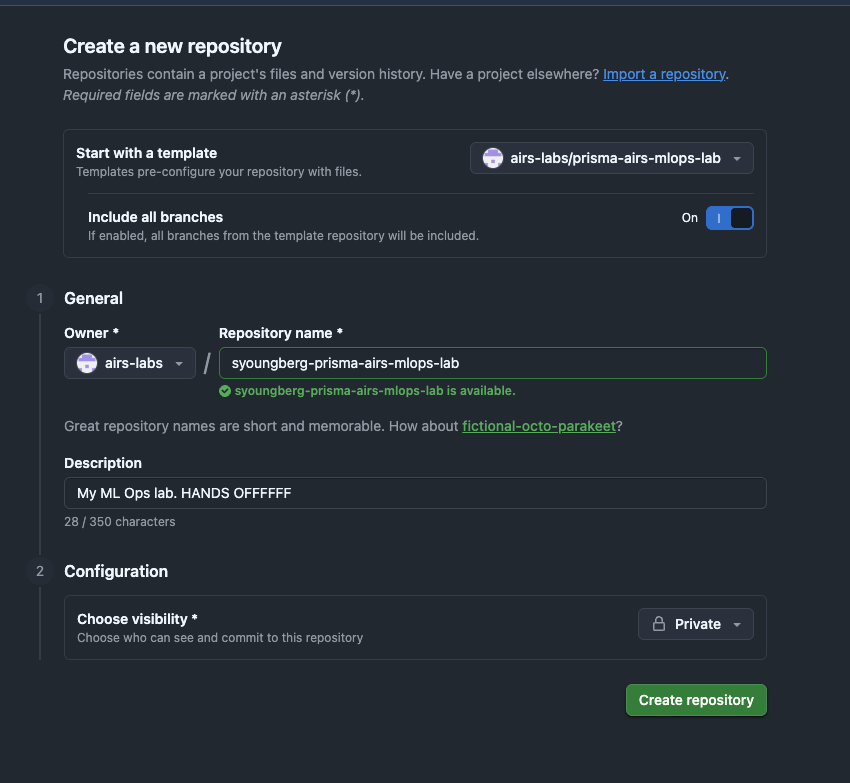

# Guia de Configuração do Estudante

Complete esses passos antes do lab começar. Ao final, você terá sua própria cópia privada do repositório do lab, as dependências instaladas e o Claude Code pronto para uso.

---

## Passo 1: Crie Seu Repo Privado a partir do Template

1. Abra o repositório template no seu navegador:

   ```
   https://github.com/airs-labs/prisma-airs-mlops-lab
   ```

2. Clique no botão verde **"Use this template"** (canto superior direito, ao lado de "Code").

3. Selecione **"Create a new repository"**.

4. Configure seu novo repo (veja a captura de tela abaixo):
   - **Include all branches:** Ative **On** — isso é necessário para que você receba tanto o branch `lab` (seu espaço de trabalho) quanto o branch `main` (soluções de referência)
   - **Owner:** Selecione `airs-labs` (a organização do workshop)
   - **Repository name:** `<seu-nome>-prisma-airs-mlops-lab` (ex: `syoungberg-prisma-airs-mlops-lab`)
   - **Visibility:** Selecione **Private**

5. Clique em **"Create repository"**.



> **Por que privado?** Os GitHub Secrets têm escopo por repositório. Seu repo conterá IDs de projeto do GCP, credenciais do AIRS e configurações de implantação específicas do seu ambiente. Um fork público exporia tudo isso.

---

## Passo 2: Clone e Mude para o Branch do Lab

1. Clone seu novo repo privado:

   ```bash
   git clone https://github.com/airs-labs/<seu-nome>-prisma-airs-mlops-lab.git
   cd <seu-nome>-prisma-airs-mlops-lab
   ```

2. Mude para o branch `lab`:

   ```bash
   git checkout lab
   ```

   O branch `lab` é seu branch de trabalho. Ele tem a estrutura do pipeline mas o escaneamento do AIRS ainda não está integrado: isso é o que você vai construir durante o workshop.

   O branch `main` contém a implementação de referência completa. Você pode comparar com ele a qualquer momento usando `git diff lab..main`.

3. Instale as dependências de Python:

   ```bash
   uv sync
   ```

   > Se você não tem `uv` instalado: `curl -LsSf https://astral.sh/uv/install.sh | sh` e reinicie seu terminal.

---

## Passo 3: Inicie o Claude Code

1. Abra o Claude Code no diretório do repo:

   ```bash
   claude
   ```

   O Claude foi pré-configurado como seu mentor do lab através do arquivo `CLAUDE.md` na raiz do repo. Ele conhece o código, adapta o ritmo das suas explicações e usa perguntas socráticas para guiar você.

2. Inicie o lab digitando:

   ```
   /lab:module 0
   ```

   O Módulo 0 guia você na verificação do seu projeto GCP, GitHub CLI e credenciais do AIRS. O Claude também vai ajudar a conectar seu repo ao template para receber atualizações do instrutor.

---

## Referência Rápida

| Comando | O Que Faz |
|---------|-----------|
| `/lab:module N` | Iniciar ou retomar o módulo N |
| `/lab:verify-N` | Executar verificações do módulo N |
| `/lab:hint` | Obter uma dica progressiva para seu desafio atual |
| `/lab:explore TEMA` | Mergulho em um conceito |
| `/lab:quiz` | Testar sua compreensão |
| `/lab:progress` | Ver seu dashboard de progresso |

---

## Retomando o Trabalho entre Sessões

Quando voltar ao lab depois de fechar seu terminal ou no dia seguinte:

### Passo 1: Baixe Atualizações do Instrutor

Antes de iniciar o Claude Code, baixe quaisquer mudanças que o instrutor tenha publicado. Abra um terminal no diretório do seu repo e cole este prompt no Claude:

```bash
cd <seu-nome>-prisma-airs-mlops-lab
claude
```

```
Verifique se eu tenho um remote "upstream" apontando para airs-labs/prisma-airs-mlops-lab.
Se não, adicione. Depois faça fetch do upstream e merge de upstream/lab no meu branch atual.
Se houver conflitos de merge em lab/.progress.json ou .github/pipeline-config.yaml,
mantenha minha versão (--ours) já que contêm minha configuração pessoal. Para todo o resto,
use a versão do upstream (--theirs).
```

O Claude vai cuidar dos comandos de git e resolver qualquer conflito automaticamente.

### Passo 2: Reinicie Sua Sessão do Lab

Se as mudanças do upstream atualizaram `CLAUDE.md` ou arquivos do lab, o Claude precisa carregar essas mudanças. Saia e reinicie o Claude Code para que ele leia as instruções mais recentes:

```
/exit
```

```bash
claude
```

### Passo 3: Continue de Onde Parou

Seu progresso é salvo em `lab/.progress.json`, então o Claude sabe exatamente onde você está. Execute:

```
/lab:progress
```

Isso mostra seu dashboard de progresso: quais módulos estão completos, seus pontos e quaisquer blockers. Depois retome seu módulo atual:

```
/lab:module N
```

Substitua `N` pelo módulo em que você estava. O Claude vai ler seu arquivo de progresso e continuar de onde você parou.

> **Por que não /resume?:**
> `/resume` recupera sua conversa anterior mas mantém as instruções antigas do `CLAUDE.md`. Depois de baixar atualizações do instrutor, uma sessão nova garante que o Claude trabalhe com o conteúdo mais recente do lab. Seu progresso não é perdido; está tudo no `.progress.json`.


> **Passos manuais (se preferir fazer você mesmo):**
>
> **Adicionar o remote upstream (apenas na primeira vez):**
>
```bash
git remote add upstream https://github.com/airs-labs/prisma-airs-mlops-lab.git
```
>
> **Baixar mudanças:**
>
```bash
git fetch upstream
git merge upstream/lab --no-edit
```
>
> **Se tiver conflito de merge em `lab/.progress.json` ou `.github/pipeline-config.yaml`**, mantenha sua versão (contêm sua configuração pessoal):
>
```bash
git checkout --ours lab/.progress.json .github/pipeline-config.yaml
git add lab/.progress.json .github/pipeline-config.yaml
git commit --no-edit
```
>
> Para conflitos em outros arquivos (guias do lab, código, workflows), use a versão do instrutor:
>
```bash
git checkout --theirs caminho/para/arquivo
git add caminho/para/arquivo
git commit --no-edit
```


---

## Solução de Problemas

| Problema | Solução |
|----------|---------|
| Botão "Use this template" não aparece | Confirme que está logado no GitHub e que foi adicionado à organização `airs-labs` |
| Branch `lab` não existe após o clone | Você não ativou "Include all branches" ao criar o template — delete o repo, recrie com o toggle ativado |
| `uv: command not found` | Instale o uv: `curl -LsSf https://astral.sh/uv/install.sh \| sh` e reinicie seu terminal |
| `claude: command not found` | Instale o Claude Code: `npm install -g @anthropic-ai/claude-code` |
| Claude não parece saber do lab | Confirme que está no diretório do repo e no branch `lab` — o Claude lê o `CLAUDE.md` da raiz do repo |
| Conflito de merge em `lab/.progress.json` | Mantenha sua versão: `git checkout --ours lab/.progress.json && git add lab/.progress.json && git commit --no-edit` |
| Remote `upstream` não encontrado | Adicione: `git remote add upstream https://github.com/airs-labs/prisma-airs-mlops-lab.git` |
