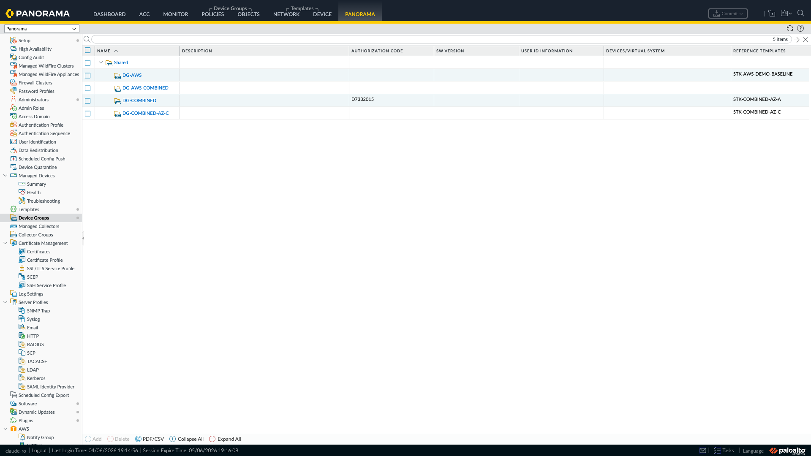
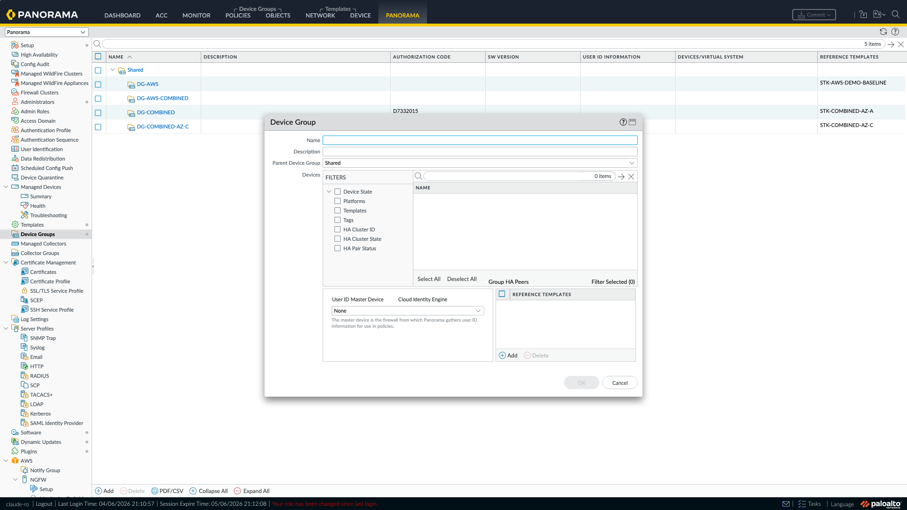
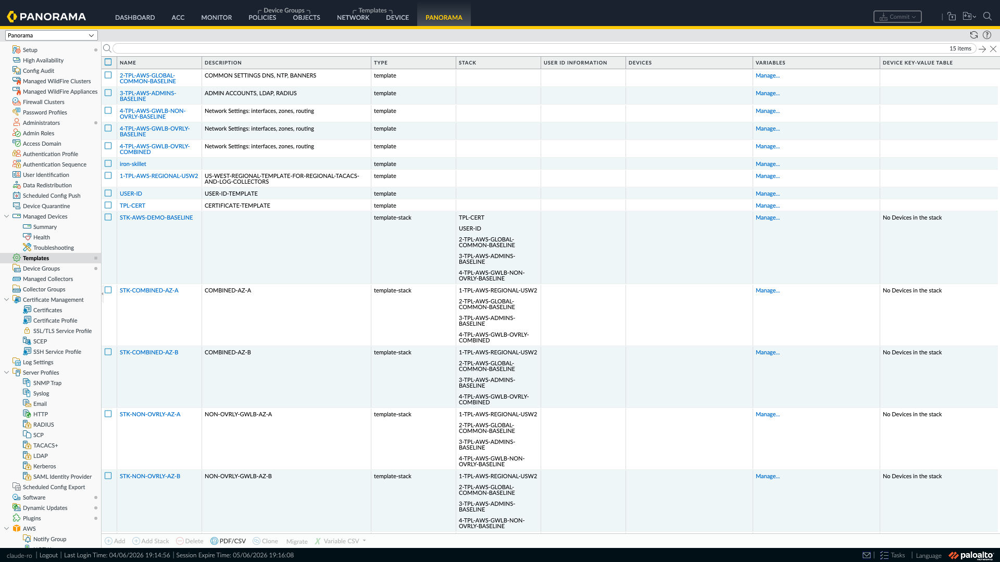
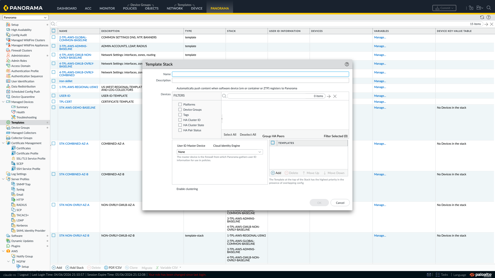
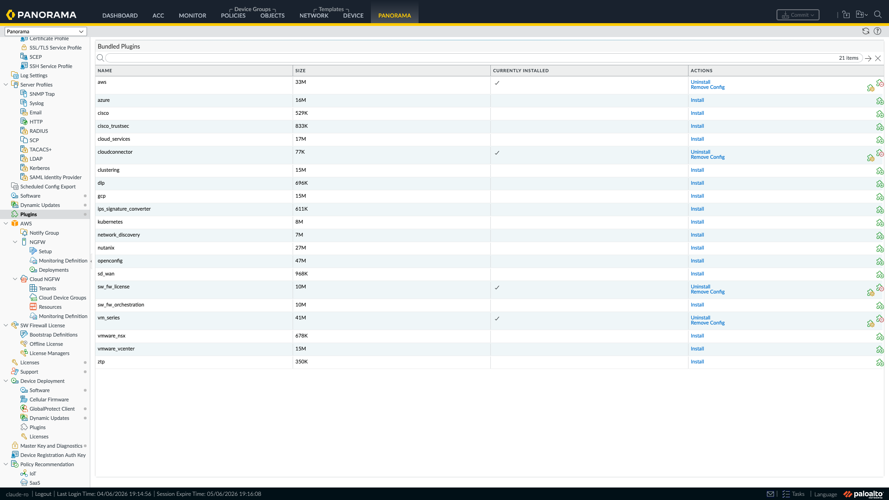
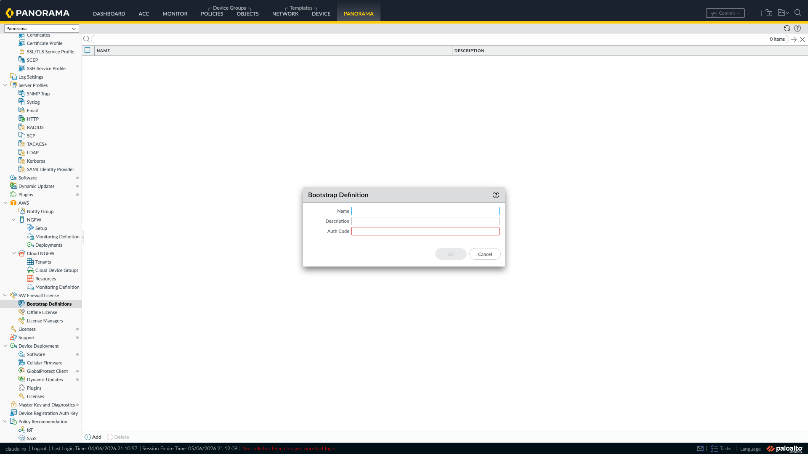
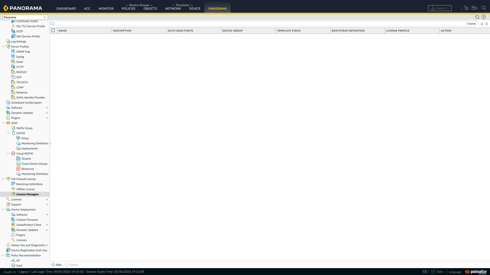
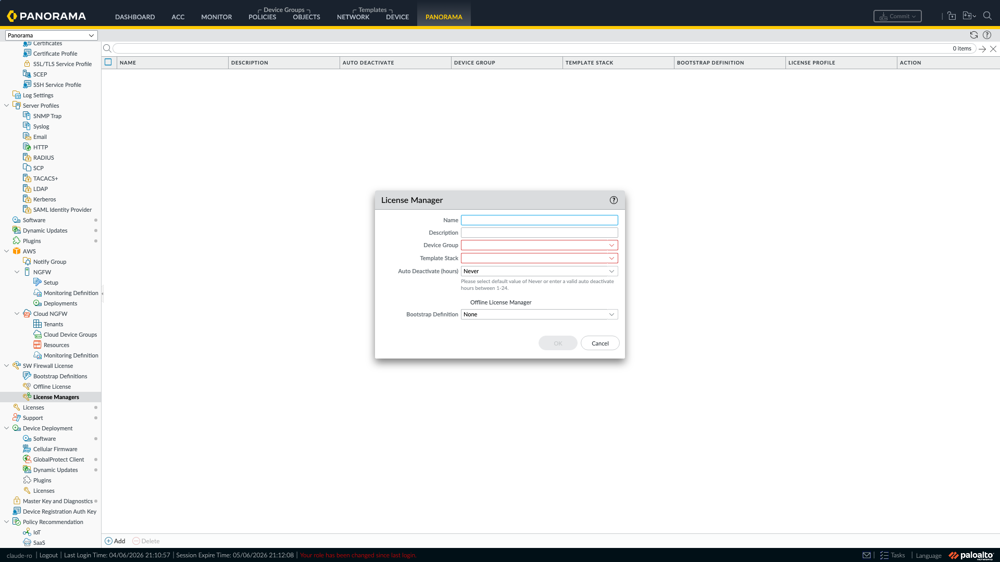
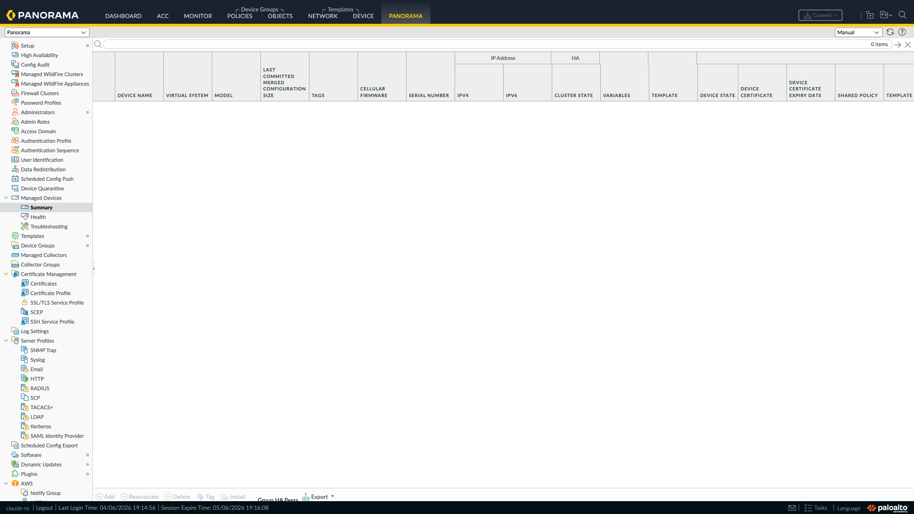

# VM-Series Firewall Bootstrap Guide (GCP)

A step-by-step guide to bootstrapping Palo Alto Networks VM-Series firewalls on GCP. Covers all four bootstrap methods in order of preference: Panorama licensing plugin, simple metadata bootstrap, GCS bucket basic bootstrap, and GCS full bootstrap with bootstrap.xml.

> **See also:** [AWS Guide](../aws/linear-guide.md) | [Azure Guide](../azure/linear-guide.md)

---

## Table of Contents

1. [Prerequisites Checklist](#prerequisites-checklist)
2. [Method 1: Panorama Licensing Plugin (Preferred)](#method-1-panorama-licensing-plugin-preferred)
3. [Method 2: Simple Bootstrap via Instance Metadata](#method-2-simple-bootstrap-via-instance-metadata-vm-auth-key--authcode)
4. [Method 3: GCS Bucket Basic Bootstrap with init-cfg and authcode](#method-3-gcs-bucket-basic-bootstrap-with-init-cfg-and-authcode)
5. [Method 4: GCS Full Bootstrap with bootstrap.xml](#method-4-gcs-full-bootstrap-with-bootstrapxml)

---

## Prerequisites Checklist

Complete all applicable items before bootstrapping. Each section includes setup instructions.

1. [ ] [**1 Software NGFW Credit Pool**](#1-activate-software-ngfw-credits) — activated and funded ([Activate Credits](https://docs.paloaltonetworks.com/vm-series/11-1/vm-series-deployment/license-the-vm-series-firewall/software-ngfw/activate-credits))
2. [ ] [**2 Deployment Profile**](#2-create-a-deployment-profile) — created with auth code ([Create a Deployment Profile](https://docs.paloaltonetworks.com/vm-series/11-1/vm-series-deployment/license-the-vm-series-firewall/software-ngfw/create-a-deployment-profile-vm-series))
3. [ ] [**3 Device Group**](#3-create-a-device-group-on-panorama) — created on Panorama ([Manage Device Groups](https://docs.paloaltonetworks.com/panorama/11-1/panorama-admin/manage-firewalls/manage-device-groups))
4. [ ] [**4 Template Stack**](#4-create-a-template-stack-on-panorama) — created on Panorama ([Manage Templates and Template Stacks](https://docs.paloaltonetworks.com/panorama/11-1/panorama-admin/manage-firewalls/manage-templates-and-template-stacks))
5. [ ] [**5 Auth Code**](#5-obtain-the-auth-code-for-bootstrap-definitions) — obtained for bootstrap definitions ([Manage a Deployment Profile](https://docs.paloaltonetworks.com/vm-series/11-1/vm-series-deployment/license-the-vm-series-firewall/software-ngfw/manage-a-deployment-profile))
6. [ ] [**6 Auto-Registration PIN ID & PIN Value**](#6-generate-auto-registration-pin-id-and-pin-value) — generated for device certificates ([Install a Device Certificate](https://docs.paloaltonetworks.com/vm-series/11-1/vm-series-deployment/license-the-vm-series-firewall/vm-series-models/install-a-device-certificate-on-the-vm-series-firewall))
7. [ ] [**7 Backhaul Connectivity to Panorama**](#7-establish-backhaul-connectivity-to-panorama) — Cloud Interconnect, Cloud VPN, VPC Peering, or Shared VPC established
8. [ ] [**8 VPC Firewall Rules**](#8-configure-vpc-firewall-rules) — Panorama ports and management access configured ([Ports Used for Panorama](https://docs.paloaltonetworks.com/pan-os/11-0/pan-os-admin/firewall-administration/reference-port-number-usage/ports-used-for-panorama))
9. [ ] [**9 GCP Marketplace Subscription**](#9-accept-the-gcp-marketplace-subscription) — accepted for your license model
10. [ ] [**10 VM-Series GCP Image**](#10-discover-the-vm-series-gcp-image) — identified from Marketplace or public project
11. [ ] [**11 Network Connectivity**](#11-ensure-network-connectivity) — management interface can reach Panorama and licensing servers
12. [ ] [**12 Licensing API Key**](#12-set-the-licensing-api-key-on-panorama) — set on Panorama for license deactivation ([Install a License Deactivation API Key](https://docs.paloaltonetworks.com/vm-series/11-1/vm-series-deployment/license-the-vm-series-firewall/vm-series-models/licensing-api/install-a-license-deactivation-api-key))

---

### 1. Activate Software NGFW Credits

> **Palo Alto Docs:** [Activate Credits](https://docs.paloaltonetworks.com/vm-series/11-1/vm-series-deployment/license-the-vm-series-firewall/software-ngfw/activate-credits)

Before creating deployment profiles or licensing firewalls, you need an active credit pool.

1. Log in to the [Palo Alto Networks Customer Support Portal](https://support.paloaltonetworks.com).
2. Navigate to **Assets > Software NGFW Credits**.
3. Locate your credit pool authorization code (provided in your purchase order).
4. Click **Activate** and enter the auth code to fund the credit pool.
5. Verify the credit pool shows available credits for your desired VM-Series model and subscription tier.

<!-- CSP SCREENSHOT NEEDED: Assets > Software NGFW Credits showing credit pool and Activate button -->


> **Note:** Credit pools are shared across your account. Each firewall deployment consumes credits based on the vCPU count and subscriptions defined in the deployment profile.

### 2. Create a Deployment Profile

> **Palo Alto Docs:** [Create a Deployment Profile](https://docs.paloaltonetworks.com/vm-series/11-1/vm-series-deployment/license-the-vm-series-firewall/software-ngfw/create-a-deployment-profile-vm-series) | [Manage a Deployment Profile](https://docs.paloaltonetworks.com/vm-series/11-1/vm-series-deployment/license-the-vm-series-firewall/software-ngfw/manage-a-deployment-profile)

The deployment profile defines the firewall model, vCPU allocation, and subscriptions that each bootstrapped firewall will receive.

1. In the Customer Support Portal, navigate to **Assets > Software NGFW Credits**.
2. Select your credit pool and click **Create Deployment Profile**.
3. Configure the profile:
   - **Profile Name** — descriptive name (e.g., `gcp-prod`)
   - **Firewall Model** — select the VM-Series model (e.g., VM-300, VM-500)
   - **vCPU Count** — number of vCPUs to allocate
   - **Subscriptions** — select Threat Prevention, WildFire, URL Filtering, DNS Security, etc.
   - **Token Count** — number of firewalls this profile can license (set based on expected fleet size)
4. Click **Create** to generate the deployment profile.
5. Note the **auth code** generated for this profile — you will need it for the bootstrap definition on Panorama.

<!-- CSP SCREENSHOT NEEDED: Create Deployment Profile dialog showing Profile Name, Firewall Model, vCPU, Subscriptions, Token Count -->


To manage existing profiles, go to **Assets > Software NGFW Credits > Deployment Profiles**. You can edit token counts, modify subscriptions, or deactivate profiles.

> **Profiles partition by licensing tier and vCPU, not by topology**
>
> A deployment profile is a license SKU bundle — firewall model, vCPU count, and subscription mix (Threat Prevention, WildFire, URL Filtering, etc.). The **auth code** the profile generates is what each bootstrapping VM-Series presents to license itself.
>
> The profile is *not* a grouping mechanism for region, cloud, function, or topology. Two firewalls in different clouds can share one profile if they have the same shape; two firewalls in the same VPC network can need different profiles if their vCPU counts or subscription tiers differ.
>
> Rule of thumb: **one profile per distinct (vCPU count + subscription bundle)**. A few common patterns:
>
> - All firewalls identical → one profile, one auth code.
> - Inbound at 4 vCPU, OBEW at 8 vCPU → two profiles (different vCPU counts).
> - Inbound with extra subscriptions (e.g. Advanced WildFire), internal-only with the base bundle → two profiles (different subscriptions) even if the vCPU counts match.
> - Same shape deployed across AWS, Azure, and GCP → one profile shared across all three clouds.
>
> Plan your profile count by walking your firewall inventory and grouping by *(vCPU count, subscription mix)*. The number of distinct combinations is the number of profiles — and auth codes — you need.

### 3. Create a Device Group on Panorama

> **Palo Alto Docs:** [Manage Device Groups](https://docs.paloaltonetworks.com/panorama/11-1/panorama-admin/manage-firewalls/manage-device-groups)

The Device Group holds security policies, objects, and rules that are pushed to managed firewalls.

1. Log in to Panorama.
2. Navigate to **Panorama > Device Groups**.



3. Click **Add** and configure:
   - **Name** — e.g., `YOUR-DG-HERE` (this is the value used in `dgname`)
   - **Description** — optional
   - **Reference Templates** — leave empty for now (firewalls inherit from the Template Stack)



4. Click **OK**.
5. **Commit** the change to Panorama (**Commit > Commit to Panorama**).

> **Important:** The Device Group must exist on Panorama *before* the firewall attempts to bootstrap. If the firewall connects and cannot find its assigned Device Group, registration will fail.

### 4. Create a Template Stack on Panorama

> **Palo Alto Docs:** [Manage Templates and Template Stacks](https://docs.paloaltonetworks.com/panorama/11-1/panorama-admin/manage-firewalls/manage-templates-and-template-stacks)

The Template Stack holds network, device, and system-level configuration that is pushed to managed firewalls.

1. In Panorama, navigate to **Panorama > Templates**.



2. Click **Add Stack** and configure:
   - **Name** — e.g., `YOUR-STACK-HERE` (this is the value used in `tplname`)
   - **Description** — optional
   - **Templates** — add one or more templates to the stack (create a base template first if none exist)



3. Click **OK**.
4. **Commit** the change to Panorama.

To create a base template:
1. Click **Add** (not Add Stack) on the **Panorama > Templates** page.
2. Name it (e.g., `TPL-BASE-GCP`) and click **OK**.
3. Configure device/network settings within this template as needed.
4. Add this template to your stack.

### 5. Obtain the Auth Code for Bootstrap Definitions

> **Palo Alto Docs:** [Manage a Deployment Profile](https://docs.paloaltonetworks.com/vm-series/11-1/vm-series-deployment/license-the-vm-series-firewall/software-ngfw/manage-a-deployment-profile)

The auth code links the deployment profile to the licensing plugin on Panorama.

1. In the Customer Support Portal, navigate to **Assets > Software NGFW Credits > Deployment Profiles**.
2. Locate the deployment profile you created in step 2.
3. Copy the **Auth Code** (format: `D1234567`).

<!-- CSP SCREENSHOT NEEDED: Deployment Profiles list showing auth code column -->


4. This auth code is used when creating the Bootstrap Definition in Panorama (under **Panorama > SW Firewall License > Bootstrap Definitions**).

### 6. Generate Auto-Registration PIN ID and PIN Value

> **Palo Alto Docs:** [Install a Device Certificate on the VM-Series Firewall](https://docs.paloaltonetworks.com/vm-series/11-1/vm-series-deployment/license-the-vm-series-firewall/vm-series-models/install-a-device-certificate-on-the-vm-series-firewall)

The PIN ID and PIN value allow the VM-Series firewall to automatically pull a device certificate from the Palo Alto Networks licensing server. This is required for the firewall to communicate with Panorama and activate its license.

1. Log in to the [Customer Support Portal](https://support.paloaltonetworks.com).
2. Navigate to **Products > VM-Series Auth-Codes** (or **Assets > VM-Series Deployment**).
3. Click **Generate OTP** (One-Time Password) or **Create Registration PIN**.

<!-- CSP SCREENSHOT NEEDED: VM-Series Auth-Codes page with Generate OTP / Create Registration PIN button -->


4. The portal generates two values:
   - **PIN ID** — a UUID format string (e.g., `81a75f2a-4de0-4f0e-959f-f31b5df06814`)
   - **PIN Value** — a hex string (e.g., `7059943c5565454db6b83cdcd305f338`)
5. Copy both values. These are used in the bootstrap parameters as:
   - `vm-series-auto-registration-pin-id`
   - `vm-series-auto-registration-pin-value`

<!-- CSP SCREENSHOT NEEDED: Generated PIN ID and PIN Value display -->


> **Note:** The PIN enables the firewall to fetch a device certificate during initial boot, which is required for license activation and Panorama registration. Without a valid PIN, the firewall cannot authenticate with the licensing infrastructure.

### 7. Establish Backhaul Connectivity to Panorama

The firewall management interfaces must have a network path to Panorama. If Panorama is on-premises, establish one of the following:

- **Cloud Interconnect (Dedicated)** — dedicated private connection from your data center to GCP
- **Cloud Interconnect (Partner)** — partner-facilitated private connection to GCP
- **Cloud VPN** — IPsec VPN tunnel from your data center to the VPC

If Panorama is hosted in GCP, establish connectivity between the firewall VPC and the Panorama VPC:

- **VPC Peering** — create a direct peering connection between the firewall VPC and the Panorama VPC
- **Shared VPC** — place both the firewall and Panorama in the same Shared VPC for simplified networking

> **Important:** Verify routing is in place end-to-end. The firewall management subnet must have a route to the Panorama management IP, and Panorama must have a return route to the firewall management subnet. Test with a simple connectivity check (e.g., `ping` or `nc -zv <panorama-ip> 3978`) from an instance in the firewall management subnet before deploying.

### 8. Configure VPC Firewall Rules

Create VPC firewall rules that allow the required traffic between the firewall management subnets and Panorama. These rules must be applied to **all** management subnets where firewalls will be deployed.

> For the full list of ports used by Panorama, see [Ports Used for Panorama](https://docs.paloaltonetworks.com/pan-os/11-0/pan-os-admin/firewall-administration/reference-port-number-usage/ports-used-for-panorama).

**Panorama Communication (required for all Panorama-managed methods):**

| Direction | Protocol | Port | Source | Destination | Purpose |
|---|---|---|---|---|---|
| Egress | TCP | 3978 | Firewall mgmt subnet(s) | Panorama IP(s) | Device registration and config sync |
| Egress | TCP | 28443 | Firewall mgmt subnet(s) | Panorama IP(s) | Panorama-to-device communication (PAN-OS 8.1+) |
| Ingress | TCP | 3978 | Panorama IP(s) | Firewall mgmt subnet(s) | Panorama-initiated connections |
| Ingress | TCP | 28443 | Panorama IP(s) | Firewall mgmt subnet(s) | Panorama-initiated connections |

**Management Access (required for UI/SSH access to firewalls):**

| Direction | Protocol | Port | Source | Destination | Purpose |
|---|---|---|---|---|---|
| Ingress | TCP | 443 | On-prem or cloud mgmt subnets | Firewall mgmt subnet(s) | Web UI (HTTPS) access |
| Ingress | TCP | 22 | On-prem or cloud mgmt subnets | Firewall mgmt subnet(s) | SSH access |

Example gcloud commands to create these firewall rules:

```bash
# Allow Panorama communication from firewalls
gcloud compute firewall-rules create allow-fw-to-panorama \
  --direction=EGRESS \
  --priority=1000 \
  --network=YOUR-VPC \
  --action=ALLOW \
  --rules=tcp:3978,tcp:28443 \
  --destination-ranges=YOUR-PANORAMA-IP/32

# Allow Panorama-initiated connections to firewalls
gcloud compute firewall-rules create allow-panorama-to-fw \
  --direction=INGRESS \
  --priority=1000 \
  --network=YOUR-VPC \
  --action=ALLOW \
  --rules=tcp:3978,tcp:28443 \
  --source-ranges=YOUR-PANORAMA-IP/32 \
  --target-tags=vm-series

# Allow management access (SSH and HTTPS)
gcloud compute firewall-rules create allow-mgmt-access \
  --direction=INGRESS \
  --priority=1000 \
  --network=YOUR-VPC \
  --action=ALLOW \
  --rules=tcp:22,tcp:443 \
  --source-ranges=YOUR-MGMT-CIDR \
  --target-tags=vm-series
```

> **Note:** Apply these rules to every management subnet where firewalls will be deployed. Use network tags (e.g., `vm-series`) to scope the rules to firewall instances. Also ensure firewall rules on the Panorama side allow inbound traffic from the firewall management subnets on ports 3978 and 28443.

### 9. Accept the GCP Marketplace Subscription

You must accept the GCP Marketplace terms before launching VM-Series instances. This is a one-time action per GCP project per product listing.

**Via GCP Console:**

1. Navigate to the VM-Series marketplace listing for your license model:
   - [VM-Series Flex BYOL](https://console.cloud.google.com/marketplace/product/paloaltonetworksgcp-public/vmseries-flex-byol)
   - [VM-Series Flex Bundle 1 (PAYG)](https://console.cloud.google.com/marketplace/product/paloaltonetworksgcp-public/vmseries-flex-bundle1)
   - [VM-Series Flex Bundle 2 (PAYG)](https://console.cloud.google.com/marketplace/product/paloaltonetworksgcp-public/vmseries-flex-bundle2)
2. Click **Launch** or **Get Started**.
3. Accept the terms and conditions. You do not need to complete the deployment from the Marketplace page.

**Via gcloud CLI:**

List available VM-Series images to verify access:

```bash
# List available VM-Series BYOL images
gcloud compute images list \
  --project paloaltonetworksgcp-public \
  --filter="name~'vmseries-flex-byol'" \
  --sort-by="~creationTimestamp" \
  --limit=5 \
  --format="table(name,creationTimestamp,status)"
```

> **Note:** Unlike AWS and Azure, GCP Marketplace terms are accepted through the console. If the `gcloud compute images list` command returns images, your project has access. If it returns empty results, accept the terms via the console links above.

### 10. Discover the VM-Series GCP Image

Find the available VM-Series images from the Palo Alto Networks public project:

```bash
# List all available VM-Series Flex images
gcloud compute images list \
  --project paloaltonetworksgx-public \
  --filter="name~'vmseries-flex'" \
  --format="table(name, creationTimestamp)"
```

Alternatively, browse the available images through the GCP Marketplace listing for VM-Series.

### 11. Ensure Network Connectivity

The firewall management interface needs:
- Outbound HTTPS (443) to Panorama (if using Panorama-managed bootstrap)
- Outbound HTTPS (443) to the Palo Alto licensing server (`updates.paloaltonetworks.com`) for license activation and device certificate retrieval
- DNS resolution

### 12. Set the Licensing API Key on Panorama

> **Palo Alto Docs:** [Install a License Deactivation API Key](https://docs.paloaltonetworks.com/vm-series/11-1/vm-series-deployment/license-the-vm-series-firewall/vm-series-models/licensing-api/install-a-license-deactivation-api-key)

The licensing API key allows Panorama to communicate with the Palo Alto Networks licensing server for automatic license allocation and deactivation.

1. Obtain the API key from the [Customer Support Portal](https://support.paloaltonetworks.com) under **Assets > Licensing API**.
2. SSH into Panorama and run:
   ```
   request license api-key set key <key>
   ```
3. Verify the key is set:
   ```
   request license api-key show
   ```

> This key is required for Method 1 (Panorama Licensing Plugin). Without it, the licensing plugin cannot allocate or reclaim licenses.

---

## Method 1: Panorama Licensing Plugin (Preferred)

> **Palo Alto Docs:** [Use Panorama-Based Software Firewall License Management](https://docs.paloaltonetworks.com/vm-series/11-1/vm-series-deployment/license-the-vm-series-firewall/use-panorama-based-software-firewall-license-management)

This is the recommended method for production and auto-scaling environments. Panorama handles licensing automatically -- firewalls receive their license upon connecting to Panorama, and licenses are reclaimed automatically when instances are terminated.

> **Internet Access:** This method does **not** require the firewalls to have direct internet access via the management interface -- Panorama handles all licensing on their behalf. However, Panorama itself **must** have direct internet access to reach `updates.paloaltonetworks.com`.

> **PAYG Note:** If you are using a PAYG (pay-as-you-go) license from the cloud marketplace, you do **not** need the SW Firewall License plugin. PAYG firewalls are licensed directly through the marketplace and do not require bootstrap definitions, license managers, or auth codes. Skip to Method 2 for PAYG deployments.

> **NSX Note:** If you are deploying VM-Series for VMware NSX, the `sw_fw_license` plugin has a dependency on the VM-Series plugin for NSX (`vm_series`). Both plugins must be installed on Panorama. Install the VM-Series plugin for NSX first, then install `sw_fw_license`. See [Troubleshooting: Plugin IP-Tag Issues](#plugin-ip-tag-issues) if you have multiple plugins installed.

> **Azure VM-Series Plugin Note:** If you have the Azure VM-Series plugin (`azure`) installed on Panorama alongside `sw_fw_license`, ensure the Azure plugin is fully configured and in a **Registered** or **Success** state. Unconfigured plugins can block IP-tag forwarding to firewalls. See [Troubleshooting: Plugin IP-Tag Issues](#plugin-ip-tag-issues).

### Step 1: Install the SW Firewall License Plugin on Panorama

1. Log in to Panorama.
2. Navigate to **Panorama > Plugins**.
3. Click **Check Now** to refresh the list of available plugins.
4. Locate `sw_fw_license` in the plugin list.
5. Click **Download** for the latest version.
6. Once downloaded, click **Install**.
7. After installation, verify the plugin appears under **Panorama > SW Firewall License** in the left navigation.



**Requirements:**
- Panorama 10.0.0 or later
- VM-Series plugin 2.0.4 or later (if managing NSX-based firewalls)
- VM-Series firewalls running PAN-OS 9.1.0 or later
- Licensing API key already configured on Panorama (see [§12 Licensing API Key](#12-set-the-licensing-api-key-on-panorama))
- Panorama must have internet access to `updates.paloaltonetworks.com` for license communication

### Step 2: Create a Bootstrap Definition

1. Go to **Panorama > SW Firewall License > Bootstrap Definitions**.
2. Click **Add**.
3. Enter a **Name** for the bootstrap definition (e.g., `bsd-gcp-prod`).
4. Enter the **Auth Code** from your [deployment profile](#2-create-a-deployment-profile) (format: `D1234567`).
5. Optionally enter a **Description** to identify the purpose of this definition.
6. Click **OK**.



> Each bootstrap definition maps to a single deployment profile auth code. If you have multiple deployment profiles (e.g., different vCPU counts or subscription tiers), create a separate bootstrap definition for each.

### Step 3: Configure a License Manager

1. Go to **Panorama > SW Firewall License > License Managers**.



2. Click **Add**.
3. Configure the following fields:
   - **Name** — e.g., `lm-gcp-prod`
   - **Device Group** — select the device group for the firewalls (e.g., `YOUR-DG-HERE`)
   - **Template Stack** — select the template stack (e.g., `YOUR-STACK-HERE`)
   - **Bootstrap Definition** — select the definition created in Step 2
   - **Auto Deactivate** — set the timer for automatic license reclamation when a firewall disconnects (1-24 hours, or "Never"). For auto-scaling environments, a value of 1-2 hours is recommended.



4. Click **OK**.
5. **Commit to Panorama** to save the configuration.

> The Auto Deactivate timer determines how long Panorama waits before reclaiming a license from a disconnected firewall. Setting this too short may cause licenses to be reclaimed during transient network issues. Setting it to "Never" requires manual deactivation.

### Step 4: Get the Bootstrap Parameters

1. In the **License Managers** screen, locate the license manager you just created.
2. In the **Action** column, click **Show Bootstrap Parameters**.
3. A dialog will display the bootstrap parameters. Copy the following values:
   - **auth-key** — the Panorama-generated authentication key (e.g., `YOUR-AUTH-KEY-HERE`)
   - **plugin-op-commands** — the plugin operation commands string (always starts with `panorama-licensing-mode-on`)

<!-- PANORAMA SCREENSHOT NEEDED: Show Bootstrap Parameters dialog — requires a configured License Manager -->


> **Important:** The `auth-key` shown here is generated by the licensing plugin and is **different** from a manually created VM auth key (`request bootstrap vm-auth-key generate`). Do not confuse the two.

### Step 5a: Configure Terraform Metadata

Use the Panorama-generated values in your Terraform configuration. In GCP, bootstrap parameters are passed as instance metadata:

```hcl
metadata = {
  # ── Minimum required values ──────────────────────────────────────
  plugin-op-commands                    = "panorama-licensing-mode-on"
  auth-key                              = "YOUR-AUTH-KEY-HERE"
  panorama-server                       = "YOUR-PANORAMA-SERVER-1-HERE"
  dgname                                = "YOUR-DG-HERE"
  tplname                               = "YOUR-STACK-HERE"

  # ── Optional: secondary Panorama ─────────────────────────────────
  panorama-server-2                     = "YOUR-PANORAMA-2-SERVER-HERE"

  # ── Optional: DHCP settings ──────────────────────────────────────
  dhcp-send-hostname                    = "yes"
  dhcp-send-client-id                   = "yes"
  dhcp-accept-server-hostname           = "yes"
  dhcp-accept-server-domain             = "yes"

  # ── Optional (best practice): device certificate auto-registration
  vm-series-auto-registration-pin-id    = "YOUR-PIN-ID-HERE"
  vm-series-auto-registration-pin-value = "YOUR-PIN-VALUE-HERE"
}
```

**Minimum required values:**

| Parameter | Description |
|---|---|
| `plugin-op-commands` | Must include `panorama-licensing-mode-on` as the first command |
| `auth-key` | Generated by the licensing plugin (from Step 4), **not** a manually created VM auth key |
| `panorama-server` | IP address of the primary Panorama |
| `dgname` | Device Group name on Panorama |
| `tplname` | **Template Stack** name on Panorama (this refers to the Template Stack, **not** a Template) |

> **Important:** The `vm-series-auto-registration-pin-id` and `vm-series-auto-registration-pin-value` parameters are optional but are a **best practice** for automatically installing a device certificate on the firewall during bootstrap.

Key points:
- `plugin-op-commands` **must** include `panorama-licensing-mode-on` as the first command
- The `auth-key` is generated by the licensing plugin, **not** a manually created VM auth key
- Do **not** include `authcodes` or `vm-auth-key` when using this method

### Step 5b: gcloud Instance Metadata

If not using Terraform, pass the same parameters as metadata key-value pairs using the `--metadata` flag:

```bash
gcloud compute instances create fw-prod-01 \
  --project=YOUR-PROJECT \
  --zone=us-central1-a \
  --machine-type=n2-standard-4 \
  --image=IMAGE-NAME \
  --image-project=paloaltonetworksgx-public \
  --metadata=plugin-op-commands=panorama-licensing-mode-on,auth-key=YOUR-AUTH-KEY-HERE,panorama-server=YOUR-PANORAMA-SERVER-1-HERE,panorama-server-2=YOUR-PANORAMA-2-SERVER-HERE,dgname=YOUR-DG-HERE,tplname=YOUR-STACK-HERE,dhcp-send-hostname=yes,dhcp-send-client-id=yes,dhcp-accept-server-hostname=yes,dhcp-accept-server-domain=yes,vm-series-auto-registration-pin-id=YOUR-PIN-ID-HERE,vm-series-auto-registration-pin-value=YOUR-PIN-VALUE-HERE
```

Alternatively, place the semicolon-delimited bootstrap string in a file and use `--metadata-from-file`:

```bash
# Create bootstrap.txt with the semicolon-delimited string
cat > bootstrap.txt << 'EOF'
plugin-op-commands=panorama-licensing-mode-on;auth-key=YOUR-AUTH-KEY-HERE;panorama-server=YOUR-PANORAMA-SERVER-1-HERE;panorama-server-2=YOUR-PANORAMA-2-SERVER-HERE;dgname=YOUR-DG-HERE;tplname=YOUR-STACK-HERE;dhcp-send-hostname=yes;dhcp-send-client-id=yes;dhcp-accept-server-hostname=yes;dhcp-accept-server-domain=yes;vm-series-auto-registration-pin-id=YOUR-PIN-ID-HERE;vm-series-auto-registration-pin-value=YOUR-PIN-VALUE-HERE
EOF

gcloud compute instances create fw-prod-01 \
  --project=YOUR-PROJECT \
  --zone=us-central1-a \
  --machine-type=n2-standard-4 \
  --image=IMAGE-NAME \
  --image-project=paloaltonetworksgx-public \
  --metadata-from-file=bootstrap-options=bootstrap.txt
```

> **Rule:** No spaces around `=` signs. GCP metadata supports both individual key-value pairs via `--metadata` and file-based input via `--metadata-from-file`.

---

## Method 2: Simple Bootstrap via Instance Metadata (vm-auth-key + authcode)

Use this when you want a quick deployment without the licensing plugin. The firewall registers with Panorama using a manually generated VM auth key and licenses itself using an auth code.

> **Internet Access:** This method **requires** the firewall management interfaces to have direct internet access to reach `updates.paloaltonetworks.com` for licensing. This can be accomplished via a **Cloud NAT gateway** (preferred) or with an external IP on the management interface (not recommended -- if an external IP is used, ensure the VPC firewall rules are locked down as tightly as possible).

### Required Information

Gather the following before proceeding:

| Information | Source | Example |
|---|---|---|
| **Auth Code** | [Deployment profile](#2-create-a-deployment-profile) in the Customer Support Portal | `D1234567` |
| **Panorama IP(s)** | Primary (and optional secondary) Panorama management IP | `YOUR-PANORAMA-SERVER-1-HERE` |
| **Device Group** | [Device Group](#3-create-a-device-group-on-panorama) name on Panorama | `YOUR-DG-HERE` |
| **Template Stack** | [Template Stack](#4-create-a-template-stack-on-panorama) name on Panorama (**not** a Template) | `YOUR-STACK-HERE` |

### Step 1: Generate a VM Auth Key on Panorama

```
request bootstrap vm-auth-key generate lifetime 8760
```

This creates a key valid for 1 year (max 8760 hours). To view existing keys:

```
request bootstrap vm-auth-key show
```

### Step 2a: Configure Terraform Metadata

```hcl
metadata = {
  # ── Minimum required values ──────────────────────────────────────
  authcodes                             = "D1234567"
  vm-auth-key                           = "YOUR-VM-AUTH-KEY-HERE"
  panorama-server                       = "YOUR-PANORAMA-SERVER-1-HERE"
  dgname                                = "YOUR-DG-HERE"
  tplname                               = "YOUR-STACK-HERE"

  # ── Optional: secondary Panorama ─────────────────────────────────
  panorama-server-2                     = "YOUR-PANORAMA-2-SERVER-HERE"

  # ── Optional: DHCP settings ──────────────────────────────────────
  dhcp-send-hostname                    = "yes"
  dhcp-send-client-id                   = "yes"
  dhcp-accept-server-hostname           = "yes"
  dhcp-accept-server-domain             = "yes"

  # ── Optional (best practice): device certificate auto-registration
  vm-series-auto-registration-pin-id    = "YOUR-PIN-ID-HERE"
  vm-series-auto-registration-pin-value = "YOUR-PIN-VALUE-HERE"
}
```

**Minimum required values:**

| Parameter | Description |
|---|---|
| `authcodes` | Auth code from your [deployment profile](#2-create-a-deployment-profile) |
| `vm-auth-key` | Manually generated VM auth key from Step 1 |
| `panorama-server` | IP address of the primary Panorama |
| `dgname` | Device Group name on Panorama |
| `tplname` | **Template Stack** name on Panorama (this refers to the Template Stack, **not** a Template) |

> **Important:** The `vm-series-auto-registration-pin-id` and `vm-series-auto-registration-pin-value` parameters are optional but are a **best practice** for automatically installing a device certificate on the firewall during bootstrap.

Key differences from Method 1:
- `plugin-op-commands` does **not** include `panorama-licensing-mode-on`
- Uses `authcodes` instead of the licensing plugin auth-key
- Uses `vm-auth-key` (manually generated) instead of the plugin-generated `auth-key`

### Step 2b: gcloud Instance Metadata

```bash
gcloud compute instances create fw-prod-01 \
  --project=YOUR-PROJECT \
  --zone=us-central1-a \
  --machine-type=n2-standard-4 \
  --image=IMAGE-NAME \
  --image-project=paloaltonetworksgx-public \
  --metadata=authcodes=D1234567,vm-auth-key=YOUR-VM-AUTH-KEY-HERE,panorama-server=YOUR-PANORAMA-SERVER-1-HERE,dgname=YOUR-DG-HERE,tplname=YOUR-STACK-HERE,panorama-server-2=YOUR-PANORAMA-2-SERVER-HERE,dhcp-send-hostname=yes,dhcp-send-client-id=yes,dhcp-accept-server-hostname=yes,dhcp-accept-server-domain=yes,vm-series-auto-registration-pin-id=YOUR-PIN-ID-HERE,vm-series-auto-registration-pin-value=YOUR-PIN-VALUE-HERE
```

> **Rule:** No spaces around `=` signs. GCP metadata supports both individual key-value pairs via `--metadata` and file-based input via `--metadata-from-file`.

> **Note:** Do **not** include `panorama-licensing-mode-on` in `plugin-op-commands` for Method 2.

---

## Method 3: GCS Bucket Basic Bootstrap with init-cfg and authcode

Use this when you need a storage-based bootstrap but do not need to bundle PAN-OS software or content updates. The GCS bucket contains only `init-cfg.txt` and the auth code file.

> **Internet Access:** This method **requires** the firewall management interfaces to have direct internet access to reach `updates.paloaltonetworks.com` for licensing. This can be accomplished via a **Cloud NAT gateway** (preferred) or with an external IP on the management interface (not recommended -- if an external IP is used, ensure the VPC firewall rules are locked down as tightly as possible).

### Step 1: GCS Bucket Directory Structure

The bootstrap GCS bucket requires the following five directories. All five **must** exist, even if empty -- the firewall checks for this structure during bootstrap and will fail if any directory is missing.

```
gs://your-bootstrap-bucket/
  config/
  content/
  license/
  plugins/
  software/
```

#### Creating the Bucket and Directory Structure

Create the GCS bucket and required directories using gsutil:

```bash
# Create the bootstrap bucket
gsutil mb gs://your-bootstrap-bucket

# Create the required directory structure
# GCS does not have true directories -- create empty marker objects to represent the folder structure
gsutil cp /dev/null gs://your-bootstrap-bucket/config/
gsutil cp /dev/null gs://your-bootstrap-bucket/content/
gsutil cp /dev/null gs://your-bootstrap-bucket/license/
gsutil cp /dev/null gs://your-bootstrap-bucket/plugins/
gsutil cp /dev/null gs://your-bootstrap-bucket/software/
```

Alternatively, create the bucket and folders through the [GCP Console](https://console.cloud.google.com/storage).

#### Directory and Required Files

| Directory | Required File(s) | File Extension | Description |
|---|---|---|---|
| `config/` | `init-cfg.txt` | `.txt` | Bootstrap configuration parameters |
| `content/` | _(empty)_ | — | Content update files (not used in this method) |
| `license/` | `authcodes` | **no extension** | License auth code(s), one per line |
| `plugins/` | _(empty)_ | — | VM-Series plugin files (not used in this method) |
| `software/` | _(empty)_ | — | PAN-OS image files (not used in this method) |

### Step 2: Create init-cfg.txt

```
type=dhcp
panorama-server=YOUR-PANORAMA-SERVER-1-HERE
panorama-server-2=YOUR-PANORAMA-2-SERVER-HERE
tplname=YOUR-STACK-HERE
dgname=YOUR-DG-HERE
vm-auth-key=YOUR-VM-AUTH-KEY-HERE
hostname=fw-prod-01
dns-primary=169.254.169.254
vm-series-auto-registration-pin-id=YOUR-PIN-ID-HERE
vm-series-auto-registration-pin-value=YOUR-PIN-VALUE-HERE
```

**Syntax rules:**
- No spaces around `=`
- One parameter per line
- `type` is required (`dhcp` or `static`)
- If `type=static`, you must also include `ip-address`, `netmask`, and `default-gateway`

#### Required Parameters

| Parameter | Description | Example |
|---|---|---|
| `type` | IP assignment method | `dhcp` or `static` |
| `panorama-server` | Primary Panorama IP | `YOUR-PANORAMA-SERVER-1-HERE` |
| `tplname` | Template Stack name on Panorama (**not** a Template) | `YOUR-STACK-HERE` |
| `dgname` | Device Group name on Panorama | `YOUR-DG-HERE` |
| `vm-auth-key` | VM auth key generated on Panorama | `YOUR-VM-AUTH-KEY-HERE` |

#### Optional Parameters

| Parameter | Description | Example |
|---|---|---|
| `panorama-server-2` | Secondary Panorama IP (HA pair) | `YOUR-PANORAMA-2-SERVER-HERE` |
| `hostname` | Desired firewall hostname | `fw-prod-01` |
| `dns-primary` | Primary DNS server | `169.254.169.254` |
| `vm-series-auto-registration-pin-id` | PIN ID for device certificate auto-registration | `YOUR-PIN-ID-HERE` |
| `vm-series-auto-registration-pin-value` | PIN value for device certificate auto-registration | `YOUR-PIN-VALUE-HERE` |

### Step 3: Create the authcodes File

Place a plain text file named `authcodes` in the `/license/` directory containing one auth code per line:

> **Important:** The file is named `authcodes` with **no file extension** -- not `authcodes.txt`, not `authcodes.key`. The firewall expects this exact filename. The file must be plain text with no trailing whitespace or blank lines.

```
D1234567
```

> **Palo Alto Docs:** [Prepare the Bootstrap Package](https://docs.paloaltonetworks.com/vm-series/11-1/vm-series-deployment/bootstrap-the-vm-series-firewall/prepare-the-bootstrap-package)

### Step 4: Upload Files to GCS

Upload the bootstrap files to the GCS bucket:

```bash
# Upload init-cfg.txt to the config/ directory
gsutil cp init-cfg.txt gs://your-bootstrap-bucket/config/

# Upload the authcodes file to the license/ directory
gsutil cp authcodes gs://your-bootstrap-bucket/license/
```

Verify the bucket structure:

```bash
gsutil ls -r gs://your-bootstrap-bucket/
```

### Step 5: Create a Service Account and Grant GCS Access

The VM instance needs a service account with read access to the GCS bootstrap bucket. Without this, the firewall cannot read the bootstrap files at launch.

```bash
# Create a service account for the VM-Series firewall
gcloud iam service-accounts create vmseries-bootstrap \
  --display-name="VM-Series Bootstrap Service Account"

# Grant the service account read access to the bootstrap bucket
gsutil iam ch \
  serviceAccount:vmseries-bootstrap@YOUR-PROJECT.iam.gserviceaccount.com:roles/storage.objectViewer \
  gs://your-bootstrap-bucket
```

Alternatively, grant the `roles/storage.objectViewer` role at the project level if the service account needs access to multiple buckets:

```bash
gcloud projects add-iam-policy-binding YOUR-PROJECT \
  --member="serviceAccount:vmseries-bootstrap@YOUR-PROJECT.iam.gserviceaccount.com" \
  --role="roles/storage.objectViewer"
```

### Step 6: Launch the Instance

Point the VM-Series instance to the GCS bucket via instance metadata:

```bash
gcloud compute instances create fw-prod-01 \
  --project=YOUR-PROJECT \
  --zone=us-central1-a \
  --machine-type=n2-standard-4 \
  --image=IMAGE-NAME \
  --image-project=paloaltonetworksgx-public \
  --service-account=vmseries-bootstrap@YOUR-PROJECT.iam.gserviceaccount.com \
  --scopes=https://www.googleapis.com/auth/devstorage.read_only \
  --metadata=vmseries-bootstrap-gce-storagebucket=your-bootstrap-bucket
```

In Terraform, pass the bootstrap bucket via the `metadata` block:

```hcl
metadata = {
  vmseries-bootstrap-gce-storagebucket = "your-bootstrap-bucket"
}

service_account {
  email  = "vmseries-bootstrap@YOUR-PROJECT.iam.gserviceaccount.com"
  scopes = ["https://www.googleapis.com/auth/devstorage.read_only"]
}
```

> **Important:** The metadata key is `vmseries-bootstrap-gce-storagebucket` and the value is the bucket name only (without the `gs://` prefix).

---

## Method 4: GCS Full Bootstrap with bootstrap.xml

Use this for zero-touch deployments where the firewall must boot fully configured with a complete PAN-OS configuration, including interfaces, security policies, NAT rules, and routing -- without needing Panorama or SCM. The `bootstrap.xml` file is a full VM-Series configuration file that the firewall applies on first boot.

> **Note:** This method is generally **not used** when Panorama or Strata Cloud Manager are managing the firewalls, since those platforms push configuration to the firewall after bootstrap. Use this method for standalone firewalls or environments where the firewall must operate independently.

> **Internet Access:** This method **requires** the firewall management interfaces to have direct internet access to reach `updates.paloaltonetworks.com` for licensing. This can be accomplished via a **Cloud NAT gateway** (preferred) or with an external IP on the management interface (not recommended -- if an external IP is used, ensure the VPC firewall rules are locked down as tightly as possible).

### Step 1: GCS Bucket Directory Structure

Same as Method 3. All five directories must exist:

```
gs://your-bootstrap-bucket/
  config/
  content/
  license/
  plugins/
  software/
```

See [Method 3 Step 1](#step-1-gcs-bucket-directory-structure) for gsutil commands to create the bucket and directory structure.

#### Directory and Required Files

| Directory | Required File(s) | File Extension | Description |
|---|---|---|---|
| `config/` | `init-cfg.txt`, `bootstrap.xml` | `.txt`, `.xml` | Bootstrap parameters and full firewall configuration |
| `content/` | Content update file | _(vendor filename)_ | e.g., `panupv2-all-contents-8776-8520` |
| `license/` | `authcodes` | **no extension** | License auth code(s), one per line |
| `plugins/` | VM-Series plugin _(optional)_ | _(vendor filename)_ | e.g., `PanGPS_vm-3.0.2` |
| `software/` | PAN-OS image(s) | _(vendor filename)_ | e.g., `PanOS_vm-11.1.4-h13` |

### Step 2: Create init-cfg.txt

Same format as Method 3. See the [init-cfg.txt reference](#init-cfgtxt-parameter-reference) below.

### Step 3: Create the authcodes File

Same as Method 3. See [Method 3 Step 3](#step-3-create-the-authcodes-file).

### Step 4: Upload Files to GCS

Same as Method 3, but also upload `bootstrap.xml` and any software/content/plugin files:

```bash
# Upload init-cfg.txt and bootstrap.xml to the config/ directory
gsutil cp init-cfg.txt gs://your-bootstrap-bucket/config/
gsutil cp bootstrap.xml gs://your-bootstrap-bucket/config/

# Upload the authcodes file to the license/ directory
gsutil cp authcodes gs://your-bootstrap-bucket/license/

# Upload software, content, and plugin files as needed
gsutil cp PanOS_vm-11.1.4-h13 gs://your-bootstrap-bucket/software/
gsutil cp panupv2-all-contents-8776-8520 gs://your-bootstrap-bucket/content/
```

### Step 5: Create a Service Account and Grant GCS Access

Same as Method 3. See [Method 3 Step 5](#step-5-create-a-service-account-and-grant-gcs-access).

### Step 6: Launch the Instance

Same as Method 3. See [Method 3 Step 6](#step-6-launch-the-instance).

### Step 7: Create bootstrap.xml

The `bootstrap.xml` is a complete PAN-OS configuration file that the firewall applies on first boot. The typical approach is to export the running configuration from a known-working reference firewall and use it as a seed configuration for new deployments.

#### Exporting the Configuration from a Reference Firewall

**Option A: Using the Web UI**

1. Log in to a VM-Series firewall that has the desired configuration.
2. Navigate to **Device > Setup > Operations**.
3. Click **Export named configuration snapshot**.
4. Select `running-config.xml` and save the file.
5. Rename the downloaded file to exactly `bootstrap.xml` (case-sensitive).
6. Place it in the `config/` directory alongside `init-cfg.txt`.

**Option B: Using the API**

Generate an API key and export the running config via the XML API:

```bash
# Generate an API key
curl -k "https://<firewall-ip>/api/?type=keygen&user=admin&password=<password>"

# Export the running configuration
curl -k "https://<firewall-ip>/api/?type=export&category=configuration&key=<api-key>" -o bootstrap.xml
```

**Option C: Using the CLI**

```
scp export configuration from running-config.xml to <user>@<destination>:/path/bootstrap.xml
```

> **Palo Alto Docs:** [Create the bootstrap.xml File](https://docs.paloaltonetworks.com/vm-series/11-1/vm-series-deployment/bootstrap-the-vm-series-firewall/create-the-bootstrapxml-file)

#### What to Review Before Using the Seed Config

> **Warning:** When using a configuration from another firewall as a seed, the following values will almost certainly differ if the new firewall is in a different region, zone, or project:
>
> - **Management interface IP address** (`ip-address`, `netmask`, `default-gateway`) -- these are environment-specific
> - **Default routes and gateway IPs** -- vary by VPC/subnet
> - **Interface IP addresses** -- dataplane interface IPs tied to the specific subnet
> - **DNS server addresses** -- may differ between environments
> - **Hostname** -- should be unique per firewall
> - **Zone and interface mappings** -- verify they match the new network topology
>
> Review and update these values in the `bootstrap.xml` before placing it in the GCS bucket. Deploying with incorrect network values will result in an unreachable firewall.

### Step 8: Add Software and Content Files (Optional)

If you need to boot the firewall with a specific PAN-OS version or content update:

- **Software:** Place PAN-OS image files in `software/`. Include **all intermediate versions** between the factory image and your target version -- the firewall upgrades sequentially and will fail if a version is skipped.
- **Content:** Place the content update file in `content/`. Include the minimum content version required for the target PAN-OS version. A content version mismatch causes the upgrade to fail.
- **Plugins (optional):** Place a single VM-Series plugin image in `plugins/` if needed.

---

## SCM (Strata Cloud Manager) Bootstrap Variant

For PAN-OS 11.0 or higher, you can bootstrap the firewall to register with Strata Cloud Manager instead of an on-premises Panorama.

```hcl
metadata = {
  panorama-server                       = "cloud"
  dgname                                = "scm_folder_name"
  dhcp-send-hostname                    = "yes"
  dhcp-send-client-id                   = "yes"
  dhcp-accept-server-hostname           = "yes"
  dhcp-accept-server-domain             = "yes"
  plugin-op-commands                    = "advance-routing:enable"
  vm-series-auto-registration-pin-id    = "YOUR-PIN-ID-HERE"
  vm-series-auto-registration-pin-value = "YOUR-PIN-VALUE-HERE"
  authcodes                             = "D1234567"
}
```

Key differences:
- `panorama-server` is set to `"cloud"` (not an IP address)
- `dgname` maps to the SCM **folder name**, not a Panorama Device Group
- No `tplname` is used
- No `auth-key` or `vm-auth-key` is needed

---

## DHCP Options Reference

These parameters control DHCP behavior on the management interface and are recommended for GCP deployments:

| Parameter | Value | Purpose |
|---|---|---|
| `dhcp-send-hostname` | `yes` | Sends the firewall hostname in DHCP requests |
| `dhcp-send-client-id` | `yes` | Sends a client identifier in DHCP requests |
| `dhcp-accept-server-hostname` | `yes` | Accepts the hostname assigned by the DHCP server |
| `dhcp-accept-server-domain` | `yes` | Accepts the domain name assigned by the DHCP server |

---

## plugin-op-commands Reference

The `plugin-op-commands` parameter accepts a comma-separated list of commands:

| Command | Purpose |
|---|---|
| `panorama-licensing-mode-on` | Enables Panorama-based licensing (Method 1 only) |
| `advance-routing:enable` | Enables advanced routing (PAN-OS 11.0+) |

---

## Auto-Registration PIN Fields

These fields are obtained from the Palo Alto Networks Customer Support Portal and enable automatic device registration:

| Parameter | Description |
|---|---|
| `vm-series-auto-registration-pin-id` | UUID-format PIN ID from the CSP |
| `vm-series-auto-registration-pin-value` | Hex string PIN value from the CSP |

To generate: Log in to the [Customer Support Portal](https://support.paloaltonetworks.com), navigate to **Assets > VM-Series Auth Codes**, and create a registration PIN.

---

## init-cfg.txt Parameter Reference

| Parameter | Description | Required |
|---|---|---|
| `type` | `dhcp` or `static` | Yes |
| `ip-address` | Management IP (IPv4) | If `type=static` |
| `netmask` | Subnet mask | If `type=static` |
| `default-gateway` | Default gateway | If `type=static` |
| `ipv6-address` | Management IP (IPv6) | No |
| `ipv6-default-gateway` | IPv6 default gateway | No |
| `hostname` | Firewall hostname | No |
| `dns-primary` | Primary DNS server | No |
| `dns-secondary` | Secondary DNS server | No |
| `panorama-server` | Primary Panorama IP or `cloud` for SCM | No |
| `panorama-server-2` | Secondary Panorama IP | No |
| `tplname` | Template Stack name | No (but needed for Panorama push) |
| `dgname` | Device Group name | No (but needed for Panorama push) |
| `vm-auth-key` | Manually generated Panorama VM auth key | No |
| `auth-key` | Plugin-generated auth key (Method 1) | No |
| `authcodes` | License authorization code | No |
| `vm-series-auto-registration-pin-id` | Auto-registration PIN ID | No (recommended) |
| `vm-series-auto-registration-pin-value` | Auto-registration PIN value | No (recommended) |
| `plugin-op-commands` | Comma-separated plugin commands | No |
| `dhcp-send-hostname` | Send hostname via DHCP | No |
| `dhcp-send-client-id` | Send client ID via DHCP | No |
| `dhcp-accept-server-hostname` | Accept DHCP-assigned hostname | No |
| `dhcp-accept-server-domain` | Accept DHCP-assigned domain | No |

---

## Bootstrap Verification

After the instance launches, verify bootstrap completion:

### CLI Commands

SSH into the firewall management interface and run:

```
# Check system status and PAN-OS version
show system info

# Verify the running configuration matches expectations
show config running

# Check license status
request license info

# Check Panorama connection status
show panorama-status

# View bootstrap status logs
debug logview component bts_details
```

### Panorama Verification

If using Panorama-managed bootstrap:

1. Navigate to **Panorama > Managed Devices > Summary**.



2. Confirm the firewall appears with the correct serial number.
3. Verify it is assigned to the expected Device Group and Template Stack.
4. For licensing plugin users, check: **Panorama > SW Firewall License > License Managers** to confirm the license was allocated.

### What Success Looks Like

- `show system info` displays the expected hostname, PAN-OS version, and operational mode
- `request license info` shows all expected subscriptions as active
- The firewall appears in Panorama under the correct Device Group and Template Stack
- Security policies are being enforced (if bootstrap.xml was used)

---

## Troubleshooting

### Common Bootstrap Errors

| Error | Cause | Resolution |
|---|---|---|
| **Boot image error** | No bootstrap media detected or critical read error | Verify the GCS bucket exists and service account has access |
| **No bootstrap config file on external device** | `init-cfg.txt` or `bootstrap.xml` missing from `/config` | Check that files are in the correct directory path |
| **Bad or no parameters for mandatory networking information** | Missing or malformed IP/netmask/gateway in `init-cfg.txt` | Check for spaces around `=` signs; verify all required fields for `type=static` |
| **Failed to install license key using authcode** | Invalid or expired auth code | Verify the auth code in the Customer Support Portal |
| **Failed content update commits** | Content version incompatible with PAN-OS version | Use the minimum content version required for the target PAN-OS |

### General Troubleshooting Steps

1. **Check the bootstrap log:** `debug logview component bts_details`
2. **Verify GCS access:** Manually test the service account by running `gsutil ls gs://your-bootstrap-bucket/` from an instance with the same service account.
3. **Check init-cfg.txt formatting:** No spaces around `=`, no trailing whitespace, no BOM characters. Use a plain text editor.
4. **Verify network connectivity:** Ensure the management subnet has a route to Panorama and/or the internet (for licensing).
5. **Check Panorama readiness:** Ensure the Device Group and Template Stack exist before launching the firewall. Ensure the VM auth key has not expired.
6. **Review instance serial console output:** In the GCP Console, navigate to **Compute Engine > VM instances**, click the instance, and select **Serial port 1 (console)** under the Logs section.
7. **Check service account permissions:** Verify the service account attached to the instance has `roles/storage.objectViewer` on the GCS bucket:
   ```bash
   gsutil iam get gs://your-bootstrap-bucket
   ```
8. **Check instance metadata:** Verify metadata was applied correctly:
   ```bash
   gcloud compute instances describe fw-prod-01 \
     --zone=us-central1-a \
     --format="yaml(metadata)"
   ```

### Firewall Stuck at 192.168.1.1

This means the bootstrap process failed and the firewall reverted to factory defaults. Common causes:
- `init-cfg.txt` has syntax errors (spaces around `=`)
- The GCS bucket is unreachable (service account permissions, bucket does not exist, or network issue)
- Required parameters are missing (e.g., `type` is not set)
- The instance metadata key `vmseries-bootstrap-gce-storagebucket` is misspelled or missing

### Plugin IP-Tag Issues

If you have a standalone Panorama or two Panorama appliances in an HA pair with multiple plugins installed, plugins might not receive updated IP-tag information if one or more of the plugins is not configured. This occurs because Panorama will not forward IP-tag information to unconfigured plugins.

This issue can also occur if one or more of the Panorama plugins is not in the **Registered** or **Success** state (the positive state differs by plugin). Ensure that your plugins are in a positive state before continuing.

**Workaround 1: Uninstall unconfigured plugins**

It is recommended that you do not install a plugin that you do not plan to configure right away. If you have unconfigured plugins, uninstall them:

1. Navigate to **Panorama > Plugins**.
2. Select the unconfigured plugin and click **Uninstall**.

**Workaround 2: Unblock device push for unconfigured plugins**

Execute the following command for each unconfigured plugin on each Panorama instance to prevent Panorama from waiting to send updates:

```
request plugins dau plugin-name <plugin-name> unblock-device-push yes
```

To cancel this workaround:

```
request plugins dau plugin-name <plugin-name> unblock-device-push no
```

> **Important:** These commands are **not persistent across reboots** and must be re-executed after any Panorama restart. For Panorama in an HA pair, the commands must be executed on **each** Panorama instance.

Without this workaround, your firewalls may lose some IP-tag information, which can affect Dynamic Address Group membership and security policy enforcement.

---

## Quick Reference: Which Method to Use

| Scenario | Recommended Method |
|---|---|
| Managed instance groups, dynamic environments | Method 1 (Panorama licensing plugin) |
| One-off deployment, quick setup | Method 2 (Instance metadata with vm-auth-key + authcode) |
| Need Panorama management but no software bundling | Method 3 (GCS bucket basic bootstrap with init-cfg and authcode) |
| Air-gapped or fully self-contained deployment | Method 4 (GCS full bootstrap with bootstrap.xml) |
| Strata Cloud Manager managed | SCM variant |
